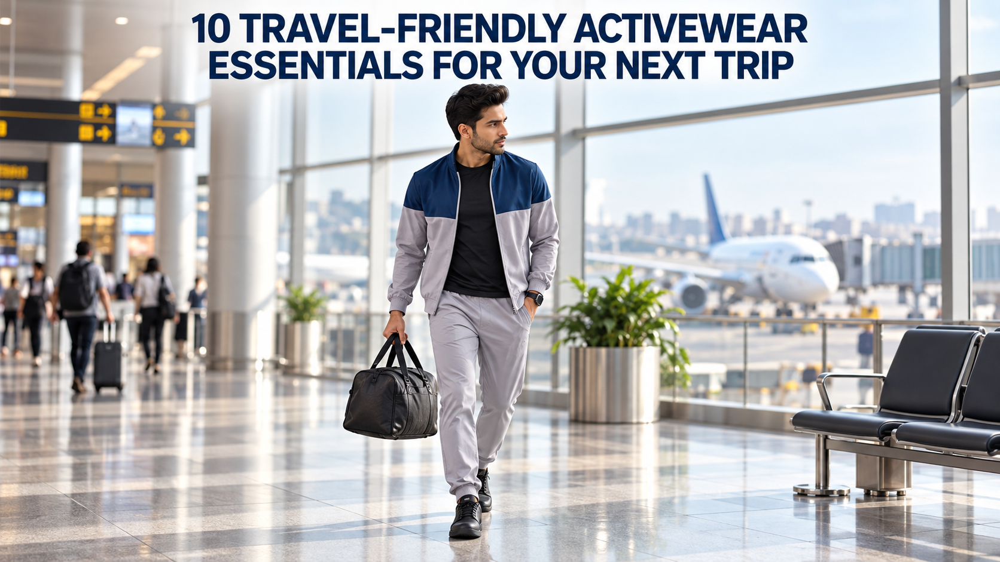

Meta Title: 10 Travel-Friendly Activewear Essentials | OFFLIMITS

Meta Description: Pack smarter for your next trip with 10 OFFLIMITS activewear essentials for travel days, hotel workouts, walks and easy sightseeing.

# 10 Travel-Friendly Activewear Essentials for Your Next Trip



Travel packing has a funny way of exposing the clothes you never actually wear. You put them in the case because they sound useful, then spend the trip reaching for the same tee, joggers and sneakers. So start there.

“I want to pack light, but I still want a hotel workout and clothes for exploring.” That is the whole brief. A good travel-activewear capsule should be comfortable in transit, easy to layer and still useful after you check in. Build around pieces that earn more than one moment of the trip.

## Quick answer: what activewear is worth packing for travel?

Pack a repeatable tee, joggers, shorts, a layer, a tracksuit or co-ord, a dedicated workout shoe if your plans call for one, a lifestyle sneaker for city walking, socks, a change of workout top and a compact bag. The exact mix changes by destination, but each item should cover travel, movement or casual time without becoming dead weight.

## 1. A clean tee for the journey and the hotel gym

Your first travel top should be the one you can wear through security, for a quick walk after check-in and during a low-fuss workout. A [Men’s Titan T-Shirt](https://offlimits.co.in/products/mens-titan-t-shirt-otm-351-03) gives you that simple base. Pair it with joggers in transit, shorts when the temperature rises, or layer it under a track jacket.

Pack one neutral tee first; add colour only when you know it will work with the rest of your rotation. That keeps the carry-on lighter and the outfit decisions easier.

## 2. Joggers that make sitting, walking and waiting easier

Long queues, a cab ride and an evening stroll ask different things from trousers, but they all reward an uncomplicated elasticated bottom. [OFFLIMITS men’s joggers and track pants](https://offlimits.co.in/collections/men-joggers-track-pants) are described by the collection as options for workouts, travel and everyday wear.

For travel, think in combinations rather than single items: tee plus joggers plus sneaker; tee plus joggers plus jacket; joggers plus sweatshirt after a late arrival. Pick one pair that feels useful enough to wear out of the suitcase first.

## 3. A track jacket for cabins, cabs and cooler evenings

The layer is what keeps a short-sleeve outfit from becoming a one-temperature plan. The [Men’s Sonic Tracksuit](https://offlimits.co.in/products/mens-sonic-track-suit-otm-341-02) is a full-sleeve, cut-and-sew option in Light Grey/A Force; its product page lists polyester-spandex and Wicktech. Wear the jacket open over a tee during transit, then use the full set when you want an instant outfit after you arrive.

Keep the layer accessible rather than buried at the bottom of the bag. It is the piece you will want when the cabin, hotel lobby or early-morning walk feels cooler than expected.

## 4. Shorts for warm destinations and short hotel sessions

A travel wardrobe needs at least one lower half that does not make sense only in air-conditioning. [OFFLIMITS men’s sports shorts](https://offlimits.co.in/collections/men-shorts) are positioned for workouts, running and training, making them a natural choice for warm-weather travel days and quick movement sessions.

Wear them with the same tee and sneaker you used for travel. That simple repeat is the point: fewer pieces, more possible outfits.

## 5. A tracksuit or co-ord when you do not want to style an outfit

Some trip days begin before your brain has agreed to make decisions. A coordinated set gives you an answer: put it on, add a tee if you want, and go. Browse [OFFLIMITS men’s tracksuits](https://offlimits.co.in/collections/men-track-suits) or [women’s tracksuits](https://offlimits.co.in/collections/women-track-suits) for the silhouette that you will wear beyond the airport.

The bonus is that a set can become separates later. The jacket works with other bottoms; the track pant works with a tee. That is how a travel piece earns the space it takes up.

## 6. A second workout top, packed for reality

You do not need a suitcase full of gym clothes. You do need a backup top if you plan to train, walk in heat or spend a long day in transit. This is less about a perfect packing formula and more about avoiding the familiar “I would work out, but my only top is still damp” moment.

Choose a second tee from the [OFFLIMITS apparel collection](https://offlimits.co.in/collections/all-apparels) in a colour that still works with your joggers and shorts. It gives your first top time to air out and keeps the rest of your outfit options connected.

## 7. A lifestyle sneaker for the parts of the trip that are not workouts

The shoe you travel in should make sense for the most walking you expect to do. The [Bomba Black/Black sneaker](https://offlimits.co.in/products/bomba-black-black-ocm-793-02) is a black lace-up lifestyle option; its product page lists a synthetic upper, TPR sole and EVA insock. Its neutral finish also makes it easy to pair with joggers, shorts and a tracksuit.

For styling ideas that keep a sneaker outfit from feeling one-note, see the OFFLIMITS guide to [styling sneakers for men and women](https://offlimits.co.in/blogs/blogs/the-ultimate-guide-to-styling-sneakers-for-men-and-women).

## 8. A dedicated gym shoe only when your itinerary needs one

It is tempting to call one pair of shoes the answer to every activity. Travel is easier when the footwear matches the plan instead. If your trip includes a real gym session, use the [OFFLIMITS gym shoe guide](https://offlimits.co.in/blogs/blogs/ultimate-gym-shoes-guide) to narrow the choice by workout type. If the plan is mainly museums, markets and meals, the lifestyle sneaker may be the pair you use most.

That distinction keeps the packing list honest. Bring specialist shoes when the activity is genuinely on the calendar, not because the case has empty space.

## 9. Fresh socks are a small item with a big role

Socks are easy to ignore until you have walked farther than planned. Pack a fresh pair for the shoe you are wearing in transit and another for your workout or activity day. It is a simple way to make the same sneaker feel ready for its next use.

Keep them with the shoes or in a small packing pouch. Travel days already create enough digging through bags.

## 10. A compact carry layer or bag for the things you reach for

The last essential is not another outfit; it is the piece that keeps the outfit functional. Use a compact bag or carry layer for your water bottle, headphones, charger and jacket. The useful version is the one you can carry without turning your travel look into a luggage operation.

If your clothing capsule is working, this bag holds the few extras—not a backup wardrobe.

## A simple three-outfit travel formula

- **Transit day:** tee + joggers + track jacket + lifestyle sneaker.
- **Warm destination morning:** tee + shorts + sneaker; carry the jacket for indoor stops.
- **Hotel gym to coffee:** second tee + training shoe if needed + joggers or shorts, then add the jacket afterwards.

The goal is not to make every outfit look identical. It is to make every packed piece easy to repeat.

## Final thoughts

The useful travel wardrobe is built around what your trip will actually involve: sitting, walking, changing temperatures and perhaps a workout. Start with the tee, joggers, layer and sneaker. Add shorts, a set or a specialist shoe only when your destination or schedule gives them a job.

When you are ready to build the rotation, explore [OFFLIMITS apparel](https://offlimits.co.in/collections/all-apparels) and choose the piece that solves the next real moment on your itinerary.

## FAQs

### What is the most useful activewear outfit for a travel day?

A tee, joggers, a removable layer and a comfortable sneaker form a flexible starting point. It works for sitting, walking and casual plans without requiring a full outfit change.

### Should I pack a separate pair of workout shoes?

Pack a dedicated pair when you have a specific workout planned. For a trip focused on sightseeing and casual walking, a lifestyle sneaker may cover more of the itinerary.

### How many activewear outfits should I take on a short trip?

Start with a small mix-and-match capsule: two tops, one jogger, one short, one layer and a sneaker. Add based on the length of the trip, access to laundry and planned activities.

### Are tracksuits good for airports?

A tracksuit can be useful because it is an easy coordinated outfit, and its pieces can also be separated later in the trip.

### What activewear should I take for hot-weather travel?

Bring a lightweight tee and shorts alongside a removable layer for cooler indoor spaces or early starts. Choose the final mix based on your activity plans.

## FAQ JSON-LD

```json
{"@context":"https://schema.org","@type":"FAQPage","mainEntity":[{"@type":"Question","name":"What is the most useful activewear outfit for a travel day?","acceptedAnswer":{"@type":"Answer","text":"A tee, joggers, a removable layer and a comfortable sneaker form a flexible starting point."}},{"@type":"Question","name":"Should I pack a separate pair of workout shoes?","acceptedAnswer":{"@type":"Answer","text":"Pack a dedicated pair when you have a specific workout planned. For sightseeing and casual walking, a lifestyle sneaker may cover more of the itinerary."}},{"@type":"Question","name":"How many activewear outfits should I take on a short trip?","acceptedAnswer":{"@type":"Answer","text":"Start with two tops, one jogger, one short, one layer and a sneaker, then add based on the trip and planned activities."}}]}
```

## Image metadata

Hero — `offlimits-travel-activewear-hero.png`. Alt text: Traveller wearing a track jacket, joggers and black sneakers at an airport, with the blog title. Placement: below H1.

## Keywords used

- **Primary:** travel friendly activewear essentials
- **Secondary:** activewear for travel; travel workout clothes; airport athleisure outfits; travel activewear India
- **Supporting:** travel gym packing list; joggers for travel; travel-friendly sneakers; tracksuit airport outfit

Keyword Planner and OFFLIMITS Search Console metrics are unavailable in this workspace, so no volume, CPC or competition figures are claimed. Phrases are selected from the topic, live SERP language and verified OFFLIMITS product/category wording.
