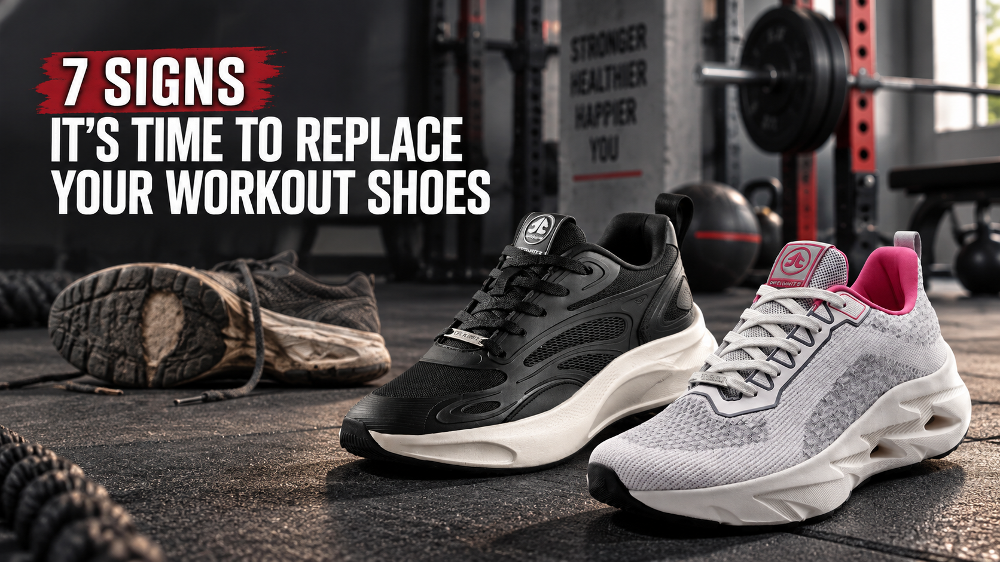
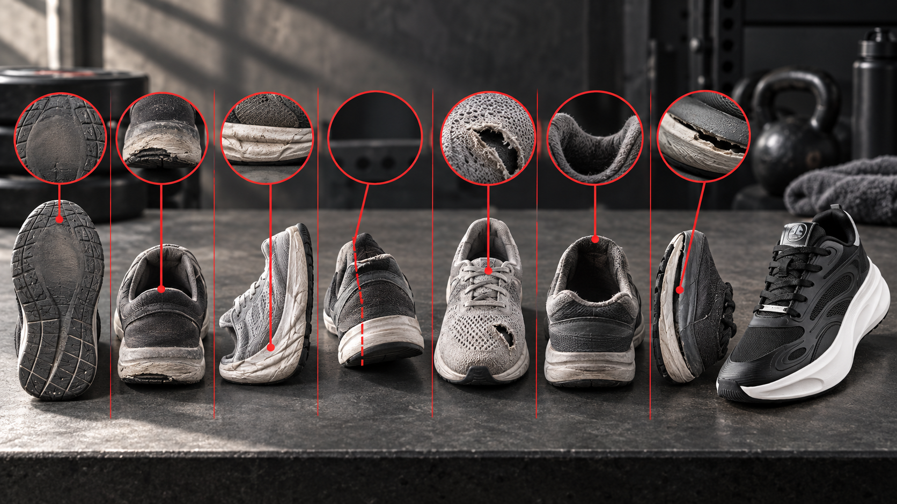

Meta Title: 7 Signs It’s Time to Replace Your Workout Shoes | OFFLIMITS

Meta Description: Check seven clear signs your workout shoes are worn out, from flat cushioning to fading grip, and choose the right replacement for your routine.

Draft Status: Editorially gated; live ZeroGPT verification is blocked because the service returned 403 (insufficient credits). Local AI-pattern risk score: 6%, below the 20% working threshold. Do not mark publish-ready until a live ZeroGPT result is recorded below 20%. Keyword Planner metrics are unavailable and have not been estimated.

# 7 Signs It’s Time to Replace Your Workout Shoes

“They still look fine.”

That is usually the first argument we make for an old pair of workout shoes. The upper is clean. The laces still tie. Nothing is dramatically falling off. So the shoes go back into the gym bag for another week.

But workout shoes often lose their usefulness from the bottom up. Grip becomes patchy. Foam stays compressed. The heel starts leaning. A fit that once felt secure becomes oddly loose. By the time the damage looks obvious from across the room, the shoe may have been feeling wrong for a while.

The good news? You do not need a lab or a calendar rule to check. You need a flat floor, good light and about a minute. If your current pair fails several of the checks below, compare purpose-built options in the [OFFLIMITS gym and training shoe collection](https://offlimits.co.in/collections/gym-training) before your next session.



## The Quick Answer: When Should You Replace Workout Shoes?

Replace workout shoes when wear changes the job they are meant to do: grip the floor, cushion repeated impact, hold your foot securely or create a steady base. Age and mileage can prompt an inspection, but condition and performance should make the decision.

Running guidance often mentions distance. The American Heart Association's [athletic-shoe guide](https://cpr.heart.org/en/-/media/AHA/H4GM/PDF-Files/ShoeInfographic.pdf?sc_lang=en) uses roughly 350 to 500 miles as a running reference and also points to worn or uneven tread. That range is not a universal expiry date for every gym shoe. A pair used for squats twice a week and a pair used for road running six days a week face very different stress.

So, rather than asking only, “How old are these?”, ask a better question: “Do they still perform the way my workout needs?”

## 1. The Outsole Tread Has Gone Smooth or Uneven

Flip the shoe over. Do not be distracted by the clean upper.

The outsole is the part meeting the floor, treadmill belt or road. Its grooves and rubber zones help create traction. If one area has become smooth, if the heel is worn heavily on one edge, or if the two shoes show dramatically different patterns, the grip is no longer working evenly.

Try this check:

- Compare the left and right outsole side by side.
- Look at the heel, forefoot and outer edges under bright light.
- Run a finger across the tread. A shiny, flattened patch is easier to feel than to see.

The urgency depends on your workout. Reduced tread matters on a run, but it also matters during lateral drills, fast circuits and any session on a dusty or slightly damp floor. If you are sliding where you did not slide before, do not wait for the sole to become completely bald.

## 2. The Midsole Feels Flat, Hard or Permanently Compressed

Remember how your shoes felt during their first few sessions? Not “brand-new stiff,” but comfortably responsive. Now notice what happens on landing. Does every treadmill step feel harsher? Do jump-rope rounds sound and feel heavier? Does the foam on one side stay visibly squashed after the shoe has rested?

That change can be a midsole losing its original feel. The midsole sits between your foot and the outsole; repeated loading can leave it compressed even when the shoe still looks presentable from above.

Press the sidewall with your thumb, then compare both shoes. Creasing alone does not automatically mean a pair is finished. A better clue is a combination: permanent compression, an uneven feel and a noticeable drop in comfort during a familiar session.

If your routine mixes running and lifting, first check whether the issue is wear or simply the wrong shoe type. The OFFLIMITS guide to [running shoes versus gym shoes](https://offlimits.co.in/blogs/blogs/running-vs-gym-shoes-uncover-the-difference-between-running-vs-gym-shoes) explains why cushioning and platform needs change with the activity.

## 3. One Shoe Leans or Rocks on a Flat Surface

Here is the easiest test in this article: place both shoes on a hard, level floor and step back.

Do they stand straight? Does one heel tilt inward or outward? Press gently on the heel and toe. Does the shoe rock because one part of the sole has worn down more than the rest?

ASICS' [DIY footwear inspection guide](https://queenstown-marathon.co.nz/assets/Uploads/2021/Queenstown-Marathon-Get-Run-Ready.pdf) lists uneven soles and shoes that no longer stand straight among common wear signs. That visual test matters because a stable-looking base should not have to be negotiated on every rep.

Do not try to diagnose your gait from an old outsole. Wear can have several causes, including the surfaces you use and the way the shoe is constructed. Treat a strong lean as a signal to retire the pair from training and, if the same pattern appears quickly in multiple pairs, consider advice from a qualified footwear specialist or clinician.

## 4. Your Heel Slips or the Upper No Longer Holds You Securely

You tighten the laces. Then tighten them again. Your heel still lifts.

That is not always a sizing problem. Over time, the heel collar can flatten, the upper can stretch and eyelets can deform. The result is a shoe that feels longer or sloppier even though your feet have not changed.

Check for:

- a heel collar that no longer returns to shape;
- stretched mesh around the midfoot or toe box;
- torn eyelets or laces that cannot hold tension; and
- side-to-side movement during a controlled lunge.

A tiny cosmetic scuff is not a reason to replace a shoe. Loss of hold is different. If your foot slides during direction changes or your toes have to grip inside the shoe to keep it in place, the upper is no longer doing its full job.



## 5. The Sole Is Cracked, Peeling or Separating

Some damage is a discussion. Sole separation is not.

Look where the upper meets the midsole and where the outsole rubber meets the foam. A small opening can grow as the shoe bends. Loose rubber at the toe or heel can catch, flap or change contact with the floor. Cracks that open when you flex the shoe are also more serious than surface creases.

Could you glue a casual shoe for light use? Possibly. But a hard training session repeatedly flexes, twists and loads the bond. A repaired area is difficult to treat as reliable performance equipment. Once the sole structure is separating, retire the pair from workouts.

## 6. Familiar Workouts Suddenly Feel Less Comfortable

This sign needs common sense, not panic.

Suppose your route, pace and weekly load are unchanged, but your regular run suddenly feels harsher through the feet. Or your usual circuit leaves a new hot spot because the upper has shifted. The shoes are worth inspecting.

New discomfort does not prove that old shoes are the cause. Training load, technique, recovery and previous injury can all matter. Stop if something hurts, check the shoe, and do not use an article to self-diagnose. If pain persists or is significant, speak with a qualified health professional.

The useful clue is repeatability. If the discomfort appears in the worn pair, disappears with a suitable fresher pair and returns when you switch back, the old shoes should not keep getting the benefit of the doubt.

## 7. The Shoe No Longer Matches the Workout You Ask It to Do

Sometimes the shoe is not destroyed. Your training has simply changed.

Maybe a pair bought for walking is now being used for fast lateral drills. Maybe a soft running shoe has become your heavy-lifting shoe. Maybe one trainer handles road runs, leg day, badminton and every errand in between. That much variety can expose limitations faster and make wear harder to read.

Ask: “Would I choose this shoe for today's workout if I were buying it now?”

If the answer is no, replacement may mean choosing the correct category rather than buying a newer copy of the same mismatch. Use the OFFLIMITS [cross-training shoe guide](https://offlimits.co.in/blogs/blogs/how-to-choose-the-best-cross-training-shoes-for-your-fitness-goals) to think through mixed sessions, or read the [gym-shoe guide](https://offlimits.co.in/blogs/blogs/ultimate-gym-shoes-guide) before narrowing your options.

## Do Not Replace by Calendar Alone

“Six months” sounds reassuringly precise. Real use is not.

One person trains indoors three times a week and changes into gym-only shoes at the locker. Another walks to work in the same pair, trains outside and leaves the shoes in a hot car. The second pair may accumulate far more wear in the same number of months.

Use time or mileage as an inspection reminder, then look at:

- workout frequency and session length;
- indoor, road or rough outdoor surfaces;
- exposure to water, heat, dirt and long daily wear;
- whether the pair is rotated with another shoe; and
- changes in tread, cushioning, structure and fit.

If you run, track distance in your training app or a simple note. If your workouts are mixed, log sessions instead. The number is not a verdict. It helps you notice when “I bought these recently” has quietly become a year of regular use.

## What Should Replace Your Old Workout Shoes?

Start with the activity you do most, not the colour you like most.

### For Running, Treadmill Work and Cardio

Prioritise a secure fit, cushioning that feels appropriate for repeated steps and outsole coverage suited to your surface. The [Speedwave For Her](https://offlimits.co.in/collections/women-shoes/products/speedwave-for-her-grey-orw-840-05) uses a seamless Flyknit upper and a Phylon/TPR sole, according to its current product page. It is a relevant route for women comparing a lightweight shoe for running, walking and gym sessions.

Men looking for a versatile run-and-gym option can consider the [Gladiator in black](https://offlimits.co.in/products/gladiator-black-orm-661-01). Its product page lists a knitted upper with KPU overlay, a memory-foam insole and a Phylon rubber sole. Check the current size and availability on the product page before choosing.

### For Strength Training

Look for a base that feels steady under the kind of load you use. More softness is not automatically more suitable for squats or deadlifts. Test the shoe with bodyweight movements first: can you keep the foot planted, or does the platform feel wobbly?

Compare the current [men's running and gym shoe range](https://offlimits.co.in/collections/mens-running-gym-shoes) by construction and intended use, not just appearance.

### For Mixed Gym Sessions

HIIT, circuits and cross-training ask one shoe to handle forward motion, short impact and changes of direction. Grip and upper hold deserve as much attention as cushioning. For women, the [gym and training collection](https://offlimits.co.in/collections/women-gym-training) provides a focused starting point instead of forcing a lifestyle shoe into a performance role.

Whatever the category, try the shoe with the socks you train in and follow the site's size information. A new shoe cannot solve a mismatch in fit or workout type.

## The 60-Second Workout Shoe Check

Before your next session, do this:

1. Turn both shoes over and compare the tread.
2. Set them on a flat floor and look for lean or rocking.
3. Press both midsoles and compare their shape.
4. Flex the toe and inspect every bonded edge.
5. Check the heel collar, upper and eyelets for loss of hold.
6. Put them on and notice slipping, harshness or unevenness.
7. Ask whether the pair still suits today's workout.

One cosmetic flaw may not matter. Several structural or performance signs together are a much clearer answer.

## Final Thoughts: Retire the Shoe, Not the Routine

Workout shoes do not need to look destroyed before they stop being useful for training. The more reliable signals are specific: smooth tread, uneven wear, compressed cushioning, a leaning base, a loose upper, separating layers or a familiar workout that suddenly feels wrong.

Check the pair you keep defending. If it still grips, stands straight, feels consistent and holds your foot securely, keep monitoring it. If it fails several checks, retire it from workouts. Your training deserves equipment you can trust without negotiating with it every session.

[Find your next workout pair in the OFFLIMITS gym and training collection](https://offlimits.co.in/collections/gym-training)

## Frequently Asked Questions

### How often should workout shoes be replaced?

There is no single replacement schedule for every workout shoe. Running distance, workout frequency, surfaces, weather and shoe construction all affect wear. Use time or mileage as a reminder to inspect the shoe, then decide based on tread, cushioning, structure, fit and performance.

### Can workout shoes be worn after the tread becomes smooth?

Smooth or uneven tread means the outsole is no longer providing the same surface contact it once did. That is especially relevant for running, fast circuits and lateral movement. Retire the pair from workouts rather than waiting for the sole to wear through.

### Are creases in the midsole a sign that shoes are worn out?

Not by themselves. Some creasing appears through normal use. Be more concerned when creasing comes with permanent compression, an uneven platform or a clear loss of comfort and responsiveness during a familiar workout.

### Why do my workout shoes feel loose even when the laces are tight?

The heel collar or upper may have stretched, eyelets may be damaged, or the shoe may never have fitted correctly. If tightening the laces does not restore secure hold and your foot slides during movement, replace the shoe or choose a better-fitting model.

### Can I use one pair for running and strength training?

Some versatile shoes can handle mixed sessions, but the needs differ. Running usually values repeated-step cushioning and smooth transitions, while strength work benefits from a stable base. Choose around your main activity and avoid using a worn or overly soft shoe for heavy lifting.

## FAQ Schema (JSON-LD)

```json
{
  "@context": "https://schema.org",
  "@type": "FAQPage",
  "mainEntity": [
    {
      "@type": "Question",
      "name": "How often should workout shoes be replaced?",
      "acceptedAnswer": {"@type": "Answer", "text": "There is no single schedule for every workout shoe. Use time or mileage as an inspection reminder, then decide from tread, cushioning, structure, fit and performance."}
    },
    {
      "@type": "Question",
      "name": "Can workout shoes be worn after the tread becomes smooth?",
      "acceptedAnswer": {"@type": "Answer", "text": "Smooth or uneven tread means the outsole no longer provides the same surface contact. Retire the pair from workouts rather than waiting for the sole to wear through."}
    },
    {
      "@type": "Question",
      "name": "Are creases in the midsole a sign that shoes are worn out?",
      "acceptedAnswer": {"@type": "Answer", "text": "Not by themselves. Look for creasing combined with permanent compression, an uneven platform or a clear loss of comfort and responsiveness."}
    },
    {
      "@type": "Question",
      "name": "Why do my workout shoes feel loose even when the laces are tight?",
      "acceptedAnswer": {"@type": "Answer", "text": "The heel collar or upper may have stretched, eyelets may be damaged, or the shoe may not fit correctly. Replace it if secure hold cannot be restored."}
    },
    {
      "@type": "Question",
      "name": "Can I use one pair for running and strength training?",
      "acceptedAnswer": {"@type": "Answer", "text": "Some versatile shoes handle mixed sessions, but running and strength work have different needs. Choose around your main activity and use a stable, suitable pair for lifting."}
    }
  ]
}
```

## Image Metadata

Banner Img

- File name: offlimits-replace-workout-shoes-hero.png
- Alt text: Fresh OFFLIMITS Gladiator and Speedwave shoes beside a worn workout shoe, with the title 7 Signs It’s Time to Replace Your Workout Shoes.
- Caption: The pair can look fine from above. Check what grip, cushioning and structure are telling you.

Image 1

- File name: offlimits-workout-shoe-wear-check.png
- Alt text: Seven visual wear checks for workout shoes, including worn tread, compressed foam, a leaning heel, a torn upper, a stretched collar and sole separation.
- Caption: A one-minute inspection can reveal wear that a quick glance misses.

## Keywords Used

- Primary keyword: when to replace workout shoes
- Secondary keywords: signs workout shoes are worn out; replace gym shoes; worn-out training shoes; how long do workout shoes last; workout shoes for men; workout shoes for women; gym and training shoes
- Long-tail keywords: how to know when workout shoes need replacing; signs it is time to replace gym shoes; when should I replace my training shoes; how to check worn-out workout shoes; when to replace running and gym shoes
- Search intent: informational/commercial
- Keyword metrics: not available from a verified GSC or Google Ads Keyword Planner source for this draft; no volume, CPC or competition figures were estimated
