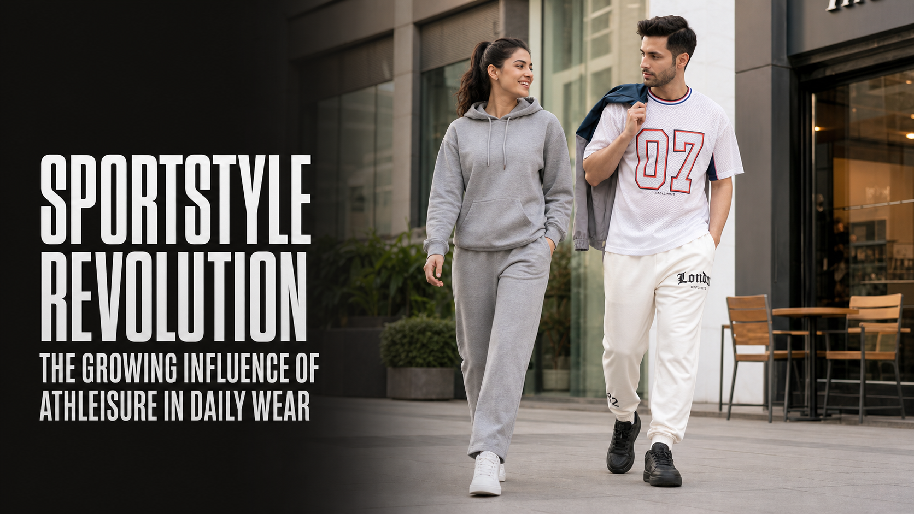
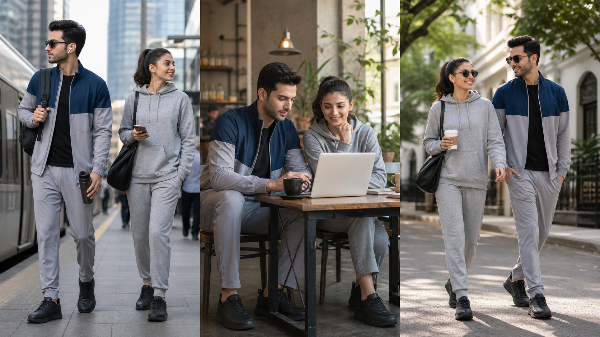

Meta Title: Sportstyle Revolution: Athleisure in Daily Wear | OFFLIMITS

Meta Description: See how athleisure is reshaping daily wear in India, then build sportstyle outfits for commutes, casual workdays, errands and weekends.

Draft Status: Editorially gated; live ZeroGPT verification is blocked because the service returned 403 (insufficient credits). Local AI-pattern risk score: 6%, below the 20% working threshold. Do not mark publish-ready until a live ZeroGPT result is recorded below 20%.

# Sportstyle Revolution: The Growing Influence of Athleisure in Daily Wear

Your calendar says commute, desk, coffee, errands and dinner. Your wardrobe used to hear five separate dress codes. That gap is where sportstyle has taken over.

Athleisure in daily wear is less about looking ready for a workout and more about removing unnecessary outfit changes. A track jacket can sharpen a plain tee. Joggers can replace stiff casual trousers when the fit is clean. Lifestyle sneakers finish the look without turning it into gym kit. The pieces still borrow movement, ease and detail from sport, but the final outfit belongs in everyday life.

If your week already moves this way, browse the [OFFLIMITS apparel collection](https://offlimits.co.in/collections/all-apparels) while you read. The useful question is not, “Can I wear activewear outside?” It is, “Which sporty piece earns a place in the rest of my day?”



## What Changed? Daily Life Stopped Waiting for an Outfit Change

Think about a normal urban day in India. You may walk to the metro, climb stairs, sit in an air-conditioned room, step back into the heat and meet friends before going home. Clothes designed for only one of those moments create friction.

Sportstyle answers with fewer hard boundaries. A full tracksuit can be worn as a set, but the jacket can also sit over denim or a neutral tee. A jogger can work with a hoodie, polo or overshirt. Sneakers that began with athletic cues now appear under almost every casual silhouette.

That does not mean every gym outfit automatically becomes an everyday outfit. The difference is intention. Outside the training floor, proportion, colour and one clear focal point matter more than how many performance details you can stack together.

Here is the quick test: if the outfit still looks considered after you remove the gym bag, it has crossed into sportstyle.

## Four Pieces That Make Sportstyle Easy to Wear

You do not need a wardrobe full of matching sets. Start with pieces that separate well, repeat easily and solve a real part of your day.

### 1. A Track Jacket That Can Leave the Set

The track jacket is sportstyle's most useful bridge. Worn zipped, it gives a clean athletic line. Worn open over a tee, it behaves more like a casual jacket. The [Men's Sonic Tracksuit](https://offlimits.co.in/products/mens-sonic-track-suit-otm-341-02) shows the formula clearly: light grey and blue colour blocking, a full-zip front and a cut-and-sew construction. Its product page identifies Wicktech and a polyester-spandex fabric.

- Works for: commutes, travel days and casual plans after work.
- Why it works: the jacket and trousers can be styled together or split across different outfits.
- Wear it with: a black tee and dark sneakers when you want the colour blocking to lead.

For a wider set of shapes and colours, compare the [OFFLIMITS men's tracksuit collection](https://offlimits.co.in/collections/men-track-suits).

### 2. A Relaxed Set That Still Has Shape

Comfort can look deliberate. The [Women's Glaze Tracksuit](https://offlimits.co.in/products/women-glaze-tracksuit-grey-melange-otw-155-01) uses grey melange, a hooded top and cargo-pocket detailing. The neutral colour makes it easy to repeat; the pocket detail keeps the outfit from reading like basic loungewear.

- Works for: airport mornings, weekend walks, coffee runs and low-key meet-ups.
- Why it works: one colour creates a long, calm visual line while the cargo pocket adds structure.
- Wear it with: clean sneakers, a compact tote and one small metal accessory.

Prefer a sharper zip-up or stronger colour contrast? The [women's tracksuit collection](https://offlimits.co.in/collections/women-track-suits) gives you more ways to choose the mood before you choose the outfit.

### 3. A Graphic Athletic Tee That Does the Talking

A graphic tee is the quickest way to make athletic references feel like street style. The [Men's Titan T-shirt](https://offlimits.co.in/products/mens-titan-t-shirt-otm-351-03) carries a bold varsity-style 07 graphic, so it needs little support.

- Works for: warm afternoons, casual college days and weekend plans.
- Why it works: the graphic provides the focal point; the rest of the outfit can stay quiet.
- Wear it with: solid joggers or straight-leg jeans and simple sneakers.

The mistake to avoid is competing graphics. If the tee is loud, keep the lower half and footwear restrained.

### 4. A Lifestyle Sneaker with Athletic Roots

Footwear decides whether a sporty outfit looks assembled or accidental. The black [Bomba lifestyle sneaker](https://offlimits.co.in/products/bomba-black-black-ocm-793-02) is built around a lace-up silhouette with a synthetic upper, TPR sole and EVA insock, according to its current product page. In an all-black colourway, it can sit under joggers, track trousers or denim without fighting the rest of the look.

- Works for: everyday walking, errands and casual evenings.
- Why it works: the tonal black design anchors brighter jackets, graphics and colour blocking.
- Wear it with: visible ankle, a neat trouser break or a tapered cuff so the shoe does not disappear.

Need more pairing ideas? The OFFLIMITS guide to [styling sneakers for men and women](https://offlimits.co.in/blogs/blogs/the-ultimate-guide-to-styling-sneakers-for-men-and-women) covers outfit routes beyond an all-athletic look.



[Explore OFFLIMITS apparel for everyday sportstyle](https://offlimits.co.in/collections/all-apparels)

## One Wardrobe, Four Parts of the Day

The influence of athleisure becomes easiest to see when you stop sorting clothes by category and start sorting them by what your day asks of them.

### The Commute

Start with movement. Choose a jogger or track trouser that stays close enough to the leg to avoid excess fabric around the shoe. Add a tee, then use a track jacket as the finishing layer. You can remove it in warmer weather or keep it handy for cold indoor spaces.

If trousers are your starting point, the [men's joggers and track pants collection](https://offlimits.co.in/collections/men-joggers-track-pants) is a more focused place to compare silhouettes than a general shop page.

### The Desk, Studio or College Day

This is where restraint helps. Pick one recognisably athletic piece, not three. A track jacket over a plain tee and jeans feels different from a matching set with a performance top and running shoes. Neither is wrong, but the first usually moves through mixed settings more quietly.

Ask yourself, “What is the hero today?” If it is the jacket, keep the tee and shoes simple. If it is the graphic tee, choose a solid lower half. That one decision prevents the outfit from becoming visual noise.

### The Errand Run

Errands reward repeatable combinations. A neutral hoodie, joggers and lifestyle sneakers can be ready in minutes, but small choices still matter: clean hems, pockets that lie flat and a bag that belongs to the outfit. Sportstyle looks strongest when ease is visible without looking careless.

### The Weekend Plan

Weekend styling gives you more room. Split a tracksuit and pair the jacket with denim. Put a graphic tee under an open layer. Swap a training-looking shoe for a tonal lifestyle sneaker. If you like the simplicity of coordinated sets, read why [tracksuits work as an everyday essential](https://offlimits.co.in/blogs/blogs/why-tracksuits-are-the-ultimate-everyday-essential), then use the set as a base rather than a rule.

## Three Styling Rules That Keep Athleisure Out of Gym-Only Territory

### Balance the Volume

An oversized top usually looks cleaner with a tapered or straight lower half. Relaxed trousers benefit from a neater tee or a jacket with a defined hem. You are not chasing one “correct” fit; you are giving the eye somewhere to settle.

### Repeat a Colour, Not Every Colour

Pick up one colour from the jacket in the tee, shoe or small accessory. Then stop. A blue panel with a blue cap can feel connected. Blue panels, blue trousers, blue shoes and a blue bag can flatten the whole look.

### Mix Sport with One Everyday Texture

Denim, a cotton overshirt, a structured tote or a simple leather-look accessory can pull technical-looking pieces into daily wear. The contrast is useful. It tells the outfit where it is going.

## Before You Buy: Run the Real-Day Test

Product photography can show colour and silhouette, but your routine decides whether a piece will be worn. Before adding anything, ask:

- Can I style it with at least three pieces I already own?
- Will the jacket, top or bottom work separately from its matching set?
- Does the hem sit cleanly with my usual sneakers?
- Are the fabric and layer weight right for when I plan to wear it?
- Have I checked the current product page for size, material, care and availability?

Fit deserves extra attention online. Compare garment information with your own measurements and read the product page rather than relying on a familiar size label alone. A clean fit is doing much of the styling work in sportstyle.

## Final Thoughts: Let the Day Build the Outfit

Athleisure did not enter daily wear because everyone decided to dress for the gym. It grew because modern days stopped fitting into one neat box. A practical sportstyle wardrobe recognises that reality: a jacket that can change roles, a trouser that can move, a tee with a point of view and sneakers that finish more than one kind of outfit.

Start with the moment that currently creates the most friction. If it is your commute, begin with joggers or a track jacket. If it is the jump from errands to a casual plan, start with neutral lifestyle sneakers. One useful piece is enough to change the rhythm of several outfits.

[Build your everyday sportstyle rotation with OFFLIMITS](https://offlimits.co.in/collections/all-apparels)

## Frequently Asked Questions

### What is sportstyle fashion?

Sportstyle fashion uses athletic design cues—track jackets, joggers, graphic sports tees and sneakers—in outfits made for everyday settings. The focus is on styling and repeat wear, not on pretending every casual outfit is training gear.

### Is athleisure the same as activewear?

Not exactly. Activewear is selected primarily for movement or training. Athleisure carries some of that comfort, construction or visual language into daily wear. A piece can belong to both categories, but the occasion and styling change how it reads.

### How can I wear athleisure without looking like I am going to the gym?

Choose one athletic hero piece, control the proportions and add an everyday texture such as denim or a structured bag. Lifestyle sneakers also create a different finish from shoes chosen specifically for a workout.

### Can a tracksuit work for casual daily wear?

Yes. Wear the full set for a coordinated look or split the jacket and trousers. Neutral colours are easy to repeat, while colour-blocked sets look clearest when the rest of the outfit stays simple.

### Which athleisure pieces should I buy first?

Start with the gap in your current routine. A versatile track jacket, neutral joggers, a graphic tee or tonal lifestyle sneakers are practical first choices because each can connect with clothes you may already own.

## FAQ Schema (JSON-LD)

```json
{
  "@context": "https://schema.org",
  "@type": "FAQPage",
  "mainEntity": [
    {
      "@type": "Question",
      "name": "What is sportstyle fashion?",
      "acceptedAnswer": {"@type": "Answer", "text": "Sportstyle fashion uses athletic design cues such as track jackets, joggers, graphic sports tees and sneakers in outfits made for everyday settings."}
    },
    {
      "@type": "Question",
      "name": "Is athleisure the same as activewear?",
      "acceptedAnswer": {"@type": "Answer", "text": "Activewear is selected primarily for movement or training, while athleisure carries some of that comfort, construction or visual language into daily wear."}
    },
    {
      "@type": "Question",
      "name": "How can I wear athleisure without looking like I am going to the gym?",
      "acceptedAnswer": {"@type": "Answer", "text": "Choose one athletic hero piece, balance the proportions and add an everyday texture such as denim or a structured bag."}
    },
    {
      "@type": "Question",
      "name": "Can a tracksuit work for casual daily wear?",
      "acceptedAnswer": {"@type": "Answer", "text": "Yes. Wear the full set for a coordinated look or split the jacket and trousers across separate outfits."}
    },
    {
      "@type": "Question",
      "name": "Which athleisure pieces should I buy first?",
      "acceptedAnswer": {"@type": "Answer", "text": "Begin with the gap in your routine. A versatile track jacket, neutral joggers, graphic tee or tonal lifestyle sneakers are practical first choices."}
    }
  ]
}
```

## Image Metadata

Banner Img

- File name: offlimits-sportstyle-revolution-hero.png
- Alt text: Indian man and woman wearing OFFLIMITS-inspired athleisure in an urban daily-wear setting, with the Sportstyle Revolution blog title.
- Caption: Sportstyle Revolution: athleisure built for the way an everyday schedule actually moves.

Image 1

- File name: offlimits-sportstyle-daily-wear-lineup.png
- Alt text: OFFLIMITS-inspired grey and blue tracksuits styled for an Indian commute, café work session and weekend walk.
- Caption: One sportstyle rotation, restyled from commute to weekend.

## Keywords Used

- Primary keyword: athleisure in daily wear
- Secondary keywords: sportstyle fashion; athleisure wear in India; everyday athleisure outfits; casual sportswear; tracksuits for daily wear; joggers for everyday wear; lifestyle sneakers
- Long-tail keywords: how to wear athleisure every day; how athleisure influences daily fashion; how to style tracksuits for casual wear; sportstyle wardrobe in India
- Search intent: informational/commercial
- Keyword metrics: not available from a verified GSC or Keyword Planner source for this draft
