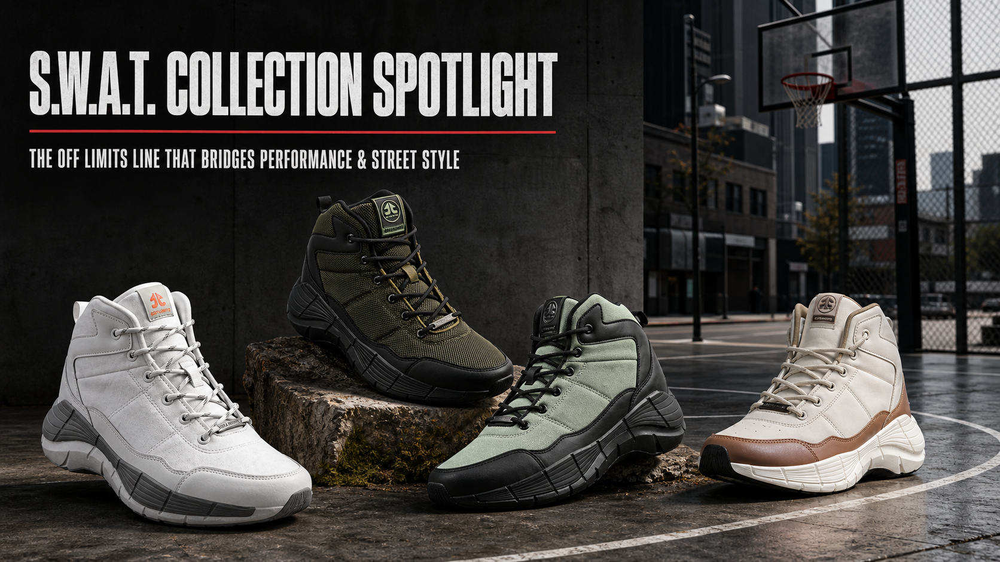
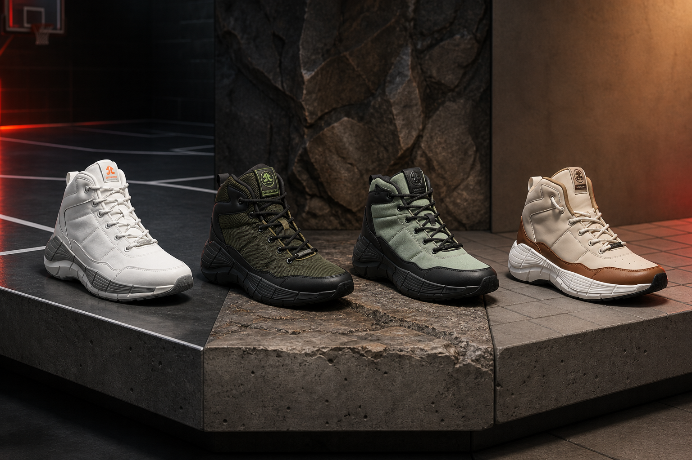

# S.W.A.T. Collection Spotlight: The Off Limits Line That Bridges Performance & Street Style

You want the support and presence of a performance high-top, but you do not want your shoes to look stranded outside a court or training session. Sound familiar?

That tension is exactly where the **OFFLIMITS S.W.A.T. collection** gets interesting. The line keeps a strong high-top profile across several editions, then changes the materials, cushioning and colour story to suit different parts of your day. One pair leans athletic. Another looks ready for rougher weekend plans. The newest Street Edition makes the lifestyle intent impossible to miss.

So, is S.W.A.T. a performance shoe or a street-style sneaker? The honest answer is: it depends on the edition you choose. This guide breaks down the current [OFFLIMITS S.W.A.T. collection](https://offlimits.co.in/collections/s-w-a-t-men) so you can pick the version that matches how you actually move and dress.

*The original S.W.A.T., Sports Edition, Trail Edition and Street Edition in one performance-to-street lineup.*

## First, what connects the whole S.W.A.T. line?

At a glance, the family resemblance is obvious: a high-top or mid-cut stance, substantial soles, lace-up closures and a silhouette that carries more visual weight than a low-profile trainer. That shape is the bridge. It looks at home with basketball shorts and joggers, but it also has enough structure to anchor cargos, denim and oversized streetwear layers.

The difference sits under the surface. OFFLIMITS varies the sole, upper and insole between editions. That means the choice should begin with your main use, not only your favourite colour.

Here is the quick version:

| S.W.A.T. edition | Verified construction | Good fit for | Street-style character |
|---|---|---|---|
| Original S.W.A.T. in White | Phylon/TPR sole, canvas upper, Advanced Memory Foam insock | An everyday high-top with an athletic build | Clean, graphic and easy to pair |
| Sports Edition in Olive/Black | Phylon/TPR sole, mesh/synthetic upper, Advanced Memory Foam insock | Basketball and training-led use | Dark, tactical-looking colour blocking |
| Trail Edition in Sage Green/Black | Phylon/TPR sole, mesh/synthetic upper, EVA insock | Shoppers drawn to the trail-labelled edition and rugged styling | Earthy palette and outdoor attitude |
| Street Edition in Cream/Mocha Mousse | Synthetic sole, mesh/synthetic upper, Advanced Memory Foam insock | Lifestyle-first wear | Warm neutrals and a fashion-led finish |

## “I want one pair that does a bit of everything.” Start with the original S.W.A.T.

The [original S.W.A.T. in White](https://offlimits.co.in/products/swat-orm-600-03) is the visual reset of the range. Its mostly white upper and grey sole details keep the large silhouette clean rather than busy. OFFLIMITS currently lists a Phylon/TPR sole, canvas upper and Advanced Memory Foam insock for this colourway.

Why does that combination matter to the buyer? The high-top build gives the outfit a strong athletic base, while the white palette makes it easier to repeat across different looks. Wear it with black joggers and a fitted tee for training-day energy. Switch to straight blue denim and an overshirt, and the same shape reads as a deliberate streetwear choice.

If you are new to statement high-tops, this is the easiest place to enter the collection. It has presence without forcing the rest of your outfit to compete.

## “Court first, street second.” Meet the Sports Edition

The [S.W.A.T. Sports Edition in Olive/Black](https://offlimits.co.in/products/s-w-a-t-sports-edition-olive-black-orm-599-12) is the performance-led option in this edit. Its current product page specifies a Phylon/TPR sole, mesh-and-synthetic upper and Advanced Memory Foam insock. OFFLIMITS positions it for basketball and training, with the mesh construction adding ventilation and the synthetic sections adding structure.

The olive-and-black colourway also does useful style work. It feels technical without relying on bright court colours. That makes it easy to wear with black basketball shorts, charcoal joggers or tapered cargos after the session.

Planning to use a high-top primarily for basketball? Read OFFLIMITS' guide to [choosing the right basketball shoes](https://offlimits.co.in/blogs/blogs/how-to-choose-the-right-basketball-shoes) before deciding. Silhouette matters, but your playing needs should lead the purchase.

## “I like the rugged look.” The Trail Edition changes the mood

The [S.W.A.T. Trail Edition in Sage Green/Black](https://offlimits.co.in/products/s-w-a-t-trail-edition-sage-green-black-ocm-681-02) takes the same bold family shape into an earthier direction. The live page lists a Phylon/TPR sole, mesh-and-synthetic upper and EVA insock.

Notice how the colour changes the entire personality of the shoe. Sage fabric panels soften the black overlays, while the dark sole keeps the base visually grounded. Pair it with black cargos, an off-white heavyweight tee and a utility jacket, and the shoe becomes the most distinctive part of the outfit without looking disconnected.

The important distinction: choose this edition because its listed construction and rugged styling suit your plan. The name alone should not replace checking the terrain, conditions and fit required for a specific outdoor activity.

## “My wardrobe is lifestyle-first.” The Street Edition answers directly

The [S.W.A.T. Street Edition in Cream/Mocha Mousse](https://offlimits.co.in/products/s-w-a-t-street-edition-cream-mocha-mousse-ocm-689-02) is the clearest expression of the collection's fashion side. OFFLIMITS lists a synthetic sole, mesh-and-synthetic upper and Advanced Memory Foam insock. The cream upper, mocha panels and sculpted white sole create a softer, warmer look than the darker Sports and Trail versions.

This is the pair for someone who likes athletic proportions but builds outfits around city wear. Try it with relaxed stone trousers and a chocolate-brown tee. For a sharper contrast, wear it under black wide-leg denim with a cream sweatshirt. The neutral palette leaves room for texture and proportion to carry the look.

Want more outfit ideas beyond this one silhouette? OFFLIMITS' guide to [styling sneakers for men and women](https://offlimits.co.in/blogs/blogs/the-ultimate-guide-to-styling-sneakers-for-men-and-women) is a useful next read.

*From left: original White, Sports Edition Olive/Black, Trail Edition Sage Green/Black and Street Edition Cream/Mocha Mousse.*

## How do you style a substantial high-top without overdoing it?

Here is the trick: let the shoe provide the weight, then keep the rest of the outfit controlled.

### Balance the proportions

A substantial high-top works well with a slightly roomier leg. Tapered joggers can finish just above the collar, while straight or relaxed trousers can fall naturally over part of the upper. Very skinny bottoms can make a chunky shoe look even larger, so use that contrast only when it is intentional.

### Repeat one colour, not every colour

Wearing the Olive/Black Sports Edition? A black tee or jacket is enough to connect the shoe to the outfit. With the Cream/Mocha Street Edition, repeat the cream in a top or cap and let the mocha panel stand on its own. Matching every shade can turn a confident look into a uniform.

### Choose the edition before choosing the outfit

This sounds backwards, but it saves time. Sports Edition for a court-led day; Trail Edition for rugged styling; Street Edition for a city-first outfit; original White when you want maximum flexibility. Once the purpose is clear, the clothes around the shoe become simpler.

## Which S.W.A.T. edition should you choose?

Ask yourself one direct question: **where will I wear this pair most often?**

- Choose the **original S.W.A.T. in White** if you want the most neutral bridge between athletic and casual outfits.
- Choose the **Sports Edition** if basketball or training is the centre of the purchase and you still want a street-ready colourway.
- Choose the **Trail Edition** if you prefer an earthy, rugged visual identity and its listed construction suits your intended use.
- Choose the **Street Edition** if you want the S.W.A.T. silhouette mainly for everyday styling in a warm neutral palette.

Whichever edition wins, choose the size that gives you a secure heel and midfoot fit without crowding your toes. Try it with the socks you normally wear and walk, turn and flex before deciding.

## Frequently asked questions

### Are OFFLIMITS S.W.A.T. shoes only for basketball?

No. The collection includes distinct original, Sports, Trail and Street editions. The Sports Edition is positioned around basketball and training, while the other versions use different materials and styling cues. Check the product page for the exact edition rather than assuming every S.W.A.T. colourway is built identically.

### Can high-top performance shoes work with streetwear?

Yes, when the outfit proportions and colours are intentional. Pair the substantial shoe shape with straight trousers, cargos or joggers, then repeat one shoe colour elsewhere in the outfit. The S.W.A.T. line makes that crossover easier because its editions range from athletic olive-and-black to lifestyle-led cream and mocha.

### What is the difference between the S.W.A.T. Sports and Street editions?

The current Olive/Black Sports Edition page lists a Phylon/TPR sole, mesh/synthetic upper and Advanced Memory Foam insock, and positions the shoe for basketball and training. The Cream/Mocha Street Edition lists a synthetic sole, mesh/synthetic upper and Advanced Memory Foam insock, with a more lifestyle-led neutral colour story.

### Does every S.W.A.T. edition use the same insole?

No. The product pages reviewed for this guide list Advanced Memory Foam for the original, Sports and Street editions, while the Sage Green/Black Trail Edition lists an EVA insock.

## One silhouette, four different answers

The strongest idea in the S.W.A.T. collection is not that one shoe can magically do everything. It is that OFFLIMITS has taken one recognisable high-top language and tuned it for different priorities.

The original White keeps the look versatile. Sports Edition puts performance needs first. Trail Edition adds a rugged visual direction. Street Edition brings the silhouette fully into everyday styling. Pick the version that matches your most common day, and the performance-to-street crossover will feel natural rather than forced.

**Ready to find your pair? Explore the complete [OFFLIMITS S.W.A.T. collection](https://offlimits.co.in/collections/s-w-a-t-men) and compare the available editions and colourways.**

---

## SEO handoff

**SEO title:** OFFLIMITS S.W.A.T. Collection: Performance Meets Street Style

**Meta description:** Explore the OFFLIMITS S.W.A.T. collection, compare the original, Sports, Trail and Street editions, and find the right high-top for performance and street style.

**Suggested slug:** `/blogs/swat-collection-performance-street-style`

**Primary keyword used:** OFFLIMITS S.W.A.T. collection

**Secondary keywords used:** S.W.A.T. shoes; high-top sneakers for men; sports shoes for men; performance streetwear shoes; basketball boots for men; tactical boots for men; street-style sneakers

**Long-tail keywords used:** shoes that bridge performance and street style; how to style high-top sneakers for men; which OFFLIMITS S.W.A.T. edition to choose; difference between S.W.A.T. Sports and Street editions

**Keyword note:** Search-volume and difficulty metrics were unavailable from a connected first-party SEO data source. Keywords were selected for branded relevance, commercial intent and natural topical coverage; validate demand in the team's keyword platform before final targeting.

## Product sources

- [OFFLIMITS S.W.A.T. collection](https://offlimits.co.in/collections/s-w-a-t-men)
- [Original S.W.A.T. in White](https://offlimits.co.in/products/swat-orm-600-03)
- [S.W.A.T. Sports Edition in Olive/Black](https://offlimits.co.in/products/s-w-a-t-sports-edition-olive-black-orm-599-12)
- [S.W.A.T. Trail Edition in Sage Green/Black](https://offlimits.co.in/products/s-w-a-t-trail-edition-sage-green-black-ocm-681-02)
- [S.W.A.T. Street Edition in Cream/Mocha Mousse](https://offlimits.co.in/products/s-w-a-t-street-edition-cream-mocha-mousse-ocm-689-02)
