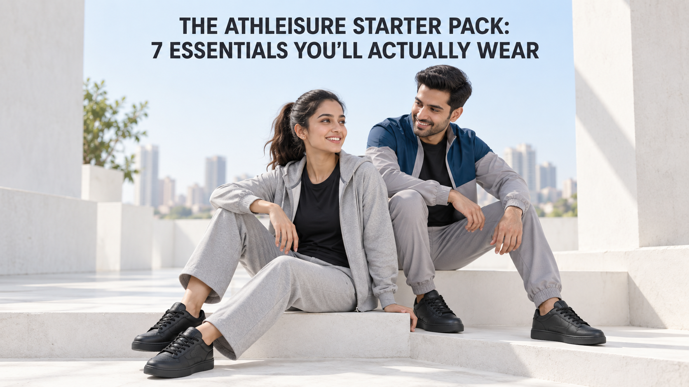
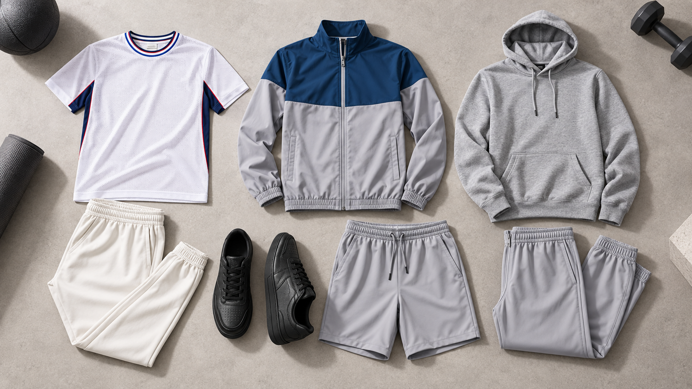

Meta Title: Athleisure Starter Pack: 7 Everyday Essentials | OFFLIMITS

Meta Description: Build an athleisure starter pack with seven OFFLIMITS essentials that work for training, travel, errands and easy weekends.

# The Athleisure Starter Pack: 7 Essentials You’ll Actually Wear



You do not need a new personality—or a matching set in every colour—to dress athleisure-first. You need a small rotation that survives the question every good purchase gets asked: “Will I reach for this on a regular Tuesday?”

Here is the familiar conversation. “I want gym clothes that look put together outside the gym.” “Great—what will you wear for a walk, a quick coffee, a long commute and a lazy Sunday?” If the answer is a different outfit for each, the wardrobe is doing too much. An **athleisure starter pack** works when its pieces can be re-used, re-layered and worn without a plan.

This guide builds that pack around seven practical essentials from the OFFLIMITS world: a base top, two dependable bottoms, a layer, an easy set, warm-weather shorts and sneakers that finish the look. Start with the pieces that match your actual week; add the rest only when you feel a real gap.

## Quick answer: what belongs in an athleisure starter pack?

Start with a clean tee, joggers, a track jacket, a coordinated tracksuit, a hoodie or sweatshirt, shorts and a versatile sneaker. The point is not to wear all seven at once. It is to own a compact set that can handle movement, travel, errands and time off with small changes in proportion and layering.

Before buying, give each item a three-situation test: can it work for movement, casual plans and a travel/commute day? If it earns two of those answers, it belongs in the rotation.

## 1. A clean performance tee is the base layer you keep repeating

Every useful athleisure outfit starts somewhere simple. A plain or considered graphic tee gives you the most combinations with the least styling effort: joggers for a walk, shorts for a warm session, or a track jacket over the top when you want a little structure.

The [Men’s Titan T-Shirt](https://offlimits.co.in/products/mens-titan-t-shirt-otm-351-03) is a practical reference point for this role: it is a tee, so it can stay the quiet base while the rest of the outfit changes. Keep the fit easy enough to move in, then let the bottom decide the mood. A darker jogger makes it feel more street-ready; shorts make it feel lighter and more training-led.

One small rule helps: choose the tee you will happily wear with non-gym clothes too. That is how it avoids becoming a shirt that only leaves the wardrobe for an hour.

## 2. Joggers or track pants do the everyday heavy lifting

If you are choosing one bottom first, make it a pair you can wear for more than a workout. [OFFLIMITS men’s joggers and track pants](https://offlimits.co.in/collections/men-joggers-track-pants) are positioned for workouts, travel and everyday wear—exactly the crossover a starter pack needs.

Think of them as the answer to “I want to be comfortable, but I do not want to look like I forgot to get dressed.” Pair them with the tee for errands. Add sneakers and a jacket for a journey. Swap in a sweatshirt when the day cools down. A closer, tidier silhouette usually makes a relaxed top feel intentional; a roomier pant works nicely with a cleaner tee.

This is also a good place to avoid buying three almost-identical pairs. Wear one, learn whether you want a lighter fabric, a different fit or a second colour, and then build from experience.

## 3. A zip track jacket gives a simple outfit a finished shape

The layer is what makes a tee-and-jogger combination feel ready to leave the house. It is also useful on the way to and from training, in an over-air-conditioned cab or when the weather changes faster than your plans.

The [Men’s Sonic Tracksuit](https://offlimits.co.in/products/mens-sonic-track-suit-otm-341-02) provides a useful template: a full-sleeve, cut-and-sew tracksuit in a light-grey and A Force colourway. Wear the jacket closed when you want the coordinated look, or open over a black tee for a more casual break-up of colour. The set includes a polyester-spandex construction and Wicktech treatment, so it keeps the performance detail close to the purpose rather than turning it into a slogan.

The best use of a jacket in this pack is simple: it should earn its place both on and off. If it only works when you are already in full gym kit, it is not doing enough.

## 4. A coordinated tracksuit removes the “what goes with this?” problem

There is a reason sets stay in rotation: they make getting dressed faster. When the colour and shape are already handled, all you need to decide is the tee and sneaker. That makes a tracksuit particularly useful for early starts, travel days and weekends when you want to look considered without building an outfit from scratch.

For a women’s option, the [Women Glaze Tracksuit](https://offlimits.co.in/products/women-glaze-tracksuit-grey-melange-otw-155-01) comes in Grey Melange. For a broader starting point, browse [OFFLIMITS women’s tracksuits](https://offlimits.co.in/collections/women-track-suits) or [men’s tracksuits](https://offlimits.co.in/collections/men-track-suits) according to the fit and colour family you will genuinely repeat.

Wear the set together first. Later, split it: wear the top with another bottom, or the pant with a tee and sneaker. That is the starter-pack trick—one purchase should create more than one easy outfit.



## 5. A hoodie or sweatshirt gives your rotation a softer layer

Some days call for a zip jacket; others call for the pull-on ease of a hoodie or sweatshirt. This is the piece that makes the pack feel comfortable enough for a slow morning, a late commute or an evening walk.

Keep the rest of the outfit uncomplicated: hoodie plus joggers plus clean sneakers is enough. If your bottom has a looser fit, choose a sweatshirt that does not add unnecessary bulk. If your tee is more fitted, a relaxed outer layer can create balance. [OFFLIMITS apparel](https://offlimits.co.in/collections/all-apparels) is the right place to compare the broader clothing range before deciding whether your first layer should be a hoodie, sweatshirt or another track top.

You do not need to force a hoodie into a serious workout. In this starter pack, its job is coverage, comfort and repeat wear.

## 6. Shorts make the pack usable when the day is warm

An athleisure wardrobe that only works with full-length bottoms is not very flexible. A pair of [OFFLIMITS men’s sports shorts](https://offlimits.co.in/collections/men-shorts) gives you the easy warm-weather option for training, walking and casual time outdoors.

The formula is straightforward: tee, shorts, sneakers. Bring the track jacket along instead of wearing it from the start, and you have an outfit that adapts once you are indoors or the day stretches past the workout. A clean tee and a simple sneaker keep shorts from looking like a single-purpose kit.

For a compact wardrobe, that matters more than owning lots of variants. The most useful short is the one you are happy to put on before you have decided exactly where the day is going.

## 7. Lifestyle sneakers are the finishing piece

Athleisure can look almost right until the footwear pulls it in another direction. A lifestyle sneaker gives the tee, jogger, track jacket and set a common landing point. It is why a practical outfit can still feel complete for a café, a local errand or travel.

The [Bomba Black/Black sneaker](https://offlimits.co.in/products/bomba-black-black-ocm-793-02) is a black lace-up lifestyle option with a synthetic upper, TPR sole and EVA insock listed on its product page. That neutral black finish makes it easier to pair with grey, black and colour-blocked clothing. For more outfit ideas, the OFFLIMITS guide on [styling sneakers for men and women](https://offlimits.co.in/blogs/blogs/the-ultimate-guide-to-styling-sneakers-for-men-and-women) is a useful next read.

Reserve your specialist footwear for the sport it is made for. A starter-pack sneaker should be the pair that helps your everyday outfits feel connected, not a stand-in for every workout requirement.

## Three no-fuss outfits from the seven pieces

- **The grab-and-go day:** clean tee + joggers + Bomba sneakers. Add the track jacket when you want more coverage.
- **The warm-session plan:** clean tee + shorts + sneakers. Carry the jacket for the commute home.
- **The easy weekend set:** tracksuit + a simple tee + sneakers. Separate the set later for more outfit combinations.

If you want more ideas for the set itself, read [why tracksuits are an everyday essential](https://offlimits.co.in/blogs/blogs/why-tracksuits-are-the-ultimate-everyday-essential). The useful takeaway is not that every day needs a matching set; it is that a good one gives you a reliable starting point.

## How to build the pack without buying everything at once

Start with three: a tee, a bottom and a sneaker. Wear that combination for a couple of weeks. Then ask a specific question: am I missing a layer, a warm-weather bottom or an outfit I can put on without thinking? Your answer tells you what to add next.

That is more useful than a huge haul because it is based on your routine. A starter pack is supposed to lower friction, not create new decisions every morning.

## Final thoughts

The most wearable **athleisure essentials** are not the loudest pieces in the wardrobe. They are the ones that let you move through an ordinary day with fewer changes: a tee you can repeat, a bottom that travels well, a layer for coverage, a set for speed, shorts for warmer plans and sneakers that bring it together. Build from the part of that list you will use this week, then keep going.

Ready to put together your own rotation? Explore the [OFFLIMITS apparel collection](https://offlimits.co.in/collections/all-apparels) and choose the first piece that solves an actual gap in your day.

## FAQs

### What are the essential pieces in an athleisure starter pack?

Start with a tee, joggers or track pants, a track jacket, a coordinated tracksuit, a hoodie or sweatshirt, shorts and versatile sneakers. You can begin with only three of them and add based on what you repeatedly need.

### How many athleisure pieces should I buy first?

Three is enough to start: one top, one bottom and one sneaker. Add a layer or a second bottom once you know what your weekly routine asks for.

### Can a tracksuit be worn as separates?

Yes. Wear the jacket or top with another bottom, and pair the track pant with a different tee. That creates more outfit combinations from the same starting set.

### Are joggers good for everyday wear?

They can be a strong everyday choice when the fit works with the rest of your wardrobe. Pair them with a clean tee, a simple layer and sneakers to keep the outfit easy and intentional.

### What shoes work with athleisure outfits?

A neutral lifestyle sneaker is a versatile place to start because it can work with tees, joggers, tracksuits and shorts. Choose sport-specific shoes separately when your workout has its own footwear needs.

## FAQ JSON-LD

```json
{
  "@context": "https://schema.org",
  "@type": "FAQPage",
  "mainEntity": [
    {"@type":"Question","name":"What are the essential pieces in an athleisure starter pack?","acceptedAnswer":{"@type":"Answer","text":"Start with a tee, joggers or track pants, a track jacket, a coordinated tracksuit, a hoodie or sweatshirt, shorts and versatile sneakers. Begin with only three and add based on what you repeatedly need."}},
    {"@type":"Question","name":"How many athleisure pieces should I buy first?","acceptedAnswer":{"@type":"Answer","text":"Three is enough to start: one top, one bottom and one sneaker. Add a layer or a second bottom once you know what your weekly routine asks for."}},
    {"@type":"Question","name":"Can a tracksuit be worn as separates?","acceptedAnswer":{"@type":"Answer","text":"Yes. Wear the jacket or top with another bottom, and pair the track pant with a different tee to create more combinations."}},
    {"@type":"Question","name":"Are joggers good for everyday wear?","acceptedAnswer":{"@type":"Answer","text":"They can be a strong everyday choice when the fit works with the rest of your wardrobe. Pair them with a clean tee, a simple layer and sneakers."}},
    {"@type":"Question","name":"What shoes work with athleisure outfits?","acceptedAnswer":{"@type":"Answer","text":"A neutral lifestyle sneaker is a versatile place to start because it can work with tees, joggers, tracksuits and shorts. Choose sport-specific shoes separately when your workout has its own footwear needs."}}
  ]
}
```

## Image metadata

| Image | Suggested filename | Alt text | Placement |
|---|---|---|---|
| Hero | `offlimits-athleisure-starter-pack-hero.png` | Two people wearing everyday athleisure, with the title The Athleisure Starter Pack: 7 Essentials You’ll Actually Wear | Below H1 |
| Inline | `offlimits-athleisure-starter-pack-essentials.png` | Flat lay of a tee, jacket, hoodie, joggers, shorts and black sneakers for an athleisure starter pack | After essential 4 |

## Keywords used

- **Primary:** athleisure essentials
- **Secondary:** athleisure starter pack; athleisure wardrobe essentials; everyday athleisure outfits; athleisure wear in India
- **Supporting:** joggers for everyday wear; tracksuits for daily wear; lifestyle sneakers; how to build an athleisure wardrobe

Keyword metrics were not included because Google Ads Keyword Planner is not configured for this workspace and OFFLIMITS Search Console data is not connected. The phrases were selected from the topic, the live SERP language and verified OFFLIMITS category/product terminology.
