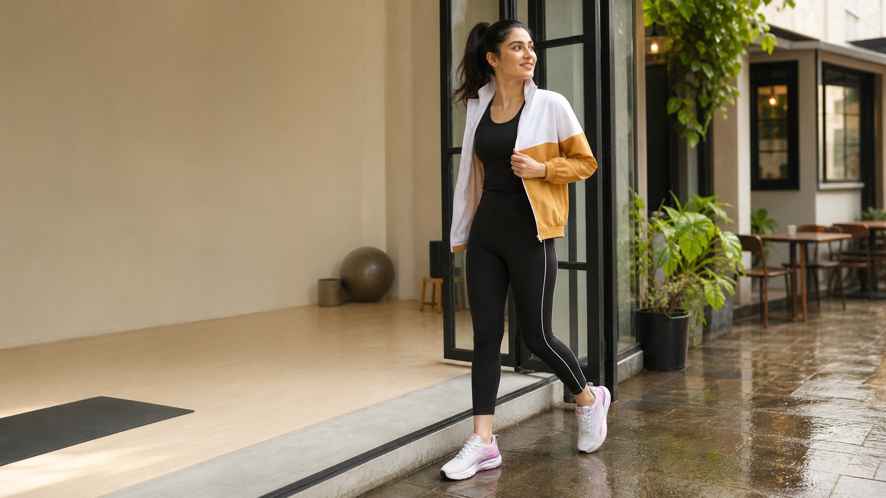
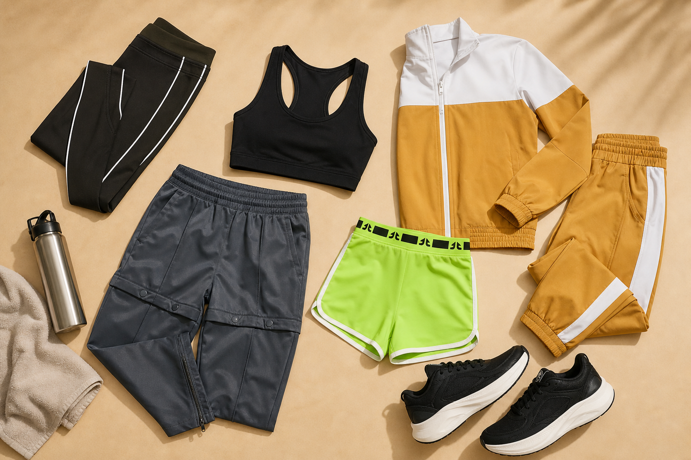

# Women's Athleisure in India: How to Build a Capsule Workout-to-Weekend Wardrobe

You know the outfit problem: your morning starts with a workout, your afternoon disappears into errands, and someone suggests coffee before you have time to change. The solution is not a cupboard full of “maybe” activewear. It is a small group of pieces that can handle the session you actually do and still feel like you once the workout is over.

This guide will help you build a practical women's athleisure capsule wardrobe for life in India—starting with movement, then adding the pieces that make the same outfit work for the rest of your day.

## First, what does your week really look like?

Before you buy another pair of tights, look at your calendar. Are you lifting three mornings a week? Walking most evenings? Taking a yoga class on Saturday and meeting friends afterwards? Your capsule should reflect that routine—not an imaginary one.

Try this quick split:

- **Workout time:** note your two most common activities and what they demand from your clothes.
- **In-between time:** think about the commute, school run, grocery stop or work-from-café hour that often sits around the workout.
- **Weekend time:** list the low-key plans for which comfort matters, but you still want a considered outfit.

Now you have a buying filter. Each piece should earn its place in at least two of those three parts of your week. If it only works for one very specific plan, it probably is not a capsule piece.

## The seven-piece workout-to-weekend capsule

Think in outfit jobs, not shopping categories. A useful starting capsule has two workout bottoms, one relaxed bottom, two upper-body basics, one layer and one pair of shoes. That is enough variety for repeat wear without turning getting dressed into a daily puzzle.

### 1. Cropped tights for training days

Start with the bottom you will reach for most. OFFLIMITS [**Core Cropped Tights**](https://offlimits.co.in/products/core-cropped-tights-obw-433-02) are a sensible anchor for gym sessions, yoga and walks. The black colour and white side piping are easy to repeat, while the cropped cut keeps the silhouette clean with trainers or an open jacket. The current product page lists a 90% polyester and 10% spandex blend, an elasticated closure and Wicktech.

What does that mean in the wardrobe? These are your movement-first bottoms. Wear them with a fitted training tank for class, then add a relaxed jacket when you leave. Because the palette is simple, you are not locked into one matching set.

### 2. Shorts for hot, high-movement sessions

Indian heat can make full-length bottoms feel like work before the workout even begins. The lime-punch [**Sprint 07 Shorts**](https://offlimits.co.in/products/sprint-07-shorts-obw-474-01) give your capsule a brighter training option. OFFLIMITS lists a 90% polyester and 10% spandex blend and Wicktech for this style.

Let the colour do the talking: pair the shorts with a plain black tank and neutral shoes. After the session, pull on the co-ord jacket rather than adding another loud piece. That one styling choice takes the look from gym-only to intentional.

### 3. A relaxed bottom for recovery and weekends

Here is the piece that gives the capsule range. The grey [**Transform Cargo Pants**](https://offlimits.co.in/products/transform-cargo-pants-obw-464-01) bring a less fitted shape into a wardrobe built around active basics. The product page describes them as mid-rise, with a cord closure and a 55% polyester and 45% cotton fabric blend.

They are the answer for travel, errands, relaxed walks and post-workout plans when you do not want to stay in tights. Style them with a close-fitting tee so the volume feels balanced. For a weekend lunch, keep the same base and add small earrings or a crossbody bag. The clothes stay comfortable; the finish changes.

### 4. One fitted performance base

Choose a fitted tank or tee that stays comfortable while you bend, stretch and lift. Black is the easiest capsule colour because it works with the Core Cropped Tights, Sprint 07 Shorts and Transform Cargo Pants.

Do the fitting-room test, even when you shop online: raise your arms, twist, sit and check the length. A tee that constantly needs pulling down will not become the reliable base layer you need. For sweaty sessions, look for a product page that explicitly names a moisture-management technology such as OFFLIMITS Wicktech; do not assume every polyester tee has the same feature.

### 5. One relaxed tee

Your second upper-body basic has a different job. It should give you space after a workout and look natural with relaxed trousers. Pick a solid or restrained graphic tee in a colour already present in your capsule—black, white, grey or a tone borrowed from your jacket.

Wear it loose over the cropped tights for the journey home, or half-tuck it into the Transform Cargo Pants for a weekend outfit. If you want more ways to use this layer, OFFLIMITS' guide to [styling graphic tees for women](https://offlimits.co.in/blogs/blogs/how-to-style-graphic-tees-for-women-trendy-tips-for-every-look) offers a natural next read.

### 6. A light layer that can finish the outfit

A layer is the switch between “I just trained” and “I am dressed for the day.” The [**Laidback Co-ord Set in Mustard/White**](https://offlimits.co.in/products/laidback-co-ord-set-mustard-white-otw-440-02) is useful because its jacket and trousers can work together or separately. OFFLIMITS lists a zip closure, high neck, pockets and a 90% polyester and 10% spandex fabric blend.

Use the jacket open over tights and a tank after a studio session. Zip it partway for an evening walk, or wear the full co-ord when you want one decision instead of three. The mustard colour adds personality, while the white panels still connect easily with neutral trainers.

### 7. Shoes chosen for the workout—not just the mirror

Finish the capsule from the ground up. If your week combines running and gym training, choose a shoe whose product page is built for those uses. OFFLIMITS describes [**Gladiator For Her in Off White/Pink**](https://offlimits.co.in/products/gladiator-for-her-off-white-pink-orw-678-03) as a lace-up running and gym shoe with a Flyknit upper, Phylon/TPR sole and memory-foam insole. The pale colour works smoothly with black tights and the mustard co-ord.

Prefer a darker shoe? [**Pulse X For Her in Black/Dark Grey**](https://offlimits.co.in/products/pulse-x-for-her-black-dk-grey-orw-887-02) is another running-and-gym option. Its product page lists a mesh upper, Phylon/TPR sole and PU-moulded insock. It makes visual sense with the black tights and grey cargo pants, so it can cover both training and casual miles. If you are still deciding which construction fits your routine, compare the [difference between running and gym shoes](https://offlimits.co.in/blogs/blogs/running-vs-gym-shoes-uncover-the-difference-between-running-vs-gym-shoes) before choosing.

Try shoes with the socks you normally train in, and leave enough room for your toes to move. Fit is personal; the colourway is only useful if the shoe feels right for your foot and your routine.

## Your capsule at a glance

| Piece | Workout role | Weekend move | OFFLIMITS starting point |
|---|---|---|---|
| Cropped tights | Gym, yoga, walks | Add an open jacket | Core Cropped Tights |
| Training shorts | Hot or high-movement sessions | Pair with a neutral tank | Sprint 07 Shorts |
| Relaxed bottom | Recovery and low-intensity days | Add a fitted tee and small accessories | Transform Cargo Pants |
| Fitted base | Secure layer for movement | Wear under a jacket | Black performance tank or tee |
| Relaxed tee | Warm-up and travel layer | Half-tuck into cargos | Neutral solid or restrained graphic tee |
| Jacket/co-ord | Warm-up, commute and layering | Wear as a full matching look | Laidback Co-ord Set |
| Running/gym shoes | Support the activity they are made for | Repeat with neutral bottoms | Gladiator For Her or Pulse X For Her |

## Five outfits from the same small wardrobe

Once the seven pieces are chosen, the fun part is seeing how little you need to change.

**Monday strength session:** fitted black tank + Core Cropped Tights + Pulse X For Her.

**Wednesday walk and grocery stop:** relaxed tee + Transform Cargo Pants + Pulse X For Her.

**Friday quick workout, then coffee:** fitted tank + Sprint 07 Shorts + Laidback jacket + Gladiator For Her.

**Saturday errands:** relaxed tee + Core Cropped Tights + Laidback jacket worn open + Gladiator For Her.

**Sunday travel or recovery day:** the full Laidback Co-ord Set + fitted tank + the shoe that fits you more comfortably.

Notice what changes the mood: silhouette, colour balance and the outer layer. You do not need a completely new outfit for every plan.

## How to make the capsule work in Indian weather

Heat and humidity make fabric choice more noticeable. For sweat-heavy sessions, prioritise pieces whose descriptions explicitly mention moisture management, then change out of damp clothing when the workout is done. A breathable-feeling outfit is helpful, but care still matters: air pieces before they enter the laundry basket and follow the wash label so stretch and shape last.

During the monsoon, a zip layer is useful for moving between humid streets and air-conditioned spaces. It is not the same as rain protection. Carry a compact umbrella, and let wet shoes dry naturally away from direct heat. In cooler months, the same jacket becomes a warm-up layer; in peak summer, it can stay in your bag until you enter a cold indoor space.

## Buy in the right order

You do not have to build all seven pieces in one go. Start with the item that solves the biggest problem.

If you train most days, begin with the Core Cropped Tights and the shoe that suits your activity and fit. Add the fitted tank next. If your priority is a wardrobe that crosses into everyday plans, start with the Transform Cargo Pants, a neutral tee and the Laidback jacket. Bring in the Sprint 07 Shorts when the heat or your training style calls for them.

Use a simple rule before checkout: can you make three outfits with this item using what you already own? If the answer is yes, it belongs in the capsule conversation.

## Frequently asked questions

### How many pieces should an activewear capsule wardrobe have?

Seven is a useful starting point, not a fixed rule. Two workout bottoms, one relaxed bottom, two upper-body basics, one layer and one pair of shoes cover several common routines. Add a second pair of shoes or another training tee when your workout frequency genuinely requires it.

### Can athleisure work for both the gym and casual plans?

Yes—when each outfit starts with the workout. Choose the bottom and shoes for the activity first, then use a relaxed tee, jacket or co-ord layer to change the look afterwards.

### Which colours are easiest for a women's athleisure capsule?

Black, grey and white are easy anchors because they repeat without demanding an exact match. Add one accent colour, such as mustard or lime, to keep the wardrobe lively. Repeating that accent once elsewhere in the outfit makes it feel deliberate.

### Should I choose tights or joggers for an athleisure capsule?

Choose both only if they serve different parts of your week. Tights are the movement-first option for workouts; joggers or relaxed cargo pants bring ease and a different silhouette to recovery, travel and weekend dressing.

## One wardrobe, fewer outfit negotiations

A useful capsule is not about wearing less for the sake of it. It is about owning pieces that know their jobs. Start with the way you move, pick shoes and bottoms for that activity, then add a neutral tee and a layer that can carry the look into the rest of your day.

With Core Cropped Tights, Sprint 07 Shorts, Transform Cargo Pants, the Laidback Co-ord and the right OFFLIMITS shoe in rotation, workout-to-weekend dressing becomes simpler: fewer abandoned purchases, more repeatable combinations and less time asking, “What do I wear now?”

**Ready to build yours? Explore [OFFLIMITS women's gym and training styles](https://offlimits.co.in/collections/women-gym-training), then choose the pieces that match the week you actually live.**

---

## SEO handoff

**SEO title:** Women's Athleisure in India: A 7-Piece Capsule Wardrobe

**Meta description:** Build a seven-piece women's athleisure capsule for workouts, errands and weekends in India, with practical outfit formulas and OFFLIMITS picks.

**Suggested slug:** `/blogs/womens-athleisure-india-capsule-wardrobe`

**Primary keyword used:** women's athleisure in India

**Secondary keywords used:** women's activewear capsule wardrobe; capsule wardrobe for women; workout-to-weekend wardrobe; gym wear for women; women's athleisure wardrobe; activewear for women in India; women's workout clothes; athleisure outfits for women

**Long-tail keywords used:** how to build an activewear capsule wardrobe; gym-to-casual outfits for women; how many pieces should an activewear capsule wardrobe have; tights or joggers for an athleisure capsule

**Keyword note:** Search-volume and difficulty metrics were not available from a connected first-party SEO data source for this run. The terms were selected for intent alignment and natural topical coverage; validate volumes in the team's keyword platform before final publication targeting.

## Product sources

- [Core Cropped Tights](https://offlimits.co.in/products/core-cropped-tights-obw-433-02)
- [Sprint 07 Shorts](https://offlimits.co.in/products/sprint-07-shorts-obw-474-01)
- [Transform Cargo Pants](https://offlimits.co.in/products/transform-cargo-pants-obw-464-01)
- [Laidback Co-ord Set – Mustard/White](https://offlimits.co.in/products/laidback-co-ord-set-mustard-white-otw-440-02)
- [Gladiator For Her – Off White/Pink](https://offlimits.co.in/products/gladiator-for-her-off-white-pink-orw-678-03)
- [Pulse X For Her – Black/Dark Grey](https://offlimits.co.in/products/pulse-x-for-her-black-dk-grey-orw-887-02)
