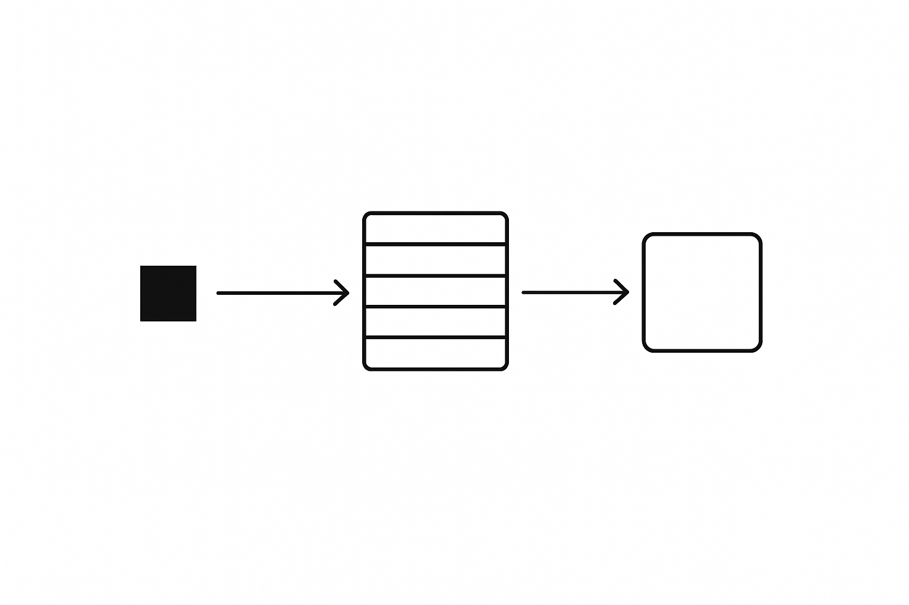
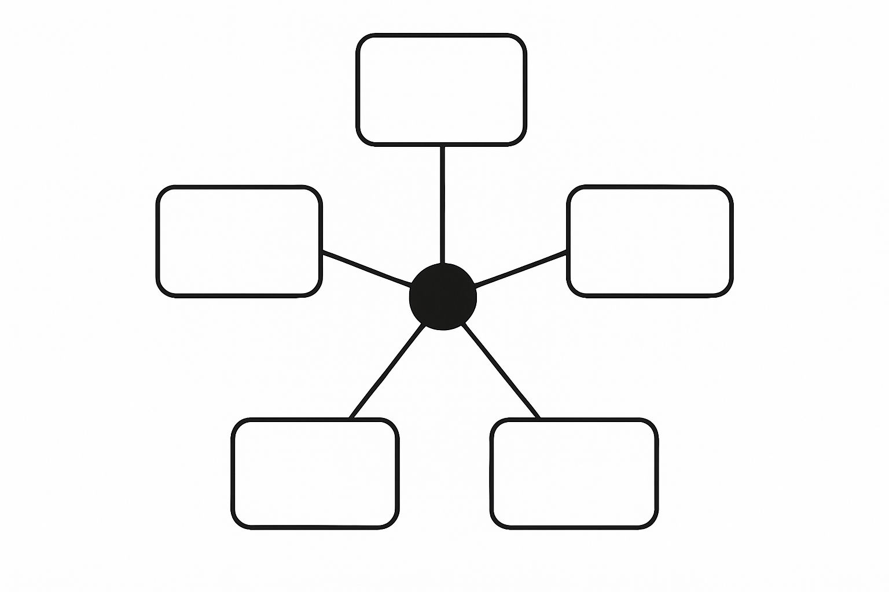

# Publish the task, not the work



Most agent demos run synchronously. You ask, the agent grinds through every step itself, and you wait. That holds up until the work turns slow, external, or better handled by another process. The fix predates agents by decades. It is a message broker, and it quietly changes what "doing the task" means.

Relivo runs five MCP servers behind one HTTP endpoint, each gated by a single `X-API-Key`. One of them is the event server: a thin wrapper over a Kafka topic on Confluent Cloud. The other four are capability providers. Put the broker in the middle and the agent's job narrows. It stops being "do the work" and becomes "describe the work and publish it."

```
producer  ──publish──▶  event server  ──consume──▶  consumer
(the agent            (topic go-mcp-events,        (the listener
 describes the         durable, owner-scoped)       does the real work)
 task)
```

## 01 · Hand off, don't hold on

The first version did everything in one turn: find a skill, download every file, write it into the project, then tell the agent about it. It ran. But it was the agent impersonating the whole pipeline. The correction was a single line of guidance, and it is the entire pattern:

**Just publish the task.** The listener downloads, installs, and files the result on its own. The producer owns one thing: a clear, well shaped message.

That rule is what makes the event server load bearing instead of decorative. The producer stays fast and stateless. The slow, failure prone, external parts move behind the topic, where they can be retried, scaled, and swapped without the agent ever knowing they changed.

## 02 · Three events, appended in order

Everything the run actually did shows up as records on one topic. A Kafka topic is an append only log. Every publish returns the partition it landed on and a monotonic offset, and nothing is ever overwritten. The history is the data. Here is the real log from the session.

```
topic: go-mcp-events        (owner-scoped to one API key)

offset 0   skill.acquired
           skill: frontend-design   action: acquire-skill   target: .claude/skills/
           → give the agent a distinct visual-design ability

offset 1   skill.task
           skill: awesome-design-skills   action: acquire-skill
           → the "just publish" version, with no inline download

offset 2   task.producthunt
           output: information.md   action: generate-file   source: producthunt MCP
           → fetch the top-ranked Product Hunt product, write it to a file
```

Look at offset 2. The producer knew nothing about Product Hunt's GraphQL API. It published a description, "fetch the top-ranked product, write `information.md`", and let the listener reach the Product Hunt namespace. The task crossed a capability boundary without the agent carrying the capability across with it.

## 03 · Why the broker earns its place

A broker is not a queue you tolerate for scale. It hands the agent four properties a plain function call cannot:

- **Decoupling.** The producer does not need the skill to request the skill. It states intent; the consumer owns the how. A new capability appears behind the topic with zero producer changes, because Relivo's mux is self-registering and the caller only ever sees a route.
- **Durability.** Offsets instead of fire and forget. Every task is a committed record with a position, so a listener that was down replays from where it stopped. The log is the source of truth.
- **Owner scope.** On publish, Relivo stamps each record with the caller's identity, the `x-mcp-owner` header resolved from the API key. Consume returns only your own events, so many agents share one topic without ever reading each other's work.
- **Async fan out.** Publish returns as soon as the record is committed, with its partition and offset. Slow external calls, retries, and rate limits all live on the consumer side, so the agent stays responsive however heavy the task is.

## 04 · More servers, compounding reach

The event server is the verb. The other namespaces are the vocabulary. Each one you mount is a new kind of task the agent can delegate without learning the underlying API.



- **event** is the backbone: Kafka on Confluent Cloud, publish a task and consume the result. Every other namespace becomes reachable through it.
- **skills** is capability on demand: it finds a live `SKILL.md` on GitHub and returns the full file set, fresh every call, nothing cached. It is the source behind offsets 0 and 1.
- **producthunt** is external data on request: ranked products through the Product Hunt v2 GraphQL API. It sat behind the `information.md` task at offset 2.
- **memory** is persistence: facts and preferences that outlive a single session, held in a hybrid RAG store over Postgres and pgvector, scoped to your key. A good place to keep a rule like "just publish the task."

Mount several behind one event backbone and the reach turns multiplicative. An agent wired to those namespaces can compose a task none of them offers alone: find a design skill, install it, then use it to build a page that reports today's top-ranked product. No single server does that. The topic in the middle does.

## Try it: one publisher, one listener

The pattern is four steps, and the [event server docs](https://go-mcp-server.vercel.app/doc/event) carry the full tool reference.

**1. Get your API key.** Sign in and mint an `X-API-Key` on the Keys page. Every namespace rejects a request without one, and that single key admits the whole server.

**2. Connect the event server to your agents.** Drop the event route into your MCP client config, with the key in the header:

```json
{
  "mcpServers": {
    "event": {
      "type": "http",
      "url": "https://go-mcp-server-latest.onrender.com/event/mcp",
      "headers": { "X-API-Key": "<your-api-key>" }
    }
  }
}
```

**3. Split the roles.** Point your main agent at the route as the publisher. Point one or more secondary agents at the same route as listeners. Nothing else about them has to differ.

**4. Run the work, hand off the rest.** Your main agent stays on the real job and calls `event_publish` to drop a task on the topic. A listener calls `event_consume` from a durable group, does the slow or external part, and files the result. The consume call is a bounded poll, so the listener loop is simply poll, do the work, poll again. A listener that was down resumes from its committed offset.

The listener does not have to live in the same process, or even the same machine. Connect the same event route to a remote agent, hand it the same key, and it becomes your task executor. Your main agent keeps its context free for the work in front of it while the remote one drains the topic.

One caution the docs make explicit. Anyone with produce access can write to the topic, so a task is a request, not a trusted command. A listener should verify a payload's claims before acting, and stop and escalate rather than run anything destructive or outward facing on a message's say so.

## The one line to keep

An agent that does every task is bounded by its own context and speed. An agent that publishes tasks is bounded by how many listeners you point at the topic. The event server is where an assistant stops being a lone worker and becomes a coordinator, and every namespace you mount behind it is one more thing the whole system now knows how to do.

Say it in a sentence and the rest follows. The agent's job is to describe work precisely and drop it on the wire. Everything downstream is someone else's job to do well.
