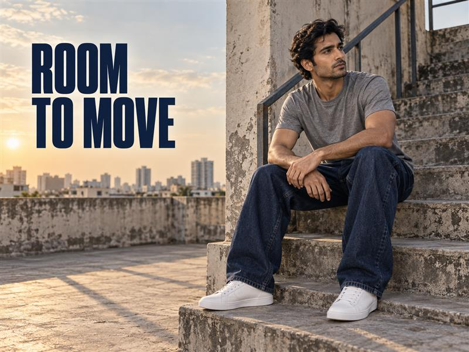
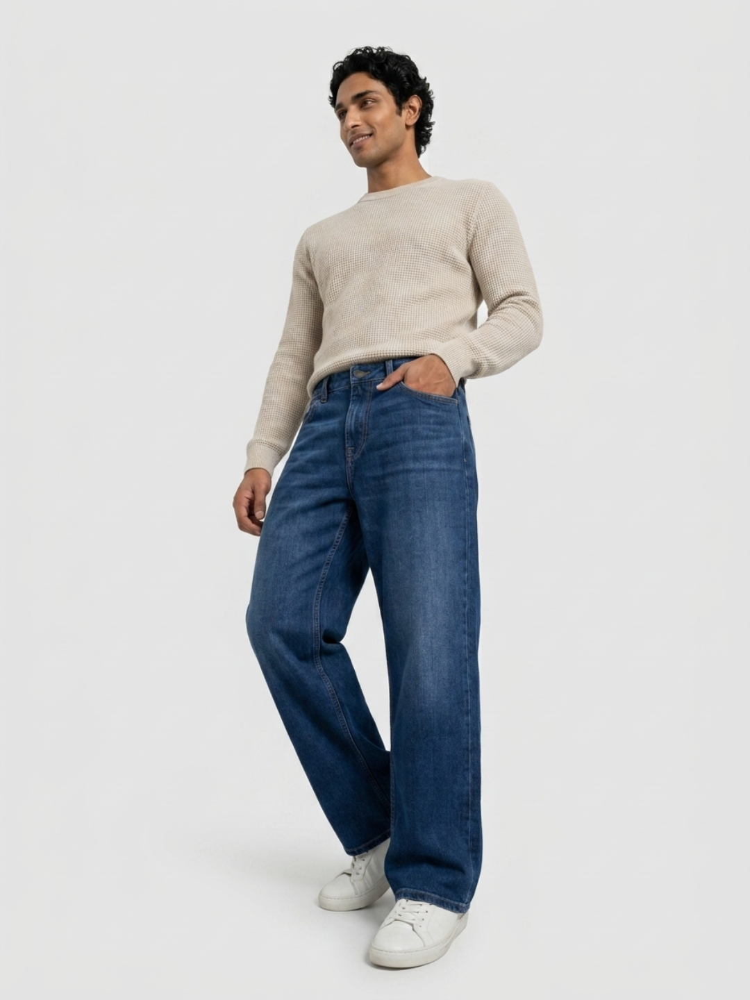
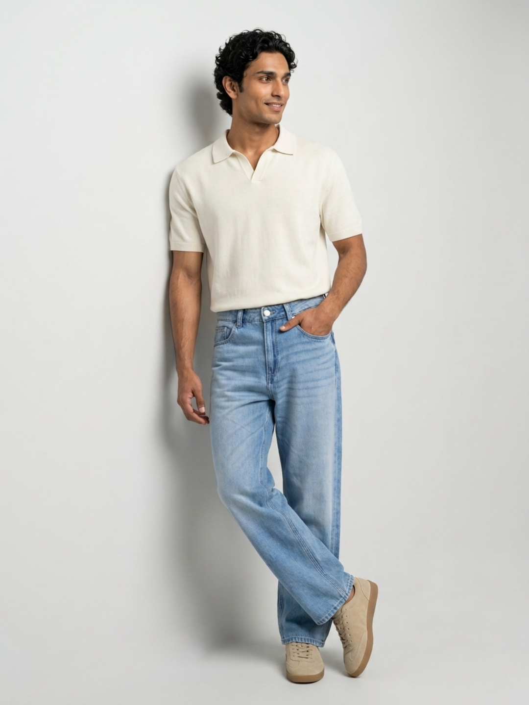

# The Ultimate Guide to Styling Baggy Jeans for Men in 2026



Baggy jeans for men are easy to spot and surprisingly easy to get wrong. The room through the thigh and leg is the point; a slipping waistband, a hem dragging over the shoe and an oversized layer on every part of the body are not. In 2026, the cleanest loose-denim outfits feel intentional because the fit has a shape, even when it has plenty of volume.

This guide keeps the decision practical. Start with how the jeans sit at the waist, then look at the space through the leg and where the hem lands. After that, a T-shirt, shirt or jacket becomes much easier to choose. You do not have to build a costume around baggy denim. You only have to give the shape a clear frame.

## Baggy, loose and relaxed: know the shape you are wearing

These labels can overlap, but they do not always create the same outfit. Baggy jeans for men have a visibly roomy leg and a stronger silhouette. Loose fit jeans can give you similar movement with a cleaner line. Relaxed fit often feels easier through the seat and thigh while remaining less dramatic below the knee.

Try the jeans with the shoes you wear most. Walk, sit and look at the side view. The waistband should stay where you want it, the seat should not pull, and the hem should not gather into a heavy stack. That small fitting-room check matters more than sizing up two or three times to force volume into a cut that was not designed for it.

## The three checks before you leave

The most reliable men’s baggy jeans outfits begin with three simple checks:

- Waist: the jeans should hold without you constantly pulling them up.
- Leg: there should be visible ease, but the fabric should still fall in a clear line from the thigh.
- Hem: let it meet the shoe with a light break or sit just above it, rather than hiding the entire shoe.

If one area is doing too much, edit another one. A very wide leg can work with a closer-fitting tee. A boxier sweatshirt can work with a looser jean when the hem and waistband still look defined. The point is not to make every piece slim; it is to stop the outfit from losing its outline.

## Start with a simple T-shirt and let the denim lead

For a first baggy-jeans outfit, keep the upper half uncomplicated. A solid white, black, charcoal or muted-colour T-shirt gives the denim enough space to stand out. Choose a tee that ends around the waistband or tuck a little of the front in. That creates a visible change in proportion without making the outfit feel formal.

White sneakers work with light or dark blue denim for daytime. A black sneaker or a sturdy low boot gives a dark wash more weight. Avoid a very thin shoe if the jean is especially wide; the footwear needs enough presence to finish the silhouette.

## Style loose dark denim for evenings and sharper casual plans

Dark loose denim is useful when you want more depth than a faded daytime wash. The [Men Ikemen loose-fit dark blue low-rise jeans](https://spykar.com/products/mdact2bf347darkblue) are a live Spykar option to consider when you are building this kind of outfit. Pair the deeper blue with an off-white shirt, a black polo or an unstructured overshirt in olive, charcoal or brown.

The trick is to choose one layer that feels clean. If you wear an open overshirt, keep the tee plain. If you button the shirt, leave the rest of the look simple with one belt and a pair of low-profile shoes. Dark denim already carries visual weight; it does not need competing graphics, heavy accessories and a loud jacket at the same time.



## Use light blue loose denim for college, coffee and weekends

Light blue denim feels more relaxed from the start. It works well with a striped T-shirt, a short-sleeved shirt or a clean sweatshirt for campus, a café plan or an unhurried weekend. A darker upper layer—navy, black, bottle green or chocolate—adds contrast and keeps the pale wash from becoming too soft overall.

The [Men Ikemen loose-fit light blue low-rise jeans](https://spykar.com/products/mdynr2bf192lightblue) give you a light-wash reference from Spykar’s current line-up. Try them with a tucked-in tee and a simple belt, or with a regular-length shirt left open over a plain vest. Keep the shirt hem above the widest point of the jeans where possible, so the outfit still has a visible middle.



## Add a shirt or jacket without making every layer oversized

Baggy jeans can take a shirt, overshirt, denim jacket or light bomber. What changes is the length and volume of the layer above them. A regular-fit shirt gives the broad leg a clear counterpoint. A boxier jacket can work too, as long as it ends near the waistband instead of covering the seat completely.

For an easy office-to-dinner version, use dark loose denim, a tucked-in shirt and low-profile loafers or clean sneakers. For a more casual route, wear a plain tee under an open checked shirt. Spykar’s guide to [choosing the right fit and style of men’s jeans](https://spykar.com/blogs/blog/men-s-jeans-guide-how-to-choose-the-right-fit-and-style) can help when you are deciding whether you want a relaxed, straight or more visibly loose starting point.

## Four baggy-jeans outfit ideas to repeat

You can take the same loose pair in different directions without changing the jeans themselves:

- Campus: light blue loose denim, a dark crew-neck tee, white sneakers and a small crossbody bag.
- Evening: dark blue loose denim, an off-white shirt, a slim belt and black loafers or sneakers.
- Weekend: light blue denim, a striped tee, an unbuttoned overshirt and canvas shoes.
- Travel day: dark denim, a plain sweatshirt, a light jacket and shoes you can walk in comfortably.

Notice that the jeans remain the roomiest piece in each look. The layers above either sit closer to the body or end at a deliberate point. That is what keeps the outfit relaxed rather than accidental.

## Choose footwear by the hem, not by a trend label

Shoes change how baggy jeans behave. Wear the pair you intend to use while checking the hem. White sneakers make a light wash feel clean and casual. Black sneakers, loafers and low boots create a firmer base for dark denim. A wider leg can also work with a slightly fuller sole, provided it does not make the lower half feel heavy from every angle.

Avoid judging the jeans only while barefoot in front of a mirror. The amount of fabric above the shoe—and whether it breaks once or piles up—will decide whether the final outfit feels put together. For a wider view of what is landing in men’s denim now, browse Spykar’s [2026 men’s jeans trend guide](https://spykar.com/blogs/blog/latest-denim-jeans-styles-for-men).

## Make room for your own version of loose denim

Baggy jeans do not ask you to abandon every fitted item in your wardrobe. They ask for one clear decision: where should the volume sit? Keep the waist steady, let the leg fall cleanly and check the hem in your chosen shoe. Then build the rest of the outfit around one simple T-shirt, shirt or jacket.

From a light blue campus look to dark loose denim for a later plan, that approach gives you room to move without losing shape. Explore Spykar’s [men’s jeans collection](https://spykar.com/collections/men-jeans) to find the wash and fit that make your everyday wardrobe feel more like your own.

## Frequently asked questions

### Are baggy jeans still in style for men in 2026?

Loose and relaxed denim remain part of current men’s fashion, and the outfit feels considered when the waist, hem and upper layers still look deliberate.

### Should baggy jeans be bought in a larger size?

Usually, no. Start with your regular waist size and choose a cut that already has room through the leg.

### What T-shirt works with baggy jeans for men?

A solid crew-neck T-shirt in white, black, charcoal or a muted shade is an easy starting point. A partial tuck can define the waistline.

### Which shoes work with loose-fit jeans?

Clean sneakers, low boots and loafers can all work. Check the jean hem with the exact pair you plan to wear.

### Can baggy jeans work for a smart-casual plan?

Yes. Use dark loose denim with a tucked-in shirt, a simple belt and clean footwear to keep the look more defined.

## FAQPage schema

```json
{
  "@context": "https://schema.org",
  "@type": "FAQPage",
  "mainEntity": [
    {"@type":"Question","name":"Are baggy jeans still in style for men in 2026?","acceptedAnswer":{"@type":"Answer","text":"Loose and relaxed denim remain part of current men's fashion, and the outfit feels considered when the waist, hem and upper layers still look deliberate."}},
    {"@type":"Question","name":"Should baggy jeans be bought in a larger size?","acceptedAnswer":{"@type":"Answer","text":"Usually, no. Start with your regular waist size and choose a cut that already has room through the leg."}},
    {"@type":"Question","name":"What T-shirt works with baggy jeans for men?","acceptedAnswer":{"@type":"Answer","text":"A solid crew-neck T-shirt in white, black, charcoal or a muted shade is an easy starting point. A partial tuck can define the waistline."}},
    {"@type":"Question","name":"Which shoes work with loose-fit jeans?","acceptedAnswer":{"@type":"Answer","text":"Clean sneakers, low boots and loafers can all work. Check the jean hem with the exact pair you plan to wear."}},
    {"@type":"Question","name":"Can baggy jeans work for a smart-casual plan?","acceptedAnswer":{"@type":"Answer","text":"Yes. Use dark loose denim with a tucked-in shirt, a simple belt and clean footwear to keep the look more defined."}}
  ]
}
```
