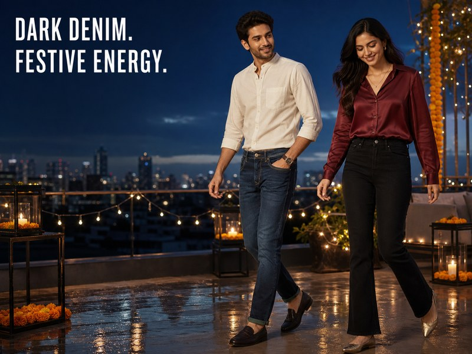
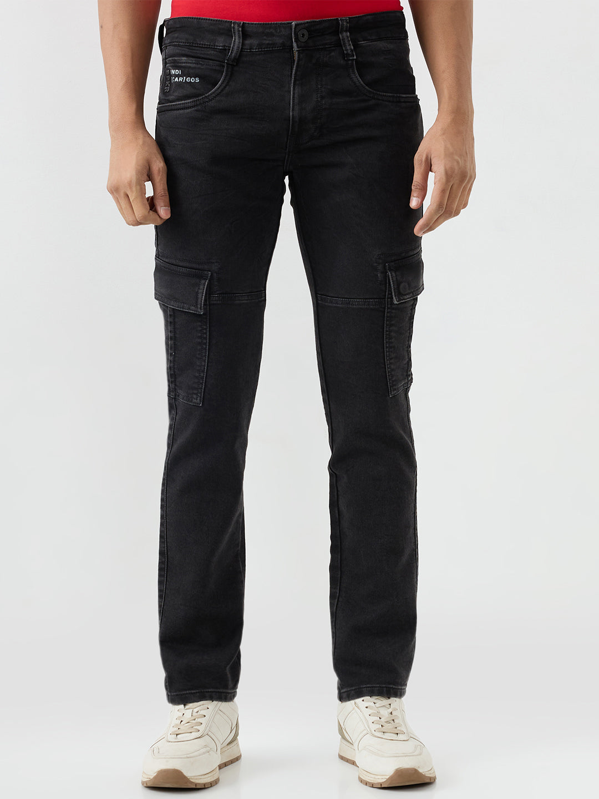
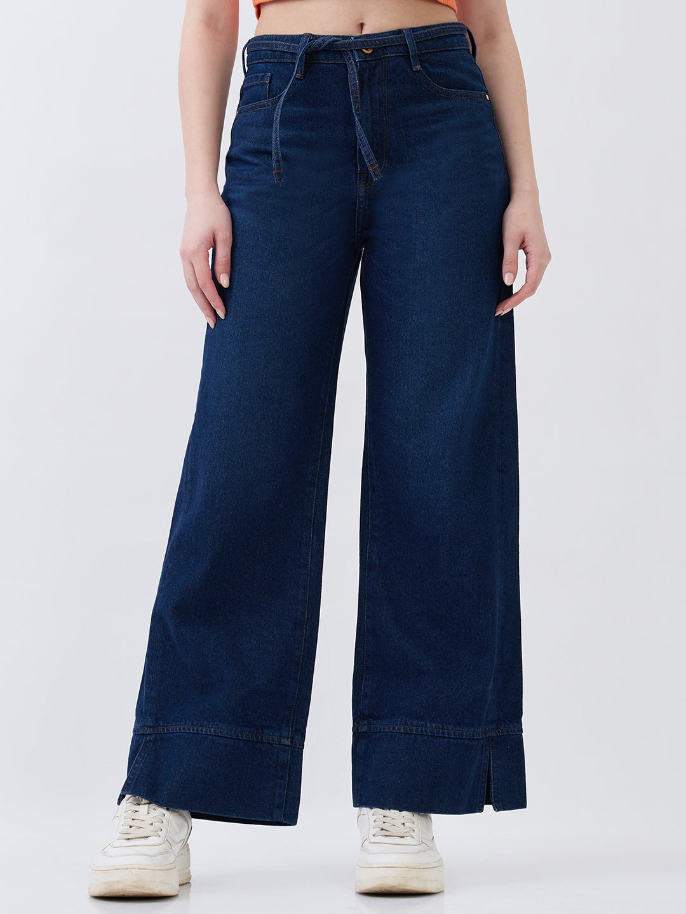

# Dark-Wash Denim for the Festive Transition: 8 Smart-Casual Looks

*Banner CMS fields — Alt: Man and woman styling dark-blue and black Spykar jeans at a festive rooftop gathering | Title: Dark-Wash Denim for the Festive Transition | Filename: dark-wash-denim-festive-transition-banner-800x600.jpg*

August dressing in India sits in an interesting middle ground. The monsoon has not fully left, but office celebrations, family lunches and early festive plans are already arriving. Dark wash jeans fit that in-between calendar well. Deep indigo or clean black feels more considered than a heavily faded pair, yet it does not ask you to dress as formally as a kurta set, dress or tailored trousers.

The trick is not to make denim pretend to be occasionwear. Build around its clean finish: one polished shirt or top, one festive colour or texture, and shoes that suit the actual plan. These eight festive denim outfits do exactly that.

## Why dark wash jeans work for the festive transition

A dark, even wash creates a quieter base. Stitching, fading and distressing attract less attention, so the shape of the jeans and the clothes around them become more important. That is useful when the invitation says “smart casual” but the day includes a commute, a desk and dinner.

Dark denim is not a fixed dress code. Put a printed shirt over deep-blue regular-fit jeans and the mood stays relaxed. Swap to a wine top and black bootcuts, and the line becomes sharper. Fit and everything around the denim decide where it lands.

Before you style a pair, check three things:

- Choose a clean or lightly faded finish when the occasion leans polished.
- Test the full outfit while sitting and walking; festive plans often last longer than the photograph.
- Let either colour, texture or jewellery provide the festive signal. Using all three at full volume can make smart casual denim feel busy.

## Eight smart-casual looks for festive-season plans

### 1. Ivory band-collar shirt with deep-blue regular-fit jeans

Picture an office puja at four and dinner at eight. An ivory band-collar shirt bridges both without looking like a full festive uniform. Wear it with deep-blue regular-fit jeans; the indigo is dark enough to hold the pale shirt, and the collar does more for the outfit than another accessory would.

Sleeves down for the office, turned back once after work. Brown loafers suit a mostly indoor evening. If the route includes a railway footbridge or a fair stretch of pavement, dark minimal sneakers are the sensible edit. Add a rust or wine pocket square only when the shirt has a chest pocket and the rest of the outfit is quiet.

[Spykar Men Trooper Jeans Regular Fit Dark Blue High Rise](https://spykar.com/products/mdact1bc189darkblue) are one current dark-blue reference for this proportion. Check the product page for the latest availability and care instructions.

### 2. Wine satin and black bootcuts, with the hem checked first

Wine, plum and berry shades already belong to the festive palette. They do not need sequins to announce it. A plain satin or softly lustrous top, tucked into high-rise black bootcut jeans, puts the emphasis on the waist and the sweep below the knee.

Do the shoe test before leaving home. With a short car-to-venue walk, a compact heel or metallic flat is easy enough. For a cab-and-metro evening, pointed dark flats will be kinder, and small earrings can supply the glint. Whatever the shoe, no black denim should be brushing a damp pavement.

[Spykar Women Elissa Jeans Boot Cut Fit Black High Rise](https://spykar.com/products/wdeli2be017jetblack) are the black bootcut product used in the blog banner.

### 3. Printed shirt with clean black jeans for men

[Spykar Men Trooper Jeans Regular Fit Black Mid Rise](https://spykar.com/products/mdact2be309carbonblack)

*CMS image fields — Alt: Spykar men's regular-fit black mid-rise jeans | Title: Spykar Men Trooper Regular-Fit Black Jeans | Filename: spykar-men-trooper-regular-fit-black-jeans.jpg*

The white-shirt reflex is useful, but not compulsory. Against black jeans, men can wear a small paisley, geometric or abstract print in teal, rust or muted gold. Keep the scale modest. The shirt then reads festive from across a table, not from across the street.

There are two clean ways to wear it: tucked all the way, or untucked in a straight cut that ends around the hip. Skip the nervous half-tuck when the print is already doing plenty. Loafers fit an indoor dinner; black sneakers make more sense for a college event or a creative office. The pictured Spykar pair is a mid-rise regular fit with a clean black finish.

### 4. Emerald top with dark-blue wide-leg jeans

[Spykar Women Bella-Wide Jeans Wide Leg Dark Blue High Rise](https://spykar.com/products/wdynr2be102darkblue)

*CMS image fields — Alt: Spykar women's dark-blue high-rise wide-leg jeans | Title: Spykar Women Bella-Wide Dark-Blue Jeans | Filename: spykar-women-bella-wide-dark-blue-jeans.jpg*

Emerald against deep indigo is a strong colour meeting, so the shapes can stay simple. Tuck a fitted teal or emerald top into high-rise wide-leg jeans. That is enough structure at the waist; the denim can take over below it.

If there is embroidery at the neck, the necklace can stay home. Small earrings and pointed flats are plenty for lunch, while a low block heel suits an evening reached mostly by car. The pictured Spykar Bella-Wide jeans have a solid dark-blue, clean-look finish—a calm background for the saturated top.

### 5. The lunchtime version: off-white tee and an overshirt

Some celebrations happen beside a desk at lunchtime. Start with an off-white tee and regular or straight dark wash jeans, then add a navy, bottle-green or subtle jacquard overshirt. Open over the tee, it feels relaxed; buttoned halfway, it looks ready for the group photograph.

Large graphics would fight the woven detail, so leave them out. The layer can come off in a humid auto queue and go back on in the office air-conditioning. Low-profile sneakers handle that kind of day better than precious footwear.

### 6. A short jacket over dark-indigo wide legs

Wide-leg jeans and a long jacket can turn into one unbroken column. A shorter jacket avoids that. Try a collarless charcoal, cream or muted-colour version over a fitted neutral top, with the jacket ending close to the waistband.

It is a combination for an air-conditioned office, gallery or restaurant more than an uncovered afternoon commute. Carry the jacket until you arrive if the air is sticky. Once it is on, keep the bag compact and the footwear unadorned; there is already a clear shape at the top and another at the leg.

### 7. Rust knit polo, deep indigo, nothing fussy

Rust and burnt orange nod to the season without turning the outfit into traditionalwear. Pick a knit polo whose collar sits properly—if it curls before you leave home, it will not improve over lunch—and wear it with deep-indigo jeans.

Dark brown loafers warm the combination; charcoal sneakers make it younger and more casual. Contrast tipping or a visible knit texture counts as detail. No overshirt is required. When a polo feels too relaxed for the guest list, the same colour idea works with a burgundy button-down.

### 8. Tonal black, then stop after one accent

Begin with black jeans, a charcoal or black top and dark shoes. Now interrupt the dark column once: perhaps with a textured shirt, oxidised-silver earrings, a compact metallic bag or a deep-red layer.

Once is the operative word. A textured black shirt and steel watch are a complete men’s version. A clean black top with silver earrings is a complete women’s version. In a tonal outfit, a bunched waistband or overlong hem becomes conspicuous, so sort those two details before considering another accessory.

## The small edits that make denim feel polished

A useful test is to remove one item and look again. If the outfit still communicates the plan, the missing piece was probably extra. These details usually matter more than adding another festive element:

- **Finish:** Clean dark denim generally reads sharper than heavy whiskering, rips or large distressed patches.
- **Proportion:** A wide or bootcut leg works with a closer top; a regular or straighter leg can take a relaxed shirt.
- **Hem:** Check the length in the intended shoes. Several folds of fabric over the shoe blur the line you have built elsewhere.
- **Colour:** Ivory, wine, emerald, rust and navy are all plausible partners for deep indigo or black. Let two colours lead; a metallic detail can remain an accent.
- **Comfort:** Sit, climb a step and walk before deciding. An outfit that needs constant adjusting will not improve over a long celebration.

If shirts are your usual route into smart casual, see Spykar’s guide to [styling jeans with shirts](https://spykar.com/blogs/blog/how-to-style-jeans-with-shirts-smart-casual-outfit-ideas). For more on the visual difference between deeper denim finishes, read the guide to [dark and rinse-wash jeans](https://spykar.com/blogs/blog/elevate-your-denim-collection-with-dark-and-rinse-wash-jeans).

## What to avoid

- Heavy distressing when the event calls for a polished dress code.
- A long denim hem on damp streets, especially with wide-leg or bootcut shapes.
- Strong embroidery, bold jewellery, a printed layer and metallic shoes in the same outfit. Choose a focal point.
- Brand-new shoes for a plan with several hours of standing or walking.
- Assuming all dark denim washes or fits behave alike. Try the whole combination in natural light.

## Questions people ask before wearing denim to a celebration

### Is dark denim festive enough?

For a casual or smart-casual invitation, it can be. A clean finish plus a band-collar shirt, satin top or short jacket moves it away from an ordinary tee-and-jeans day. A traditional or formal dress code is different; in that case, take the host at their word.

### What colours can I wear with dark wash jeans?

Try ivory or cream for contrast; rust and burgundy for warmth; emerald or teal for a jewel-tone look. Muted gold is easier as a small accent than a large layer. This is a menu, not a rulebook—choose the contrast that feels like you.

### Do black jeans work for a smart-casual festive plan?

Yes. Clean black denim is at home at an office celebration or informal dinner when the shirt, top and shoes look considered. Large rips and a hem collapsing over the footwear send a much more casual message.

### What shoes work with festive denim outfits?

Loafers, minimal sneakers, pointed flats and low block heels can all work. Choose according to the hem and the route, not only the photograph. For late-monsoon streets, darker soles and a hem that clears the ground are practical choices.

### Can the same styling formula work for men and women?

Yes. A clean dark base, one festive colour or texture and appropriate shoes is not gender-specific. The useful variables are fit, proportion, comfort and the event. Spykar’s current [men’s jeans](https://spykar.com/collections/men-jeans) and [women’s jeans](https://spykar.com/collections/women-jeans) collections show different silhouettes to build from.

### How should dark wash jeans be cared for?

Follow the care label on the specific garment. Product composition and finishing can differ from one pair to another, so the garment label and current product page are better guides than one universal washing rule.

## The transition is the point

Dark wash jeans are useful here because they do not force the day into one dress code. Deep indigo can carry an ivory shirt from lunch to dinner; black denim can ground wine, emerald or a small metallic detail after dark. Keep the finish clean, check the hem with the actual shoes and let one element signal the celebration.

That approach leaves room for personal style—and for the weather, commute and venue that exist beyond the outfit photograph. Explore Spykar’s [men’s jeans](https://spykar.com/collections/men-jeans) and [women’s jeans](https://spykar.com/collections/women-jeans) to find a dark silhouette that suits the plan.

## SEO and publishing fields

- **Meta title:** Dark Wash Jeans: 8 Festive Smart-Casual Outfits
- **Meta description:** Style dark wash jeans for the festive transition with eight smart-casual looks for men and women, from polished shirts to jewel-tone tops.
- **Suggested URL:** https://spykar.com/blogs/blog/dark-wash-denim-festive-transition-smart-casual-looks
- **Canonical:** https://spykar.com/blogs/blog/dark-wash-denim-festive-transition-smart-casual-looks
- **Robots:** index, follow, max-image-preview:large
- **Schema:** BlogPosting, FAQPage
- **Primary keyword:** dark wash jeans
- **Secondary keywords:** festive denim outfits; smart casual denim; black jeans men
