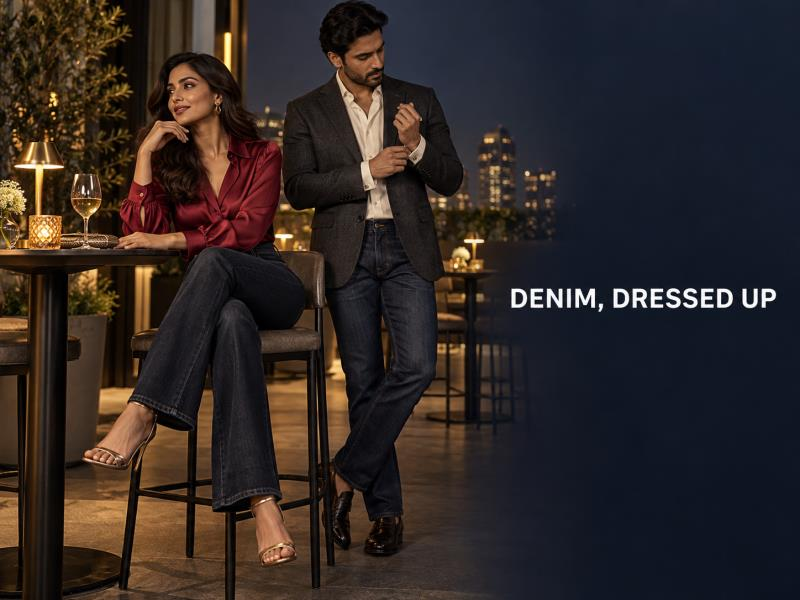
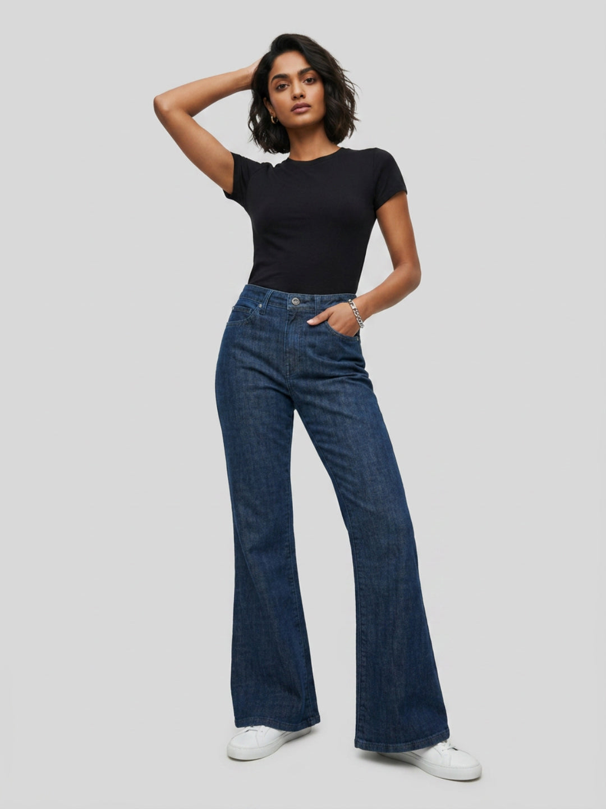

# Denim for the Festive Season: 10 Ways to Make Jeans Look More Dressy



Jeans do not need to look like an afterthought at every festive plan. For a relaxed dinner, an office celebration or an invitation marked smart casual, the difference is usually in the details: a cleaner wash, a sharper shirt, a more intentional shoe and one element with texture or shine. That is how dressy denim outfits work without pretending that denim belongs at every event.

If a celebration calls for traditional or formal attire, follow the dress code. When jeans are welcome, these ten ideas make the outfit feel occasion-ready while keeping the comfort that makes denim useful in the first place.

## Begin with a clean, darker wash

Dark indigo, black and clean mid-blue denim create a more polished starting point than heavy fades, rips or loose stacking at the shoe. The jean does not have to be stiff or slim; it just needs a neat finish and a hem that works with your chosen footwear.

The [Men Chico Jeans Relaxed Fit Black Mid Rise](https://spykar.com/products/mdynr1bf149carbonblack) is a useful example. The live product page lists a relaxed fit, mid rise, cotton-stretch fabric, clean look and stretch. Pair it with a structured shirt or blazer rather than another casual layer.


*CMS alt text: Spykar Men Chico Jeans Relaxed Fit Black Mid Rise in black cotton-stretch denim.*

## Ten ways to make jeans look more dressy

### 1. Add a shirt with depth

An ivory shirt, jewel-toned shirt, subtle print or crisp collar changes the mood immediately. Keep the jeans plain and let the shirt carry the colour.

### 2. Use a structured outer layer

A blazer, short jacket, Nehru-inspired layer or cropped overshirt can define the outfit. Make sure it sits cleanly over the waistband; a layer that is too long or too oversized can lose the sharper effect.

### 3. Choose one dressier fabric

Satin, linen-blend fabric, textured cotton, embroidery or a soft sheen above the waist makes ordinary jeans feel more intentional. Use one elevated fabric rather than mixing several statement pieces.

### 4. Swap everyday trainers for a polished shoe

Loafers, sleek flats, low heels, metallic sandals or clean leather shoes bring the outfit together. Check the jean hem with that exact pair before leaving.

### 5. Define the waist or tuck

A full tuck, a neat half-tuck or a visible belt creates proportion. This is especially helpful with wide-leg, relaxed or bootcut denim, where the upper and lower halves need a clear meeting point.

### 6. Keep the accessories focused

One watch, a compact clutch, metallic earrings or a clean belt is enough. Accessories should finish the outfit, not compete with a bright shirt or textured layer.

### 7. Use tonal colour with contrast in texture

Black jeans with charcoal, navy with indigo or white with pale denim can look refined when the fabrics are different. A matte jean beside a satin blouse or textured jacket gives the eye a reason to read the outfit as deliberate.

### 8. Make the upper half the festive element

For women, a blouse, short jacket or bright shirt can carry the occasion. The [Women Flare Fit Jeans Flare Leg Dark Blue High Rise](https://spykar.com/products/wdfla2bf047darkblue) is listed with a high rise, full length, clean finish, five pockets and stretch. Its dark wash gives rust, crimson, emerald and metallic accents space to stand out.



*CMS alt text: Spykar Women Flare Fit Jeans Flare Leg Dark Blue High Rise in a clean dark wash.*

### 9. Let the occasion decide the layer

For a family dinner, a printed shirt or soft jacket may be enough. For a festive evening, introduce a blazer, a richer blouse or metallic shoes. Do not make the outfit more formal than the invitation asks for.

### 10. Finish with grooming and fit

Steam the shirt, check the denim for creases and make sure the waistband stays comfortable after sitting. The details people notice first are usually the ones closest to the face and shoes: a clean collar, tidy hair, well-kept footwear and a hem that does not bunch.

## Outfit formulas for men and women

For men, pair [black or dark-blue men’s jeans](https://spykar.com/collections/men-jeans) with an ivory shirt and loafers for a festive dinner, or use an emerald overshirt with a dark tee underneath for a more relaxed gathering. Spykar’s guide to [styling jeans with shirts](https://spykar.com/blogs/blog/how-to-style-jeans-with-shirts-smart-casual-outfit-ideas) has more ways to adjust the shirt-and-denim balance.

For women, combine dark flares or straight jeans with a ruby blouse and metallic flats, or use a cropped jacket over a fitted upper layer with a clean mid-blue jean. Browse [women’s denim collections](https://spykar.com/collections/women-jeans) for fits that work with your preferred footwear and proportions.

## Know when to skip denim

Dressy denim is for occasions where smart casual or fusion dressing is genuinely welcome. If the event is black tie, highly formal or has a traditional dress expectation, choose something else. The point is not to force jeans into every celebration; it is to know how to make them count when they are appropriate.

## A little polish goes a long way

Festive denim outfits feel elevated when the choices are clear: a clean wash, one sharper layer, practical footwear and an accessory that adds a little finish. You do not need ten new pieces. You need a few combinations that match the plan and still feel like you.

Explore Spykar’s [men’s denim](https://spykar.com/collections/men-jeans) and [women’s jeans](https://spykar.com/collections/women-jeans) to find a fit you can dress up for the celebrations already on your calendar.

## FAQs

### Can jeans look dressy enough for a festive dinner?

Yes, when the invitation is smart casual or fusion-friendly. Start with a clean dark wash, then add a sharper shirt, layer or shoe.

### Which jeans wash looks more dressed up?

Black, dark indigo and clean mid-blue washes generally pair easily with textured shirts, blouses and polished footwear.

### What should men wear with jeans for a festive evening?

Try a structured shirt, clean shoes and one simple accessory such as a watch or belt.

### What should women wear with jeans for a festive evening?

Use a bright blouse, short jacket or metallic accessory above clean dark or mid-blue denim.

### Can I wear jeans to a traditional puja?

Check with the host and follow the dress code. Traditional attire is the appropriate choice when the gathering expects it.

## FAQPage schema handoff

```json
{"@context":"https://schema.org","@type":"FAQPage","mainEntity":[{"@type":"Question","name":"Can jeans look dressy enough for a festive dinner?","acceptedAnswer":{"@type":"Answer","text":"Yes, when the invitation is smart casual or fusion-friendly. Start with a clean dark wash, then add a sharper shirt, layer or shoe."}},{"@type":"Question","name":"Which jeans wash looks more dressed up?","acceptedAnswer":{"@type":"Answer","text":"Black, dark indigo and clean mid-blue washes generally pair easily with textured shirts, blouses and polished footwear."}},{"@type":"Question","name":"Can I wear jeans to a traditional puja?","acceptedAnswer":{"@type":"Answer","text":"Check with the host and follow the dress code. Traditional attire is the appropriate choice when the gathering expects it."}}]}
```
