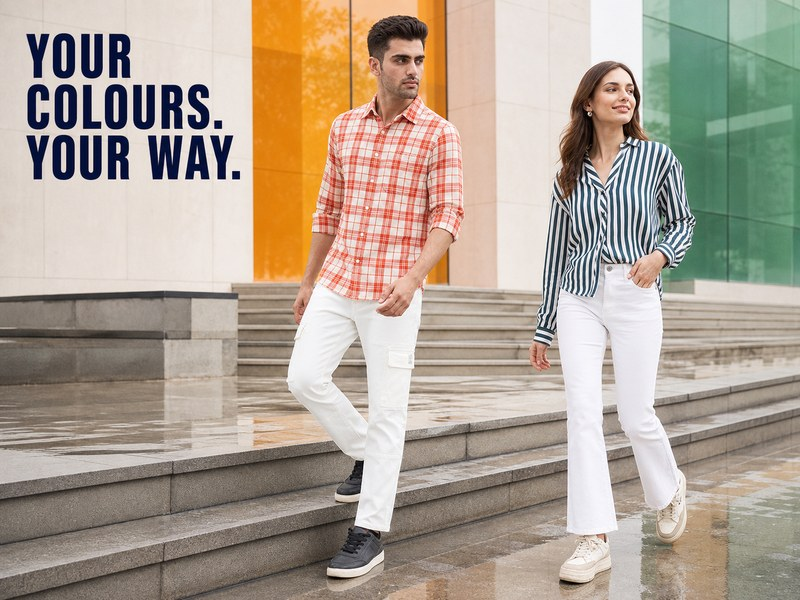
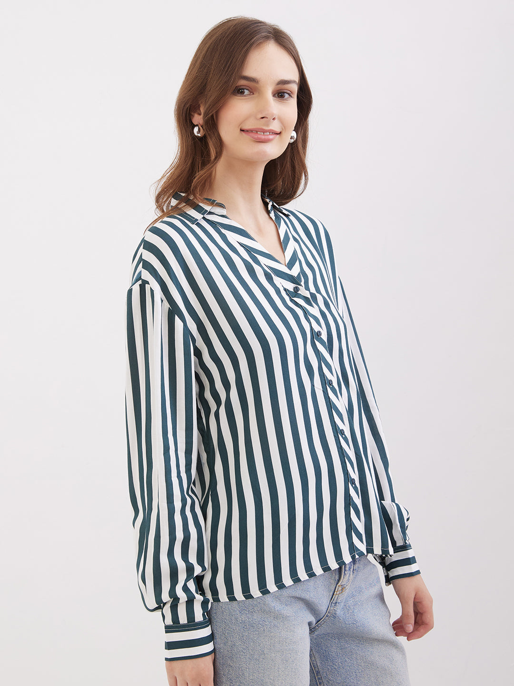
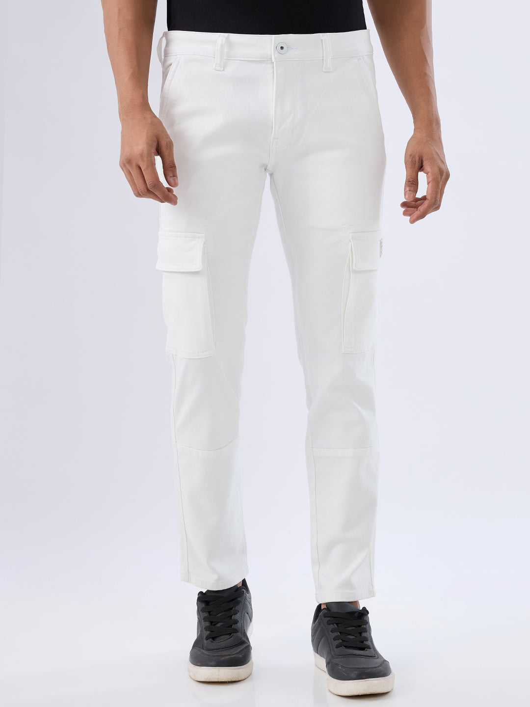

# Independence Day Outfit Ideas: Tricolour Styling with Denim and Everyday Basics

*Banner CMS fields — Alt: Man and woman in Spykar white jeans with orange and green shirts on rain-washed urban steps | Title: Independence Day Outfit Ideas with Denim | Filename: independence-day-tricolour-denim-banner-800x600.jpg*

On Independence Day, three good colours can quickly become one very busy outfit. Denim gives the eye somewhere to rest. It already belongs in college corridors, creative offices, society courtyards and family lunches, so a white pair, blue wash or dark indigo base needs only one thoughtful saffron or green element.

These Independence Day outfit ideas use clothes that can return to the wardrobe the next morning. There is no complicated shopping list—only denim, everyday basics and tricolour references used with a lighter hand.

## The simple tricolour rule: let one colour lead

Equal blocks of saffron, white and green can look more like event uniform than personal style. Instead, decide which colour owns the outfit. White denim may be the base, a burnt-orange shirt may be the main note, or malachite green may sit closest to the face. The remaining colours can appear through a small accessory—or stay out altogether.

Denim works as the bridge because blue and indigo sit outside the literal palette. They give the eye a neutral pause and make a single green or orange garment feel intentional.

There is also an important distinction between styling with the national colours and wearing the National Flag. The Ministry of Home Affairs’ [official National Flag FAQ](https://www.mha.gov.in/sites/default/files/FAQ_18072023.pdf) sets rules for the Flag’s use in clothing and dress material. For a fashion look, use saffron, white, green and navy as colour inspiration; do not turn an actual flag into clothing, drapery or an accessory.

## Eight denim-first Independence Day outfit ideas

### 1. Burnt-orange checks with white regular-fit jeans

This is the clearest men’s look in the edit, but it still feels like an everyday outfit. Pair a burnt-orange checked shirt with white regular-fit jeans and let the checks supply the warm colour. The ecru lines in the shirt connect naturally to the denim, so a third bright colour is unnecessary.

Roll the sleeves once for a morning society function or keep them down for an office gathering. Navy or black sneakers add the quiet blue note, while tan shoes pull the outfit towards lunch. The white jeans should finish cleanly above the shoe; several folds at the ankle make the pale lower half look untidy.

[Spykar Men Shirt Orange Slim Fit](https://spykar.com/products/mshcs2be178burntorange) and [Men Trooper Jeans Regular Fit White Mid Rise](https://spykar.com/products/mdact2be297white) are the live Spykar products used for this combination in the banner.

### 2. Green striped shirt with white bootcut jeans

The green-and-white striped shirt already carries two colours, but the narrow repeat keeps it wearable. Tuck it into high-rise white bootcut jeans and leave the styling there. The outfit has enough movement in the stripes and the flared hem; a saffron bag, scarf and earrings together would crowd it.

For an office celebration, add small silver earrings and pointed flats. For a college event, choose clean low-profile sneakers. Check the bootcut length with those shoes before the day arrives, especially if the route crosses wet paving.

[Spykar Women Shirt Green Regular Fit](https://spykar.com/products/wshps2be073malachitegreen) and [Women Elissa Jeans Boot Cut Fit White High Rise](https://spykar.com/products/wdeli2be018white) are the garment references used in the banner.

*CMS image fields — Alt: Spykar women's malachite-green and white striped regular-fit shirt | Title: Spykar Women Malachite-Green Regular-Fit Shirt | Filename: spykar-women-malachite-green-striped-shirt.jpg*

### 3. White tee, blue jeans and one green overshirt

A white crew-neck tee with mid-blue straight or relaxed jeans is the easiest starting point here. Add a bottle-green or forest-green overshirt, worn open, and the outfit moves from ordinary weekend wear to a clear Independence Day colour reference.

Treat the overshirt as something you carry, not something you must wear from the front door. Put it on once you reach an air-conditioned auditorium or classroom. A plain tee leaves enough room for the green layer to do its job. If the walk from the station is wet, navy canvas shoes will cause less worry than a spotless white pair.

### 4. White jeans for men with a navy polo and saffron detail

An orange or green shirt is not compulsory with white jeans for men. Try a navy polo instead. It nods to the blue at the centre of the flag without making the outfit literal. If you still want warmth, use a rust watch strap or a slim woven bracelet; a pocket square only makes sense when the polo and occasion are smart enough to support it.

For a housing-society breakfast, choose a regular white pair and a polo that ends near the hip rather than halfway down the thigh. The featured Trooper jeans have cargo pockets, so keep the bag compact and let it sit above or below that pocket line. Dark sneakers give the pale denim a firm finish and are forgiving around wet kerbs.

[Spykar Men Trooper Jeans Regular Fit White Mid Rise](https://spykar.com/products/mdact2be297white)

*CMS image fields — Alt: Spykar men's white regular-fit mid-rise jeans | Title: Spykar Men Trooper White Regular-Fit Jeans | Filename: spykar-men-trooper-white-regular-fit-jeans.jpg*

### 5. Ivory shirt, dark indigo jeans and a green accent

If white jeans feel risky during the monsoon, move the pale colour upwards. An ivory or off-white shirt with clean dark-indigo jeans is suitable for a workplace ceremony, client-facing office or family lunch. A slim green belt, compact bag or pair of earrings is enough to connect the outfit to the day.

This formula works across genders because the important choices are finish and proportion. A relaxed shirt suits straight or tapered denim; a closer shirt can sit well with a wider leg. Keep distressing limited if the event involves a formal programme or stage photographs.

### 6. Apricot tee with light-blue denim

Look beyond a vivid ceremonial orange. Apricot, rust and terracotta read more like everyday T-shirt colours, especially beside faded blue denim. That pairing feels right for a college performance, a café stop afterwards or a low-key afternoon with friends.

A slightly boxy tee works, but give it jeans with a clear hem instead of another oversized shape pooling at the shoe. A green hair clip or watch strap is optional. The rust-and-blue pairing already carries the idea, and the pieces will not look stranded once the celebration is over.

### 7. White shirt over a denim skirt or wide-leg jeans

Start with a fitted navy or green tee, add a crisp white shirt without buttoning it, and finish with a denim skirt or wide-leg jeans. The white shirt breaks up the stronger colour and can be rolled into a tote when the afternoon turns humid.

Morning plans often mean damp lawns and slick tiles, so try the full hem-and-shoe combination at home first. For dinner later, half-button the shirt, add one small metallic earring and change to a compact shoulder bag. The clothes stay the same; the adjustment takes a minute.

### 8. Double denim with one colour at the centre

Double denim is a useful answer when you would rather avoid obvious tricolour dressing. Combine a blue denim shirt or jacket with jeans in a nearby wash, then place a plain white, saffron or green tee beneath it. Only a small area of the colour needs to show.

Vary the washes slightly so the layers do not resemble a jumpsuit: mid-blue over dark indigo, for example. Keep the inner tee plain and the footwear neutral. If the day is humid, carry the denim layer and put it on indoors rather than wearing it through the whole commute.

## White denim on an August morning: the practical check

White denim makes these tricolour outfit ideas feel crisp, but it asks for a little route planning. Look out of the window before committing, then think beyond the forecast: uncovered auto stands, wet two-wheeler seats and muddy society lawns matter more than a weather icon.

Before leaving, make these quick checks:

- Put on the actual shoes and check that the white hem clears the floor.
- Pack an overshirt only for an indoor venue; it may spend the humid commute in your bag.
- Use the darker bag and footwear when the route includes puddles, a two-wheeler or public transport.
- If the sky changes before you leave, swap the white pair for dark indigo instead of trying to rescue the look.
- Follow the product’s care label rather than using one universal white-denim washing rule.

## Casual patriotic outfits for different plans

The event should decide how polished the denim becomes.

**Office programme:** Pair clean dark jeans or white denim with a collared shirt. Let the shirt supply the Independence Day colour and leave the rest quiet. On a day with a presentation or client call, loafers or pointed flats will take the outfit further than running shoes.

**College celebration:** A tee, overshirt and relaxed jeans leave room for a dance, club stall or long stretch of standing. A graphic is fine when it is not a reproduction of the flag. Wear shoes you have already tested on stairs; this is not the morning for a stiff new pair.

**Society flag hoisting:** Dress for a short outdoor ceremony followed by tea or breakfast. The green striped shirt and white jeans combination feels considered without looking formal, while ivory and dark denim is the safer choice for a lawn that stayed wet overnight.

**Family lunch:** Keep the denim base and sharpen one detail: a freshly pressed shirt, a small metallic earring or a better-structured bag. That is usually enough to move the outfit from morning casual to lunch-ready.

For more shirt-and-denim combinations, use Spykar’s guide to [styling jeans with shirts](https://spykar.com/blogs/blog/how-to-style-jeans-with-shirts-smart-casual-outfit-ideas). You can also browse the current [men’s jeans](https://spykar.com/collections/men-jeans), [women’s jeans](https://spykar.com/collections/women-jeans) and [shirts](https://spykar.com/collections/all-shirts) collections.

## What keeps the look personal, not costume-like

- Use one strong colour across the largest garment area.
- Treat the second colour as support and the third as optional.
- Skip flag prints, Ashoka Chakra graphics and an actual flag worn as clothing.
- Repeat an everyday silhouette you already know suits you.
- Let denim provide the familiar element, especially when the shirt colour is unusual for you.

The point is not to hide the theme. It is to make the reference look like your own wardrobe rather than a one-day uniform.

## Questions people ask about Independence Day dressing

### What can I wear for Independence Day if I do not own ethnicwear?

Use jeans with a white shirt or tee, then bring in one orange or green piece. A striped overshirt for college and a collared shirt for work use the same idea but land at different levels of polish.

### How can I create a tricolour outfit without wearing all three colours equally?

Choose one lead colour, one smaller supporting colour and treat the third as optional. For example, white jeans with an orange checked shirt already make a clear reference; navy shoes can finish the look without adding green.

### Are white jeans practical during the August monsoon?

They can be for a mostly covered route. Check the forecast and the ground conditions, keep the hem clear of the pavement and have dark denim ready when heavy rain changes the plan.

### Can I wear the Indian National Flag as part of my outfit?

Use the national colours as inspiration instead. The Ministry of Home Affairs publishes rules governing how the National Flag may be used in clothing and dress material; check its official guidance if your plan includes an actual flag or flag reproduction.

### Which shoes suit casual patriotic outfits?

Start with the route. Damp grass and railway stairs need a tested sole; an indoor lunch leaves room for loafers, pointed flats or a low block heel. Minimal sneakers sit comfortably between the two.

### Can the same outfit work after Independence Day?

That is the advantage of using everyday basics. Separate the orange or green shirt from the white denim, or wear the denim with a navy, black or printed shirt. None of the pieces needs to stay in a one-day outfit.

## Wear the colours your way

You do not need a new wardrobe for Independence Day. Begin with the denim you would choose on any August morning, decide whether orange, white or green takes the lead, and edit the rest. A wet lawn may change the white jeans; an office programme may change the shoes. Neither change loses the idea.

That is the useful part of a denim-first theme: every piece still has somewhere to go afterwards. Explore Spykar’s [men’s jeans](https://spykar.com/collections/men-jeans) and [women’s jeans](https://spykar.com/collections/women-jeans) when the base of the outfit needs a refresh.

## SEO and publishing fields

- **Meta title:** Independence Day Outfit Ideas with Denim | Spykar
- **Meta description:** Try Independence Day outfit ideas built around denim, white basics and restrained saffron or green accents for office, college and casual plans.
- **Suggested URL:** https://spykar.com/blogs/blog/independence-day-outfit-ideas-tricolour-denim
- **Canonical:** https://spykar.com/blogs/blog/independence-day-outfit-ideas-tricolour-denim
- **Robots:** index, follow, max-image-preview:large
- **Schema:** BlogPosting, FAQPage
- **Primary keyword:** Independence Day outfit ideas
- **Secondary keywords:** tricolour outfit ideas; white jeans for men; casual patriotic outfits
