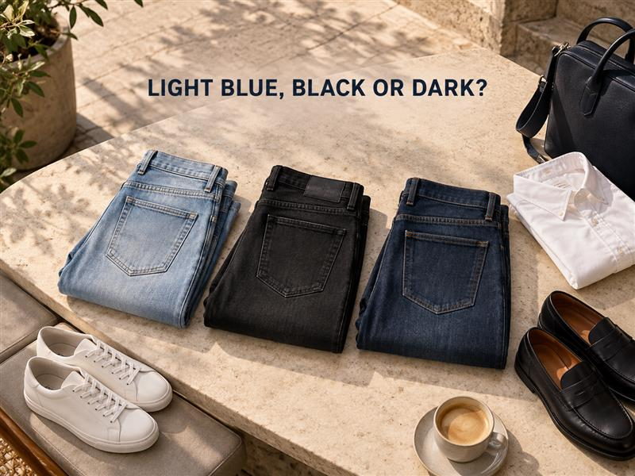
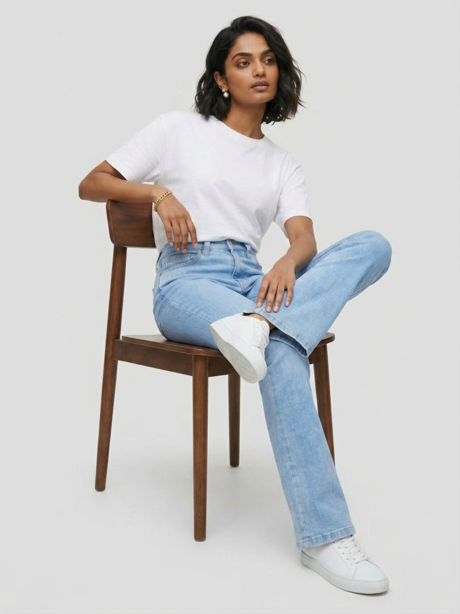
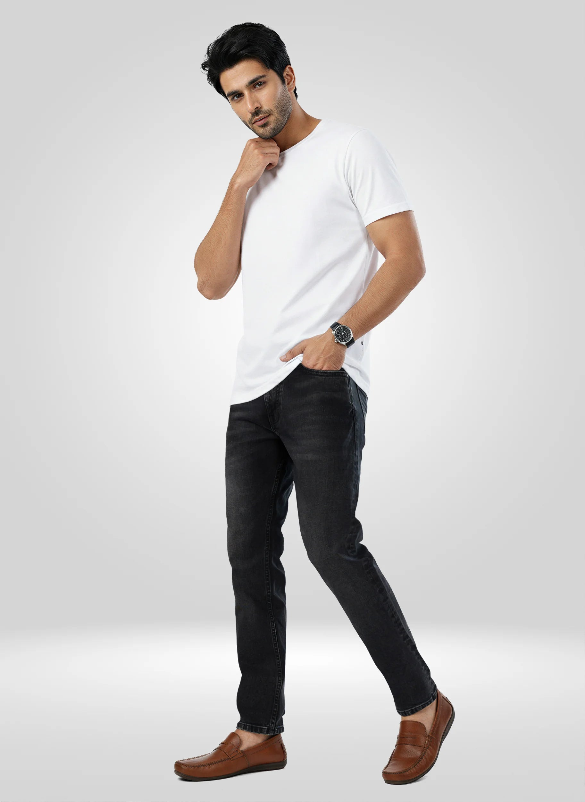

# Light Blue, Black or Dark Wash? How to Choose the Right Jeans for September



September is when one week can hold a late breakfast, a long office day, a birthday dinner and a last-minute weekend plan. The fit of your jeans matters, but the wash often decides how the whole outfit reads first. A pale blue pair can make a simple shirt feel easy. Black can give the same shirt a sharper edge. Dark wash sits comfortably in between, ready for plans that start casually and stretch into the evening.

This jeans wash guide makes the choice less abstract. Before you reach for light blue jeans, black jeans or dark wash jeans, look at the plan, the shirt or layer you want to wear and the shoes you are leaving in. That three-part check is usually more useful than choosing a wash by habit.

## Start with the plan, then choose the wash

September dressing works better when the denim is answering a real question: where are you going, and do you need the outfit to change pace later? A daytime campus plan, a client-facing workday and an evening table booking do not need the same visual weight.

Use this quick order before you get dressed:

- Pick the setting: casual day, work, dinner or a mixed plan.
- Choose the upper layer: T-shirt, shirt, polo, knit, kurta or jacket.
- Finish with footwear: clean sneakers, loafers, boots, flats or heels.

The wash then becomes a link between those pieces. It is not a rulebook. It is a way to make the outfit feel considered without overworking it.

## Choose light blue jeans when the plan feels open and daytime-led

Light blue jeans bring an easy, relaxed colour to an outfit. They work well for college, a coffee meet-up, a daytime date or a weekend errand run—especially when the upper half is simple. A white T-shirt and low-profile sneakers keep the look crisp; an olive overshirt or a printed shirt adds a little more character without making the outfit busy.

For women, a boot-cut silhouette gives light blue denim a clean line with fitted tops, tucked-in shirts or a short jacket. The [Women Elissa boot cut fit light blue high-rise jeans](https://spykar.com/products/wdeli2bf043lightblue) are a current Spykar example of that direction. Let the hem work with the shoes you actually plan to wear; a more streamlined shoe keeps the lower half visually calm.



Light blue is also useful when your upper layer is darker. A navy shirt, charcoal tee or black cropped jacket gets a clear contrast against the denim. If your shirt is already pale and loose, bring in definition through a belt, bag or shoe rather than adding more light layers.

## Choose black jeans when you want the outfit to look more defined

Black jeans give a shirt, polo or jacket a firmer outline. They suit workdays with a relaxed dress code, an evening film plan or a dinner where you want denim to feel intentional. Start with a white, grey, deep green or blue shirt, then choose footwear with a similarly clean finish. That small bit of coordination keeps black denim from feeling disconnected from the rest of the look.

For a men’s option, the [Men Chico relaxed-fit black mid-rise jeans](https://spykar.com/products/mdynr1bf149carbonblack) give you a black base to build around. Pair a relaxed fit with a structured overshirt, a solid polo or a tucked-in Oxford-style shirt; avoid adding volume in every piece at once. With black jeans, one relaxed element and one cleaner element usually create a balanced silhouette.



Black also solves the “day to night” question neatly. Keep a plain tee and sneakers for the afternoon, then swap in a shirt or a light jacket when the plan moves indoors. You do not need a different pair of jeans; you need an upper layer that changes the mood.

## Choose dark wash jeans when your calendar does a bit of everything

Dark wash jeans hold their own beside a shirt, but they are still easy with a T-shirt. That makes them a practical choice for a September day that begins at college or work and ends with dinner, a family visit or an evening drive. Think dark indigo with an off-white shirt, a muted polo, a striped knit or a small-print blouse.

Keep the rest of the outfit clear rather than matching every shade. Brown loafers with dark wash denim and a pale shirt feel grounded. White sneakers create a more casual contrast. For women, a fitted blouse with a dark-wash wide leg or boot cut can carry a day plan into the evening; for men, a straight or relaxed dark wash works well with a shirt that has a little structure.

If you are building a denim rotation rather than buying for one plan, explore Spykar’s [men’s jeans collection](https://spykar.com/collections/men-jeans) and [women’s jeans collection](https://spykar.com/collections/women-jeans) by wash and fit together. The right answer is the pair you can picture with the tops already in your wardrobe.

## Let your shirt and shoes settle the close call

Still deciding between two pairs? Put the shirt and shoes beside both. The combination usually tells you what you need.

| If you are wearing | Start with | Why it works |
| --- | --- | --- |
| A graphic or striped T-shirt with sneakers | Light blue | The relaxed wash keeps the outfit easy. |
| A plain shirt and loafers | Dark wash | The deeper blue gives the shirt a cleaner base. |
| A dark shirt, jacket or polished shoes | Black | A single dark base keeps the contrast intentional. |
| A soft pastel shirt or compact blouse | Light blue or dark wash | Choose light blue for contrast; choose dark wash for a more grounded look. |

This is especially useful for jeans and shirts. For more combinations by shirt type and mood, see Spykar’s guide to [styling jeans with shirts for smart-casual outfits](https://spykar.com/blogs/blog/how-to-style-jeans-with-shirts-smart-casual-outfit-ideas). The wash is one part of the picture; fit, proportion and footwear complete it.

## A September wash rotation that does not feel repetitive

You do not need three versions of the same outfit. Give each wash a clear job and the rotation starts feeling more useful:

- Light blue for daytime, campus and casual weekend plans.
- Black for a sharper work-to-evening look.
- Dark wash for plans that sit somewhere in the middle.

Change one or two pieces around the jeans rather than rebuilding everything. A light blue pair can move from a tee to a shirt. Black jeans can go from sneakers to loafers. Dark wash can take a pale overshirt one day and a fitted blouse the next. The familiar denim stays; the surrounding choices change the energy.

## Make the wash do the work

The right September jeans are rarely about a strict colour rule. Light blue jeans bring ease to daylight plans. Black jeans give a sharper frame to an outfit that needs to feel a little more put together. Dark wash jeans help when the day does not fit neatly into one category.

Start with the place you are going, then put the intended shirt and shoes beside the jeans. If the three pieces feel like they belong together, you have your answer. Explore Spykar’s [latest denim styles](https://spykar.com/collections/men-jeans) when you are ready to add a wash that makes your existing wardrobe work harder.

## FAQs

### Which jeans wash is right for September?

Choose light blue for relaxed daytime plans, black for a more defined work or evening look, and dark wash for a schedule that moves between both.

### Can I wear light blue jeans after the monsoon?

Yes. Style light blue jeans with a darker shirt, jacket or shoe to give the outfit a little more contrast for September.

### Are black jeans suitable for smart-casual plans?

Yes. Pair black jeans with a plain shirt, polo or structured overshirt, then keep the footwear clean and simple.

### What tops work with dark wash jeans?

Off-white shirts, muted polos, striped knits and small-print tops all work well with dark indigo denim.

### Should my shoes match the wash of my jeans?

They do not need to match exactly. Choose shoes that support the outfit’s overall mood: sneakers for ease, loafers or boots for a more defined finish.

## FAQPage schema

```json
{
  "@context": "https://schema.org",
  "@type": "FAQPage",
  "mainEntity": [
    {"@type": "Question", "name": "Which jeans wash is right for September?", "acceptedAnswer": {"@type": "Answer", "text": "Choose light blue for relaxed daytime plans, black for a more defined work or evening look, and dark wash for a schedule that moves between both."}},
    {"@type": "Question", "name": "Can I wear light blue jeans after the monsoon?", "acceptedAnswer": {"@type": "Answer", "text": "Yes. Style light blue jeans with a darker shirt, jacket or shoe to give the outfit a little more contrast for September."}},
    {"@type": "Question", "name": "Are black jeans suitable for smart-casual plans?", "acceptedAnswer": {"@type": "Answer", "text": "Yes. Pair black jeans with a plain shirt, polo or structured overshirt, then keep the footwear clean and simple."}},
    {"@type": "Question", "name": "What tops work with dark wash jeans?", "acceptedAnswer": {"@type": "Answer", "text": "Off-white shirts, muted polos, striped knits and small-print tops all work well with dark indigo denim."}},
    {"@type": "Question", "name": "Should my shoes match the wash of my jeans?", "acceptedAnswer": {"@type": "Answer", "text": "They do not need to match exactly. Choose shoes that support the outfit’s overall mood: sneakers for ease, loafers or boots for a more defined finish."}}
  ]
}
```
