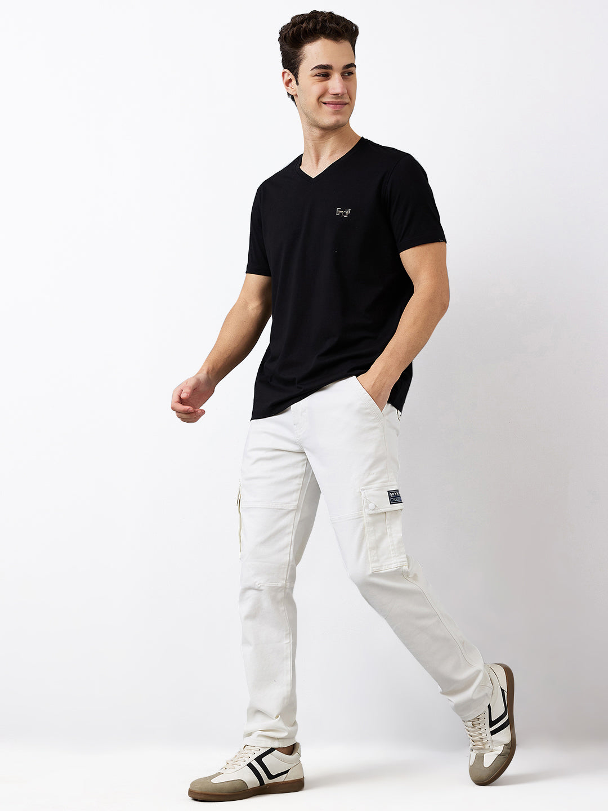
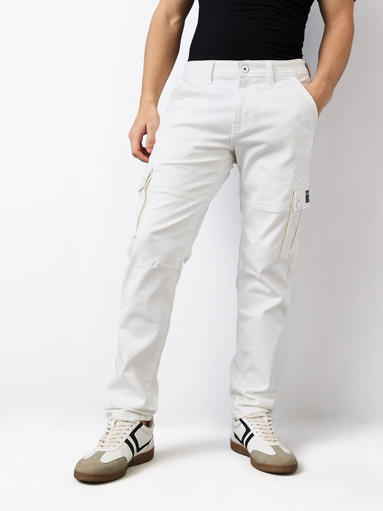

# How to Style White Jeans for Men Beyond Summer

Open a typical denim shelf and the white pair is often the one waiting for a holiday. That is a waste of a useful neutral. Lay a navy overshirt across it; now try the same test with olive or brown. Each changes the temperature of the white. Next, sit down in the jeans and photograph the pockets, fly and knees. Pulling and heavy creases that disappear into indigo show up immediately here. After that, use the shirts, jackets and shoes already worn with blue denim. These eight combinations keep white jeans for men in rotation after summer.

## Why white jeans work after summer

Most mens jeans rotate between blue, black and grey. White does not require a separate wardrobe; it makes the pieces above it easier to notice. The texture of a checked overshirt reads more clearly, and brown suede stands out instead of blending into indigo.

The seasonal shift comes from the supporting pieces. Linen and sandals pull white denim towards summer. Brushed cotton, fine knits, overshirts and closed shoes make it feel right for the months that follow. The result does not need to look formal. It only needs enough depth above and below the jeans to stop the outfit reading as beachwear.

## Choose the right white jeans for men

### Start with a clean, substantial finish

Take the pair to a window, then turn sideways. Can you see a hard rectangle where the pocket bag ends? Does the fly pull into a fan of creases when you sit? Those details are easy to miss on dark denim and obvious on white. Repeat the check under indoor lighting before removing the tags.

The live listing for Spykar's [white regular-fit mid-rise jeans](https://spykar.com/collections/trooper/products/mdact1be319white) specifies cotton with stretch, six pockets, a button-and-zip closure and a clean solid finish. In the product photographs, the leg stays regular from thigh to hem. That shape leaves room for an overshirt or jacket above without making the lower half look unusually narrow.

### Get the length right before choosing shoes

A white hem collects visual attention. If it stacks heavily over the shoe, every fold becomes obvious. Aim for a neat break with loafers or a small, intentional stack with trainers. Try the jeans with the actual shoe rather than judging the length barefoot.

### Decide between optic white and softer white

A crisp white creates the strongest contrast with black, navy and saturated colour. An ecru pair changes when it meets camel, rust or olive: the whole palette becomes warmer. Test the cloth at home with three tops you own. The answer will be clearer than any universal rule about the easiest white.

## How to style white jeans: eight outfits beyond summer

### 1. Navy overshirt, charcoal polo and brown loafers

Start here if the white pair still feels unfamiliar. Do not button the navy overshirt; a charcoal polo should remain visible down the centre. Try black and brown loafers in turn. Brown usually makes this particular combination feel less stark, especially when the belt repeats it.

Watch the overshirt hem in a full-length mirror. When it drops well below the hip, too little of the bright trouser remains visible. If the polo feels dressed-up, change just that piece for a crew-neck tee. Leave the overshirt, belt and loafers alone.



### 2. Olive utility jacket and an ecru T-shirt

Olive changes the mood immediately. In warmer cities, make it a cotton overshirt that can come off during the commute. A cooler evening can take a firmer utility jacket. Under either one, an ecru tee avoids three hard blocks of olive, bright white and dark footwear.

Try dark-brown trainers first. If the plan calls for something smarter, use suede loafers. Both give the white hem a visible ending; an all-white shoe can disappear into it.

### 3. Black shirt and black leather shoes

Black makes the outfit graphic, and there is nowhere for a poor tuck to hide. For dinner, leave a clean black shirt untucked and check that it does not cover the cargo-pocket detail. For a smarter setting, tuck it, sit down and smooth the fabric at the back before adding a narrow black belt.

Too stark? Undo the top button and use charcoal rather than white underneath. Spykar's guide to [building a modern old-money look](https://spykar.com/blogs/blog/mastering-the-old-money-look-with-spykar-a-modern-man-s-guide) takes the same restrained approach to shirts, denim and accessories.

### 4. Blue denim shirt and white jeans

Blue-on-white is still double denim, but the colour break does most of the work. Choose a mid-blue or dark shirt. A pale wash may fade into the trousers from a distance, so place the two garments together before getting dressed. Worn open, the shirt only needs a small strip of grey or white tee at the neck and centre.

Skip extra distressing when both garments already have visible seams and pockets. Tan boots take the combination in a rugged direction. Navy trainers keep it lighter for a Saturday plan.

### 5. Fine-gauge knit, shirt collar and loafers

Long hours in air conditioning are enough reason for a fine crew-neck knit. Try it in burgundy or forest green if navy feels predictable. The shirt below should reveal its collar and a sliver of cuff, but no roll of fabric around the waistband.

This is one answer to the search for smart casual outfits men can move in. The useful test is not the standing mirror. Sit at a desk and reach forward. If the shirt and knit rise together, one of the layers is too long or too tight.

### 6. Checked overshirt, plain tee and dark trainers

For a checked overshirt, read the smallest stripe in the pattern. If it is navy, rust, olive or charcoal, repeat that shade once in the tee or shoe. The check then has a reason to be there instead of looking like several unrelated colours above a blank trouser.

Leave the overshirt open. When both top layers are boxy, tuck the tee or choose a closer one so the waistband remains visible. That single boundary is usually enough.



### 7. Unstructured blazer, knit polo and suede loafers

At dinner, a gallery or a creative office, the jeans are already the casual half. Choose a soft navy or brown jacket, not a shiny suit separate with rigid shoulders. Underneath, try a chocolate or muted-green knit polo. A tie would pull this combination in the wrong direction.

Here, the hem matters more than usual. Let it brush the loafer rather than collapse over it. Suede or a plain leather derby works with the softer jacket. Spykar's [men's jackets](https://spykar.com/collections/men-jackets) and [men's shirts](https://spykar.com/collections/men-shirts) provide upper-half options that can return to blue denim on another day.

### 8. Bomber jacket, sweatshirt and minimal trainers

For an off-duty version, use a light sweatshirt under a short bomber. Turn sideways: if the jacket hides the upper pockets, try a shorter hem. Navy and deep green keep the contrast calm; black draws a hard line across the waist.

Look for a trainer with a gum sole, dark stripe or coloured heel tab. It can still be mostly light; one darker detail is enough to show where the trouser finishes.

## Colour combinations that keep white denim grounded

White can support almost any colour, which is exactly why editing matters. Build each outfit around one dominant dark or earthy tone and one supporting neutral.

- Navy with charcoal and brown feels polished without becoming formal.
- Olive with ecru and dark brown creates a warmer weekend palette.
- Black, grey and black leather produce a sharp high-contrast result.
- Burgundy, navy and tan bring a little warmth on cooler days.
- Mid-blue denim with white and brown keeps double denim easy to read.

Before leaving, cover one item at a time in the mirror. If removing the loud sneaker makes the shirt and jacket work better, the shoe is the extra. A neutral trouser is permission to use colour, not an instruction to use every colour.

## Fit and proportion checks before leaving

Stand, sit and take ten steps in the complete outfit. Watch the pocket opening and fly. If either pulls open or the waistband doubles over when seated, a longer shirt only conceals the problem; try another size or rise.

Now look at the top hem, trouser break and shoe. A long overshirt, several folds at the ankle and a thick sole all compete for space. Choose one relaxed boundary and tidy the other two.

## Keeping white jeans ready for repeat wear

Read the care label before washing; Spykar specifies machine washing according to the tag for the featured pair. Follow that direction before attacking a mark with a brush. Empty the six pockets, then keep any colour-shedding dark garment in another load.

When packing, fold the pair above the shoes rather than underneath them. Back home, feel the waistband and pocket corners before storage; these thicker areas can remain damp. Check the hem and belt loops the night before wearing them again.

## Final thoughts

The next time white denim looks too summery, place a navy overshirt and an olive jacket beside it. One of them will probably solve the problem. Black produces a harder contrast; brown and burgundy soften it. Whichever route wins, wear the intended shoes and sit down once before leaving. To compare that white pair with familiar blue, black and grey, browse Spykar's [men's jeans collection](https://spykar.com/collections/men-jeans).

## White-jeans questions, answered

### Is white denim only for hot weather?

No. A darker shirt or jacket, visible texture and a closed shoe quickly take the pair away from holiday dressing.

### Which colours are easiest to pair with it?

Navy is the simplest starting point. Olive, charcoal, brown and burgundy also work; repeat one of them in the belt or shoe.

### How should men's white jeans fit?

They should sit cleanly at the waist and thigh without pulling at the pockets. A straight or regular leg is an adaptable starting point.

### Will a white pair work for a smart-casual plan?

Yes. Check the hem, then add a collared layer and a soft blazer. Loafers or plain leather shoes finish it without making it formal.

### What footwear should sit under a white hem?

Try a brown loafer, suede boot or plain derby. A trainer with a gum sole or dark heel tab also gives the hem a clear stopping point.

## FAQ schema

```json
{
  "@context": "https://schema.org",
  "@type": "FAQPage",
  "mainEntity": [
    {"@type":"Question","name":"Is white denim only for hot weather?","acceptedAnswer":{"@type":"Answer","text":"No. A darker shirt or jacket, visible texture and a closed shoe quickly take the pair away from holiday dressing."}},
    {"@type":"Question","name":"Which colours are easiest to pair with it?","acceptedAnswer":{"@type":"Answer","text":"Navy is the simplest starting point. Olive, charcoal, brown and burgundy also work; repeat one of them in the belt or shoe."}},
    {"@type":"Question","name":"How should men's white jeans fit?","acceptedAnswer":{"@type":"Answer","text":"They should sit cleanly at the waist and thigh without pulling at the pockets. A straight or regular leg is an adaptable starting point."}},
    {"@type":"Question","name":"Will a white pair work for a smart-casual plan?","acceptedAnswer":{"@type":"Answer","text":"Yes. Check the hem, then add a collared layer and a soft blazer. Loafers or plain leather shoes finish it without making it formal."}},
    {"@type":"Question","name":"What footwear should sit under a white hem?","acceptedAnswer":{"@type":"Answer","text":"Try a brown loafer, suede boot or plain derby. A trainer with a gum sole or dark heel tab also gives the hem a clear stopping point."}}
  ]
}
```

## Image handoff

### Banner image

- Filename: `white-jeans-men-beyond-summer-banner-800x600.jpg`
- Alt text: Adult man styling white Spykar jeans with a navy overshirt and brown loafers in a contemporary urban setting
- Image title: How to Style White Jeans for Men Beyond Summer
- Source: AI-generated editorial banner using verified Spykar product images as garment references

### Inline image 1

- Filename: `spykar-white-jeans-product-01.jpg`
- Alt text: Spykar man wearing white regular-fit mid-rise jeans with a black T-shirt
- Image title: Spykar White Regular-Fit Mid-Rise Jeans for Men
- Source: https://spykar.com/collections/trooper/products/mdact1be319white

### Inline image 2

- Filename: `spykar-white-jeans-product-02.jpg`
- Alt text: Close view of Spykar white regular-fit jeans showing the waistband, seams and utility pockets
- Image title: Spykar White Men's Jeans Construction Detail
- Source: https://spykar.com/collections/trooper/products/mdact1be319white
