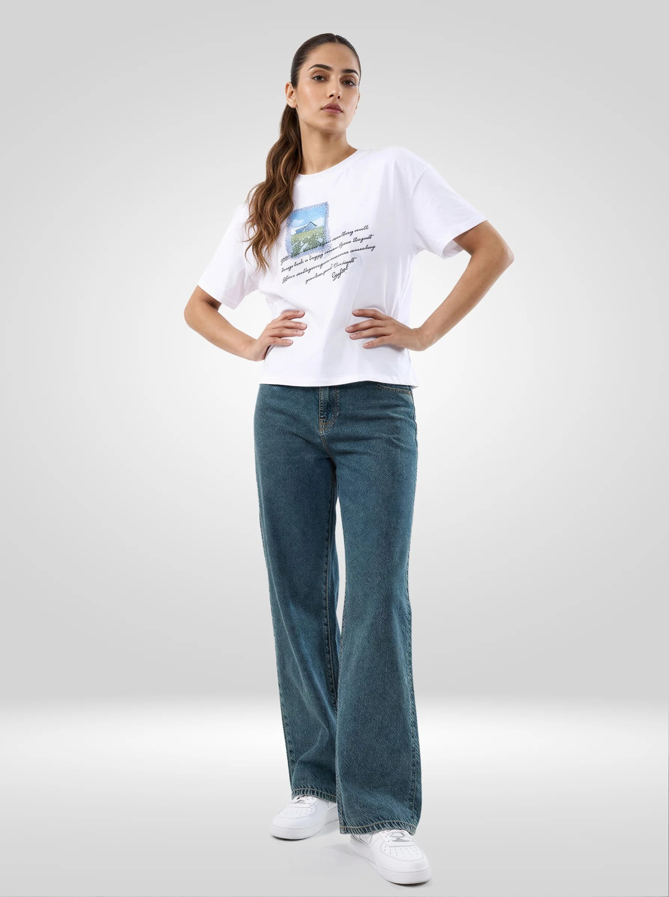
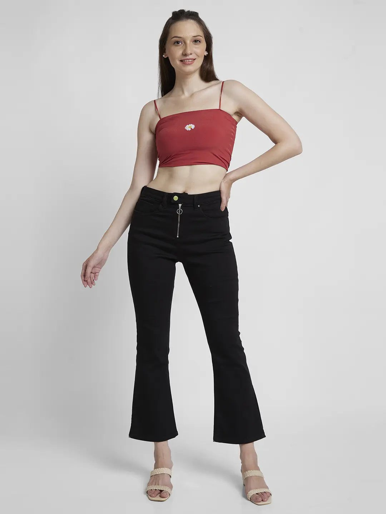

# Women’s Jeans for Every Plan: Workdays, Weekends and Festive Evenings

One pair of jeans can leave home at nine in the morning and still make sense at dinner. The difference is rarely a complete outfit change. At a desk, the shirt stays tucked and the shoe is practical; by evening, a red satin layer and one bright earring may be all that changes. The real decision sits in the smaller details: hem, wash, proportion and whatever the invitation means by “smart casual”. Here, Spykar jeans for women become the base for three familiar parts of the week—work, time off and an informal festive plan—with wide-leg and bootcut shapes doing different jobs.

## Begin with the plan, then choose the jeans

Open your calendar before the wardrobe. A presentation followed by dinner asks for a cleaner wash and a hem that behaves with two pairs of shoes. A Saturday of errands and coffee can take a softer leg, a faded wash and a tee. A festive house party gives you room for satin, metallic jewellery or a stronger colour above the waist.

That sequence saves the common mistake of choosing the most interesting top first and forcing the jeans to catch up. Denim anchors the proportion of the whole outfit. Once its rise, leg shape and length are settled, the rest becomes much easier.

## A quick fit check before styling

### Watch the waistband while sitting

The fitting-room mirror tells only half the story. Sit on the bench for a minute and look at the waistband and front pockets. A doubled waistband, an open pocket mouth or pressure that begins almost at once will still be there after the long shirt goes on. Compare another size or rise while both options are within reach.

### Check the hem with the actual shoes

Wide and flared legs change dramatically with footwear. Use the shoe from the real outfit, not the fitting-room platform. Take a few steps and look behind you. The wide-leg hem may touch the upper without brushing the floor. Bootcut needs enough length for the flare to register; three folds stacked above the shoe hide it again.

### Read the wash as part of the dress code

Clean dark blue, mid-blue and black usually move towards smarter settings. A heavily faded thigh or torn knee changes the reading before the top is even added. Still, wash alone does not set the dress code. A pressed shirt and neat loafer can sharpen denim; a slouchy tee and worn trainer can take the same colour back to Saturday.

## Workdays: three combinations that stay composed

### 1. The blue wide leg for a presentation day

Tuck an ivory or pale-blue shirt into a high-rise wide leg. Over it, a navy sleeveless blazer gives the outfit a straight outer line but is easier to carry outdoors than a full jacket. Try the belt with and without visible metal; the quieter version often suits a meeting better. The loafer or low block heel should disappear only slightly under the hem.

The live Spykar listing for [blue Bella-Wide high-rise jeans](https://spykar.com/products/wdynr1bf262vintagemidblue) describes a clean, medium-wash wide leg in stretch cotton-Lycra. Its five-pocket construction and structured shape suit this sharper upper half. Office rules vary, of course. Confirm that denim is acceptable before planning Monday around it.



### 2. The reliable dark straight-leg combination

A straight leg neither clings nor carries the sweep of a wide fit. That middle ground is useful on repeat workdays. Lay a burgundy, forest-green and charcoal knit over the jeans and keep the one that makes the wash look clearest. The jacket should finish near the waistband; a much longer one can turn the whole outfit into a dark block.

Before leaving, raise both arms and sit once. If the jacket and knit ride up together, the layers are fighting for the same space. Change one length rather than adding another layer. Spykar’s guide to [women’s tops for everyday wear](https://spykar.com/blogs/blog/essential-womens-tops-for-everyday-wear) is a useful next reference when you want to vary the upper half without buying a different jean for every day.

### 3. Black bootcut jeans, a blue shirt and pointed flats

Black bootcut denim makes sense when work slips straight into dinner. With a mid-blue shirt tucked in, note where the flare begins and let the rest remain simple. A slim black belt connects the two halves. Pointed flats work for the commute; a low heel can wait in the desk drawer.

Do not let the shirt bunch around the waistband. After tucking, sit down, stand back up and smooth the fabric at the sides rather than pulling only at the front. If the office air conditioning is strong, layer a lightweight jacket from Spykar’s [women’s jackets collection](https://spykar.com/collections/women-jackets) and remove it outdoors.

## Weekends: give the denim more room

### 4. A wide leg for coffee, errands and a long walk

Wide leg jeans for women can stay uncomplicated on Saturday. A closer tee reveals the waistband and leaves the volume to the denim. Hold white, red and charcoal against the wash in daylight rather than choosing by habit. Under the hem, a trainer with a coloured stripe or gum sole is easier to see than an entirely pale shoe.

When both pieces are loose, find the waistband somehow: a half-tuck, shorter tee or belt will do. Also notice where the bag lands. A large tote can cover the line you have just created, while a compact crossbody sits above it. Nothing needs to look narrow; the eye simply needs to find a beginning and an end.

### 5. Stripes and mid-blue denim for brunch

At brunch or an afternoon market, leave a striped cotton shirt open over a plain vest. Two sleeve turns are usually enough; a thick roll can feel warmer than the shirt deserves. Tan sandals and a brown bag pull mid-blue denim towards a warmer palette. Black sandals make the stripe look crisper.

Lay the stripe next to the jeans in daylight. A cool blue stripe can clash with a greenish or vintage wash even when both pieces are technically blue. White, navy and red stripes are easier starting points because one of those colours can repeat in the shoe, bag or lip colour.

### 6. Bootcut jeans, a cropped polo and low-profile shoes

Bootcut jeans for women are useful when you want a little shape without the full volume of a wide leg. A cropped polo or ribbed top can meet the waistband without covering it. For daytime, test a sleek trainer first, then a flat mule. A short block heel is the third option when the hem needs a little lift.

The important part is the break. A bootcut that ends too high can lose its flare; one that pools heavily looks accidental. Take the shoes to the fitting room if possible, or measure the inseam of a pair that already works at home.

## Festive evenings: change the texture, not your personality

### 7. Black bootcut jeans, a red satin shirt and gold accents

Denim can work for an informal festive dinner, a card party or a friend’s house celebration when the invitation does not call for traditional or formal dress. Let clean black denim do the quiet work and put the colour above it. A deep-red satin shirt changes under warm room light, so try it after sunset. Leave the collar open and tuck without bunching. Then pick a single warm-metal detail—perhaps the earrings—and return the other bright pieces to the table.

On Spykar’s live listing, the [black Elissa high-rise bootcut jeans](https://spykar.com/products/wdynr2bd422black) are described with a clean, no-fade finish, five pockets and a button-and-zip closure. That uncluttered surface leaves room for satin and jewellery. The high rise also makes the shirt tuck visible instead of losing it below a long layer.



### 8. An embroidered top over a quiet wide leg

Look for embroidery gathered at one place—the neckline, cuff or hem—so the eye has somewhere to settle. Beneath it, mid-blue or deep indigo keeps the wide leg quiet. A block heel lifts the hem and is the sensible choice for an evening that includes stairs, standing and moving between rooms.

Check the top length from the side. If it ends at the broadest part of the hip and the jeans also flare immediately, tuck it or try a shorter cut. Add earrings that echo one thread colour from the embroidery. That small repetition is enough; the bag does not need to match too.

### 9. Dark jeans, a metallic knit and a sharp jacket

When sparkle is the main event, keep the jeans and jacket calm. Try a fine metallic knit with dark straight or bootcut denim, then add a cropped black jacket. Hold silver beside black and cool blue, then try antique gold next to dark indigo or brown. The better metal is the one that makes the denim wash look intentional rather than dull.

Take one phone photograph under the room light and another with flash. Metallic cloth often appears louder in the second image than it does in the mirror. Remove a piece of jewellery first if the shine has taken over; there is no need to rebuild the outfit.

## How to rotate women’s jeans styles without repeating the same outfit

You do not need a separate pair for every plan. Build a small rotation in which each jean has a job.

- Keep one clean dark or black pair for work and informal evenings.
- Use a mid-blue straight or wide leg for repeat weekend wear.
- Add a bootcut when you want a longer line with pointed flats or heels.
- Treat a strongly faded or distressed pair as the casual option rather than asking it to cover every dress code.

Change one visible area at a time. A work shirt can return at the weekend worn open over a vest. The same black bootcut can move into the evening when a cotton shirt becomes satin and a flat becomes a block heel. This is where a considered wardrobe earns its space.

## Colour and accessory decisions that take five minutes

Put the full outfit on, then cover the bag with your hand. If the combination suddenly makes more sense, the bag is probably introducing a third idea. Do the same with the earrings and, finally, the shoes. This small elimination test is quicker than emptying the wardrobe onto the bed again.

At work, denim with two neutrals is a dependable ceiling; one accent can replace either neutral. Saturday can handle a stripe, graphic tee or brighter trainer. In the evening, texture does more than a pile of loud colours: satin catches light, embroidery supplies detail and metallic knit adds shine. A visible belt helps define a wide leg, whereas bootcut usually asks you to inspect the hem and shoe.

## Care between one plan and the next

Start with the sewn-in label. The two featured listings say “machine wash”, but the instructions on the jeans in your hand take priority. Check the coin pocket as well as the larger ones, fasten the zip and turn the pair inside out. A new black or dark-blue pair belongs in a separate load from pale clothing until you have seen how the dye behaves.

Feel the waistband, pocket corners and hem before the dry pair returns to the shelf; these thicker sections can stay damp. Jeans worn for only a short outing can air on a hanger, with space around them, before the next decision about washing.

## One pair, more than one calendar

The most useful jeans are not the pair saved for a single kind of day. They are the ones that can take a shirt and jacket at work, a tee and trainers at the weekend, then satin or embroidery for an informal festive evening. Start with fit, length and wash; change texture and footwear when the plan changes. To compare wide-leg, straight, slim and bootcut options in one place, explore Spykar’s [women’s jeans collection](https://spykar.com/collections/women-jeans) and choose the shape that fits both your body and your calendar.

## Women’s jeans questions, answered

### Which jeans work best from office to evening?

A clean dark-blue or black straight or bootcut pair is an adaptable base. At the end of the day, trade the cotton shirt for satin and the commuter flat for a low heel.

### How should wide-leg jeans fit at the waist?

Sit down before deciding. The waistband should remain level and the pocket mouths should not pull apart; below that, the leg may be roomy as long as its hem clears the floor.

### What tops suit bootcut jeans for women?

Try a tucked shirt, fitted knit, cropped polo or shorter jacket. Showing the waistband helps the flare look intentional.

### Can jeans be worn for festive occasions?

Yes, when the event is informal and its dress code allows denim. Choose a clean wash, then add satin, embroidery, metallic detail or polished footwear.

### How many women’s jeans styles are useful in a small wardrobe?

Start with two or three distinct jobs: a clean dark pair, a relaxed mid-blue pair and, if useful to you, a bootcut or wide-leg option.

## FAQ schema

```json
{
  "@context": "https://schema.org",
  "@type": "FAQPage",
  "mainEntity": [
    {"@type":"Question","name":"Which jeans work best from office to evening?","acceptedAnswer":{"@type":"Answer","text":"A clean dark-blue or black straight or bootcut pair is an adaptable base. At the end of the day, trade the cotton shirt for satin and the commuter flat for a low heel."}},
    {"@type":"Question","name":"How should wide-leg jeans fit at the waist?","acceptedAnswer":{"@type":"Answer","text":"Sit down before deciding. The waistband should remain level and the pocket mouths should not pull apart; below that, the leg may be roomy as long as its hem clears the floor."}},
    {"@type":"Question","name":"What tops suit bootcut jeans for women?","acceptedAnswer":{"@type":"Answer","text":"Try a tucked shirt, fitted knit, cropped polo or shorter jacket. Showing the waistband helps the flare look intentional."}},
    {"@type":"Question","name":"Can jeans be worn for festive occasions?","acceptedAnswer":{"@type":"Answer","text":"Yes, when the event is informal and its dress code allows denim. Choose a clean wash, then add satin, embroidery, metallic detail or polished footwear."}},
    {"@type":"Question","name":"How many women’s jeans styles are useful in a small wardrobe?","acceptedAnswer":{"@type":"Answer","text":"Start with two or three distinct jobs: a clean dark pair, a relaxed mid-blue pair and, if useful to you, a bootcut or wide-leg option."}}
  ]
}
```

## Image handoff

### Banner image

- Filename: `womens-jeans-every-plan-banner-800x600.jpg`
- Alt text: Two adult women styling blue wide-leg and black bootcut Spykar jeans from a modern office setting into a festive evening
- Image title: Women’s Jeans for Every Plan
- Source: AI-generated editorial banner using two verified live Spykar product images as garment references

### Inline image 1

- Filename: `spykar-wide-leg-blue.jpg`
- Alt text: Woman wearing Spykar blue Bella-Wide high-rise jeans with a white T-shirt
- Image title: Spykar Blue Bella-Wide High-Rise Jeans for Women
- Source: https://spykar.com/products/wdynr1bf262vintagemidblue

### Inline image 2

- Filename: `spykar-bootcut-black.jpg`
- Alt text: Woman wearing Spykar black Elissa high-rise bootcut jeans with a red crop top
- Image title: Spykar Black Elissa High-Rise Bootcut Jeans for Women
- Source: https://spykar.com/products/wdynr2bd422black
