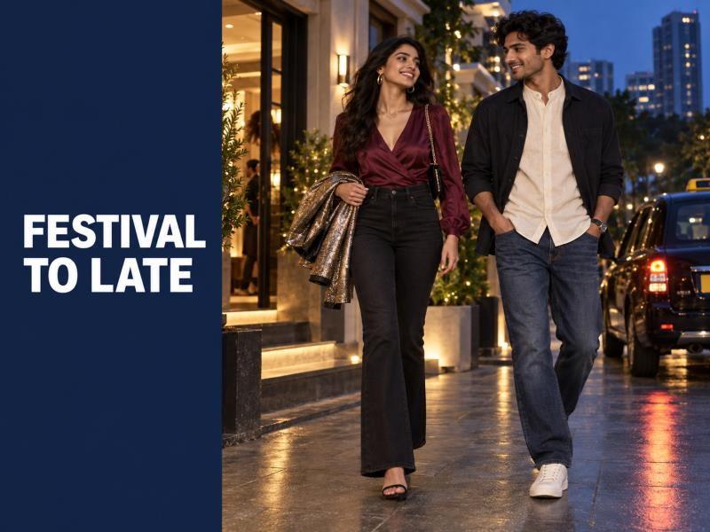
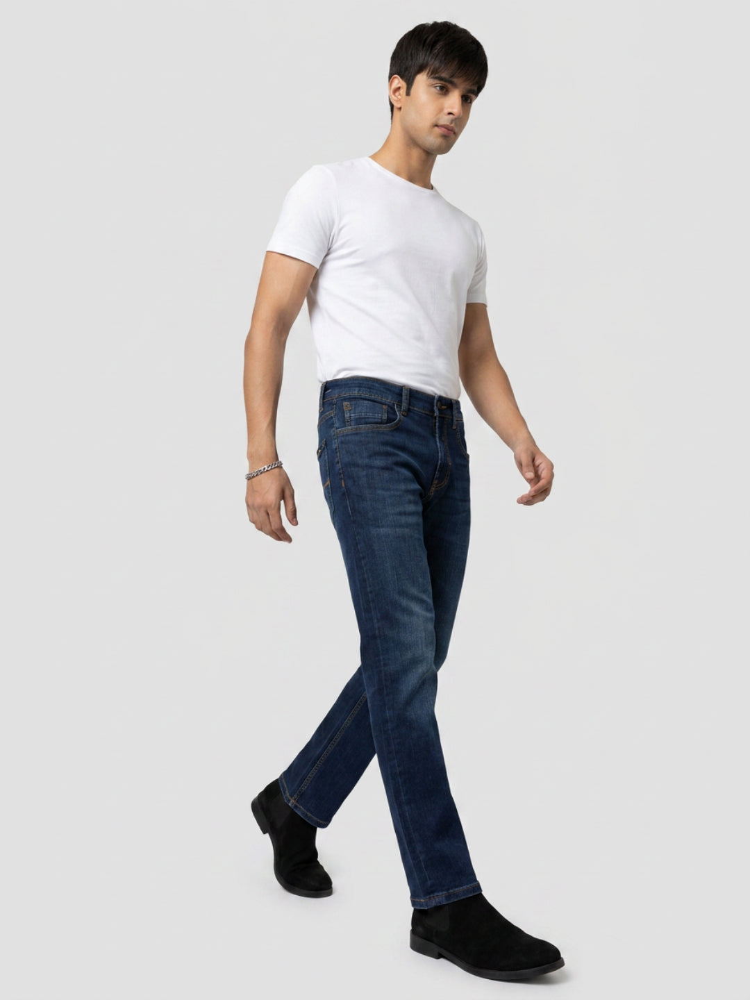
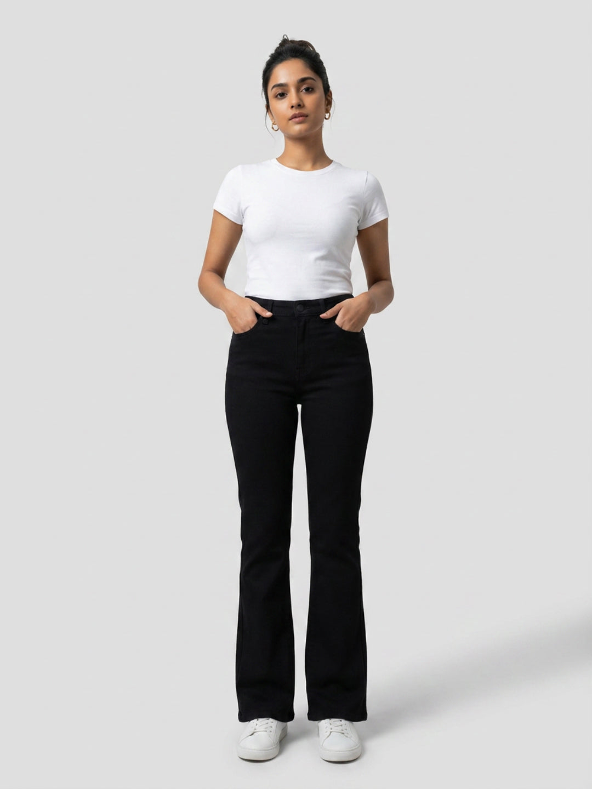

# Festival-to-Afterparty: Outfit Ideas That Work Beyond the Celebration



Some festive plans have a second act. You start at a family home or a friend's celebration, then somebody suggests dinner, a live set, dessert, or one more stop before heading home. That is where an outfit that is only ceremonial can feel restrictive—and an everyday outfit can feel underdone. The useful middle ground is a clean denim base with one or two pieces that can shift the mood after dark.

These festival-to-afterparty outfit ideas are for relaxed festive invitations, not events with a traditional or formal dress code. Read the room first. Once jeans make sense for the first venue, a darker wash, a considered shirt or blouse, and a small evening switch can carry you through both plans without a complete change.

## Begin with a base that earns its place all evening

The base layer should be simple enough for a family setting and structured enough for a late table reservation. Dark indigo, black and clean mid-blue denim are easier to take into evening than heavily distressed or very faded pairs. A straight, relaxed or bootcut fit also gives the outfit a deliberate line before you add any festive detail.

Think of your jeans as the steady part of the look. The upper layer, jewellery, bag and shoes are the elements that can change the energy later. That approach prevents the common problem of carrying a whole spare outfit for a plan that may only happen.

## Pick one festive detail, then keep the rest calm

The quickest route to dressy denim outfits is contrast. A satin-finish blouse, textured overshirt, embroidered short kurta, metallic jacket or deep-colour shirt can bring the celebration into view. You do not need all of them at once.

For women, a wine, emerald, rust or midnight-blue blouse with dark jeans feels festive without losing ease. For men, an ivory, bottle-green or deep maroon shirt has enough presence beside dark denim. Keep the jeans clean and the accessories measured; one interesting surface reads more confidently than several competing ones.

## The five-minute switch that changes the mood

The move from celebration to late plan is usually less dramatic than people expect. It is often a matter of removing or adding one layer.

- Swap a dupatta or light festive layer for a compact jacket, or drape it neatly in your bag.
- Roll down shirt sleeves and add a watch, chain or small hoops if the second venue is more relaxed.
- Change roomy daytime footwear for clean loafers, heeled sandals or sharp sneakers if you have the option.
- Move keys and essentials into a smaller shoulder bag or crossbody bag.

The point is to edit, not rebuild. A good second look should still feel like the same person arrived at both places.

## A dark-blue relaxed-jeans look for men



A relaxed dark-blue jean gives a festive shirt enough space to stand out while keeping the overall shape easy. Build the first version with a clean ivory band-collar shirt, low-profile leather sandals or loafers, and a lightweight overshirt in charcoal or deep navy. At the celebration, leave the overshirt open and the styling pared back.

For the afterparty, put the overshirt on properly, change into clean sneakers if the setting is casual, and let a watch or slim chain do the rest. The [Men Chico relaxed-fit dark-blue jeans](https://spykar.com/products/mdltd2bf302darkblue) work as a useful anchor because the dark wash supports the smarter pieces without asking the rest of the outfit to work too hard. If you are choosing a fresh base, browse Spykar's [men's jeans collection](https://spykar.com/collections/men-jeans) for a fit that feels natural when you sit, move and stay out longer than planned.

## A jet-black bootcut-jeans look for women



Black denim is especially handy when the evening plan is uncertain. Start with a jewel-tone blouse, a fitted short jacket or a longline festive layer, and simple earrings. The first venue gets the colour and texture it needs; the jeans keep the outfit grounded.

For later, remove the longer layer, add a cropped metallic jacket, and switch to a compact shoulder bag. A higher rise and bootcut line create a clean silhouette with a tucked blouse or a shorter outer layer. The [Women Elissa bootcut jet-black jeans](https://spykar.com/products/wdeli2bf046jetblack) offer that clear, evening-ready base. You can also explore Spykar's [women's jeans collection](https://spykar.com/collections/women-jeans) when you want to build a festive-to-late rotation around a fit you will repeat.

## Use proportion to make casual pieces feel intentional

When the jean is relaxed, keep the shirt or jacket closer to the body. When the jean is bootcut or straighter, a cropped jacket or a neat tuck gives the waist some definition. This is not a strict rule; it is simply a fast check before you leave home.

Avoid piling a long festive layer, a very loose shirt and wide denim into the same look unless you have tried the proportions together. The outfit can lose its shape in photographs and feel cumbersome later. One easy piece and one defined piece usually create the balance you need.

## Let your footwear match the longer plan

Footwear decides whether an outfit survives the second venue. If you will remove shoes at the first stop, carry the pair you want to wear after. If there is no chance to change, choose something clean, walkable and polished from the start. Loafers, leather sandals with a finished strap, low-profile sneakers, block heels and closed-toe flats can all work depending on the invite.

Think through the actual route too: steps at a home, a cab ride, a short walk and then an evening venue call for a different choice than a single indoor dinner. Comfort is part of the outfit plan, especially when denim is doing the all-evening work.

## Keep the festive element close to the face

If you are relying on jeans for the base, put the celebratory note where it is visible in photos and conversation: earrings, a scarf, a collar detail, a textured shirt, a rich lip colour or a light-catching jacket. That is more effective than overworking the entire outfit.

This also makes the transition easier. A small bag can hold a lipstick, earrings or a compact layer. You arrive at the late plan looking refreshed, not as though you have changed into someone else's outfit.

## Two easy formulas to keep in mind

For a men's festive-to-party outfit: dark relaxed jeans + ivory or rich-colour shirt + lightweight dark overshirt + loafers or clean sneakers. Remove the overshirt for a quieter home setting; add it back when you leave.

For a women's festive-to-party outfit: jet-black bootcut jeans + jewel-tone blouse + long festive layer + compact jacket in the bag. Keep the longer layer for the celebration, then trade it for the shorter jacket and a smaller bag after.

For more ways to make a shirt-and-jeans base feel smart-casual, see Spykar's guide to [styling jeans with shirts](https://spykar.com/blogs/blog/how-to-style-jeans-with-shirts-smart-casual-outfit-ideas). It is a useful place to begin when your invitation says relaxed but the evening may run late.

## The last check before you leave

Try the whole look on with the layer you plan to add later. Sit down, take a few steps, and see whether the bag, jacket and shoes are actually easy to carry. You do not need a dramatic transformation. You need a base that feels good at the first celebration and a couple of pieces that make sense once the lights are lower.

Spykar denim is built around fit and personal expression, which makes it a natural starting point for plans that do not end where they begin. Explore [men's denim](https://spykar.com/collections/men-jeans) and [women's denim](https://spykar.com/collections/women-jeans), then make the evening version your own.

## FAQs

### Can I wear jeans from a festival gathering to an afterparty?

Yes, when both venues allow smart-casual dressing. Choose clean, darker denim and add one festive or evening-focused piece rather than treating jeans as an afterthought.

### Which jeans work for a festive-to-party outfit?

Dark indigo, black, straight, relaxed and bootcut jeans are easy to style for evening because they give shirts, blouses and outer layers a cleaner backdrop.

### How can men make jeans feel more festive?

Pair dark jeans with an ivory or rich-colour shirt, then add an overshirt, a watch or polished footwear for the later plan.

### How can women style black jeans after a celebration?

Use a jewel-tone blouse for the first venue, then add a cropped jacket, compact bag and a little shine through jewellery or footwear for later.

### What should I avoid for an all-evening denim outfit?

Avoid overly distressed denim, uncomfortable shoes and too many statement pieces. A clean base and one clear festive accent are easier to carry across both settings.

## FAQPage schema

```json
{
  "@context": "https://schema.org",
  "@type": "FAQPage",
  "mainEntity": [
    {"@type":"Question","name":"Can I wear jeans from a festival gathering to an afterparty?","acceptedAnswer":{"@type":"Answer","text":"Yes, when both venues allow smart-casual dressing. Choose clean, darker denim and add one festive or evening-focused piece rather than treating jeans as an afterthought."}},
    {"@type":"Question","name":"Which jeans work for a festive-to-party outfit?","acceptedAnswer":{"@type":"Answer","text":"Dark indigo, black, straight, relaxed and bootcut jeans are easy to style for evening because they give shirts, blouses and outer layers a cleaner backdrop."}},
    {"@type":"Question","name":"How can men make jeans feel more festive?","acceptedAnswer":{"@type":"Answer","text":"Pair dark jeans with an ivory or rich-colour shirt, then add an overshirt, a watch or polished footwear for the later plan."}},
    {"@type":"Question","name":"How can women style black jeans after a celebration?","acceptedAnswer":{"@type":"Answer","text":"Use a jewel-tone blouse for the first venue, then add a cropped jacket, compact bag and a little shine through jewellery or footwear for later."}},
    {"@type":"Question","name":"What should I avoid for an all-evening denim outfit?","acceptedAnswer":{"@type":"Answer","text":"Avoid overly distressed denim, uncomfortable shoes and too many statement pieces. A clean base and one clear festive accent are easier to carry across both settings."}}
  ]
}
```
