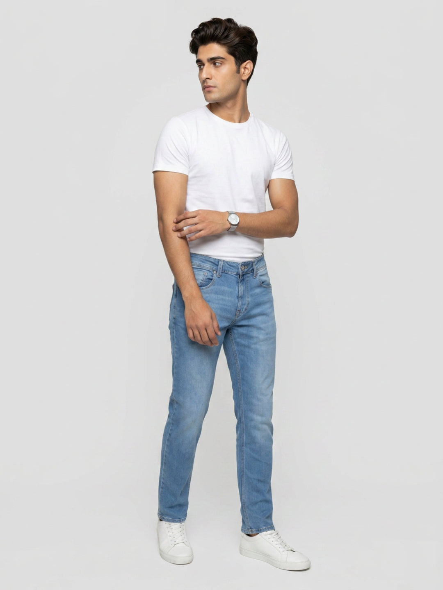

# Cotton Jeans for Men: A Comfort Guide for Late-Monsoon Humidity


Late monsoon is awkward wardrobe territory. The rain may be less constant, but the air can still feel heavy; a road that looks dry at breakfast can be splash-prone by evening. Cotton jeans for men remain useful through this stretch because they move easily between commutes, casual offices and after-work plans. The pair still needs to pass a more practical test than “contains cotton”, though.

The product label is only the first stop. Sit down in the jeans. Notice what happens across the thigh. Look at the hem with your usual shoes, then think about where a washed pair can hang at home. Those ordinary checks say more about an all-day pair than the word “cotton” on its own.

## What tends to work when the rain becomes irregular

Regular and comfort fits are sensible places to begin, especially if a close thigh bothers you while seated. The hem matters too: it should finish clear of the ground in the shoes you actually commute in. Darker denim is useful on splash-prone routes, while mid blue feels right for drier, more casual days. Above the waist, one light piece usually does the job. Pack an overshirt for the office air-conditioning instead of wearing it outdoors.

“Breathable jeans for men” is a useful shopping brief, but cotton percentage cannot settle it. Denim changes with its weight, weave, finish and cut. CottonWorks treats airflow, moisture handling and drying speed as separate fabric attributes that need testing. In other words, read the blend, then judge the garment in front of you.

## Why late monsoon needs a different denim plan

Peak-rain dressing comes with an obvious brief: protect the hem and expect wet ground. The tail end of the season is trickier. A clear morning may lead into humid traffic, a cold office and a brief shower during the ride home.

That mixed day creates three practical problems.

### The waistband can feel different after the commute

Standing still can hide a poor fit. Try the pair from a chair, take a longer-than-normal step, then lift one knee as if you were climbing into an auto. Pulling at the seat or behind the knee will reveal itself quickly. That short movement test deserves more weight than the name printed beside the size.

### The thick parts dry last

The main leg can feel dry while the waistband, pockets, fly and folded hem still hold moisture. Touch those areas before wearing or storing the jeans. If they feel cool or damp, give them more time in moving air.

### One pair cannot cover every wet week

Late-monsoon outfits are easier when denim has a rotation. After a damp commute or wash, let one pair dry completely while another is ready to wear. A two-pair rotation is more realistic than trying to force the same jeans back into service the next morning.

## How to read the fabric label without overpromising comfort

Cotton takes up moisture. CottonWorks records a much higher moisture regain for the fibre when relative humidity is very high. That helps explain why a cotton label and a quick-dry promise are not interchangeable. One pair may feel easy; another may be dense, close-cut and slow to become wearable again.

Use the product page to answer five questions:

1. **What is in the blend?** Record the cotton percentage and any polyester or spandex.
2. **Where does the cut leave room?** A regular or comfort label is helpful, though measurements tell the fuller story.
3. **Is stretch listed?** A little spandex can support movement. It says nothing conclusive about denim weight.
4. **Where will the waist and hem sit?** Check the rise and whether the leg will clear wet ground.
5. **What does the care label allow?** Follow it when wash day arrives.

So treat “breathable” as the problem you want to solve, not a quality proved by one fibre line. Room at the thigh, a manageable fabric feel and enough drying time at home belong in the same decision.

## Two current Spykar options to compare

The following pairs are useful examples because their live product pages state the blend, fit, rise and wash. They are not identical, which makes the comparison more helpful than a generic cotton label.

### 1. Ricardo comfort fit in mid blue



At 98% cotton and 2% spandex, the [Ricardo comfort-fit mid-blue jeans](https://spykar.com/products/mdrc2bf007midblue) are the more cotton-heavy of these two examples. The live listing records a mid rise, five pockets and a clean medium fade. Its comfort cut is worth considering for a weekend or a long seated day.

For Saturday errands, put an ecru or charcoal tee above it. A navy polo shifts the same jeans towards a casual office. Save this lighter wash for a route where spray from the road is not the main worry.

### 2. Ricardo comfort fit in dark blue


The second [Ricardo comfort-fit pair](https://spykar.com/products/mdrc2bf023darkblue) is dark blue, with a stated blend of 82% cotton, 16% polyester and 2% spandex. Its five-pocket build, mid rise, clean finish and light fade are all confirmed on the live page. Choose this wash when your commute regularly runs beside traffic and wet kerbs.

An off-white polo keeps the contrast crisp. A muted sage shirt is quieter and works well after office hours. In both cases, the darker leg gives the outfit a tidy centre without asking for a blazer.

Do one final check on the live listing before ordering, and read the sewn-in label before washing; stock and specifications can change.

## Five outfits for the weather between forecasts

Keep the formula lean: jeans, a light first layer and, only when needed, an overshirt in the bag. Change the shirt or wash for the destination instead of stacking clothes for every possible forecast.

### 1. The crowded commute

Dark-blue comfort-fit jeans and a stone crew-neck tee make a low-fuss start. Use shoes you already trust on wet ground. The overshirt can stay folded until you reach the office; there is little reason to wear it through a humid journey.

### 2. A casual office with no formal meeting

A clean mid-blue pair can take a short-sleeved navy, olive or micro-check shirt. If the shirt ends neatly at the hip, leave it out; a longer cut benefits from a small front tuck. Spykar's [shirts for men](https://spykar.com/collections/men-shirts) offer more colours to test against the denim.

### 3. Client-free Friday: dark jeans + polo

A polo gives denim a sharper collar without the weight of a blazer. Try an off-white one first. Dusty blue or maroon supplies more colour without making the outfit loud. At the ankle, a clean break looks sharper than a heap of denim over the shoe.

### 4. Errands that turn into coffee

Bring out the mid-blue Ricardo with charcoal or rust and low-profile sneakers. Pay attention to the T-shirt shoulder and length; a very long tee can swallow the shape of a roomier jean. Compare shades in Spykar's [men's T-shirts](https://spykar.com/collections/men-t-shirts) before settling on the pairing.

### 5. Dinner after a passing shower

A fitted tee and dark jeans can leave home on their own. When the air cools, add an open slate, olive or checked overshirt and roll the sleeves. Spykar's [monsoon outfit guide for men](https://spykar.com/blogs/blog/stylish-monsoon-outfits-for-men) has more combinations for wetter days.

## Fit, rise and hem: the three-minute trial-room test

Do not stop after fastening the button. Use this short sequence:

- **Sit for 30 seconds.** Notice whether the waistband stays put or starts to press.
- **Take two long steps.** Watch for pulling across the seat and upper thigh.
- **Lift each knee.** Fabric should not bunch heavily behind the knee.
- **Check the hem with your usual shoes.** It should not drag or brush the floor.
- **Look from the side.** Extra room is welcome; a sagging waistband or seat is not.

Shopping online? Lay a dependable pair flat and measure it. Waist, rise, inseam and thigh are more useful comparison points than assuming one tagged size behaves the same in every cut.

## A practical drying and storage routine

The care label gets the deciding vote. When it permits machine washing, close the zip and turn the jeans inside out. A small splash does not always call for a full cycle: the American Cleaning Institute advises prompt spot treatment for stains and says jeans can often go through several wears before washing, subject to dirt and odour.

After washing or a wet commute:

1. Empty the pockets and open them out as much as the construction allows.
2. Separate the legs on a rack instead of folding the jeans over several damp garments.
3. Keep the waistband exposed to moving air in a shaded, ventilated place.
4. Turn the jeans once if one side is staying against the rack.
5. Check the waistband, pocket bags, fly and hems before folding.

Do not fold the pair away while a pocket or the waistband is still damp. Skip direct high heat unless the label allows it. That caution matters with spandex blends, where the instructions for the actual garment beat a generic denim rule.

## Your late-monsoon buying checklist

Before adding another pair of jeans for men, ask:

- Does the fabric feel manageable for my commute and drying space?
- Can I sit, climb stairs and take a long step comfortably?
- Does the hem clear the ground in the shoes I wear most?
- Will the wash work for the routes and settings in my week?
- Can I rotate this pair rather than wearing it again before it is fully dry?
- Have I read the live material and care details instead of relying on the product title?

These questions are more useful than chasing one supposedly perfect monsoon jean. Your schedule, movement and home drying setup are part of the decision.

## Choose for the second half of the day

The right cotton jeans for men should still feel like a sensible choice after the commute, lunch and the ride home. Start with fabric facts, then let fit, hem and care complete the decision. A comfort or regular silhouette, a practical wash and one removable layer can cover most late-monsoon plans without turning the outfit into a weather costume.

Open Spykar's current [jeans for men](https://spykar.com/collections/men-jeans) and compare the details side by side: fit, rise, wash, then material. Choose around your weekday rotation. If a pair is still damp tomorrow morning, it is not ready simply because the outfit is.

## Frequently asked questions

### Can cotton jeans handle late-monsoon humidity?

Yes, when the complete garment fits the job. Cotton percentage belongs beside the construction, cut and drying space available at home.

### What fit should I choose for humid weather?

Regular and comfort fits are practical starting points because they can leave more room through the seat and thigh. Always confirm with a seated and walking test.

### Are cotton jeans the same as breathable jeans for men?

No. Fibre content is one clue; the finished denim's weight, weave, construction and cut decide far more about how it wears.

### Should I choose dark blue or mid blue for the commute?

Dark blue is the practical call beside wet roads. Keep mid blue for a mostly dry route or a more casual day. The journey and dress code should settle the choice.

### What is the safer way to dry jeans in humid air?

Begin with the care label. On a rack, separate the legs and leave the waistband and pockets open to moving air in a shaded spot. Touch those thicker areas before the pair goes back into the cupboard.

### How many pairs should I rotate during a wet week?

Two wearable pairs are a practical minimum if one may need extra drying time. The useful number depends on your wash schedule, commute and drying space.

## Suggested FAQ schema

```json
{
  "@context": "https://schema.org",
  "@type": "FAQPage",
  "mainEntity": [
    {
      "@type": "Question",
      "name": "Can cotton jeans handle late-monsoon humidity?",
      "acceptedAnswer": {
        "@type": "Answer",
        "text": "Yes, when the complete garment fits the job. Cotton percentage belongs beside the construction, cut and drying space available at home."
      }
    },
    {
      "@type": "Question",
      "name": "What fit should I choose for humid weather?",
      "acceptedAnswer": {
        "@type": "Answer",
        "text": "Regular and comfort fits are practical starting points because they can leave more room through the seat and thigh. Confirm the fit by sitting and walking."
      }
    },
    {
      "@type": "Question",
      "name": "Are cotton jeans the same as breathable jeans for men?",
      "acceptedAnswer": {
        "@type": "Answer",
        "text": "No. Fibre content is one clue; the finished denim's weight, weave, construction and cut decide far more about how it wears."
      }
    },
    {
      "@type": "Question",
      "name": "Should I choose dark blue or mid blue for the commute?",
      "acceptedAnswer": {
        "@type": "Answer",
        "text": "Dark blue is the practical call beside wet roads. Keep mid blue for a mostly dry route or a more casual day. The journey and dress code should settle the choice."
      }
    },
    {
      "@type": "Question",
      "name": "What is the safer way to dry jeans in humid air?",
      "acceptedAnswer": {
        "@type": "Answer",
        "text": "Begin with the care label. On a rack, separate the legs and leave the waistband and pockets open to moving air in a shaded spot. Touch those thicker areas before storage."
      }
    },
    {
      "@type": "Question",
      "name": "How many pairs should I rotate during a wet week?",
      "acceptedAnswer": {
        "@type": "Answer",
        "text": "Two wearable pairs are a practical minimum when one may need extra drying time, though the right number depends on wash schedule and drying space."
      }
    }
  ]
}
```
