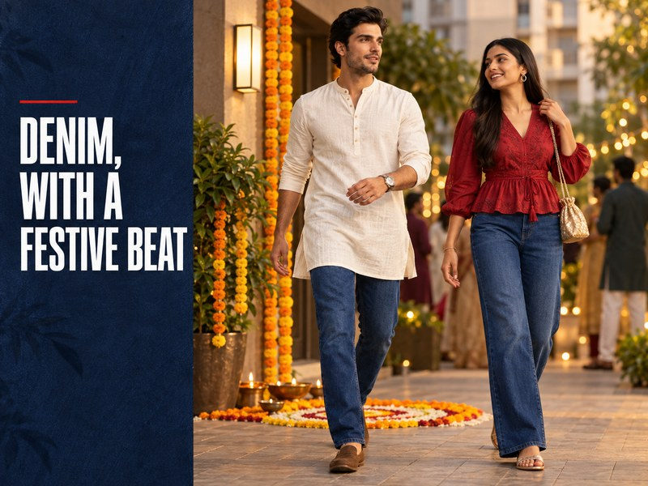
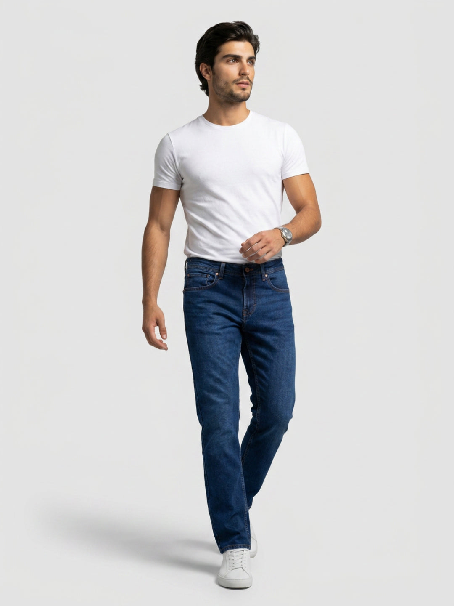
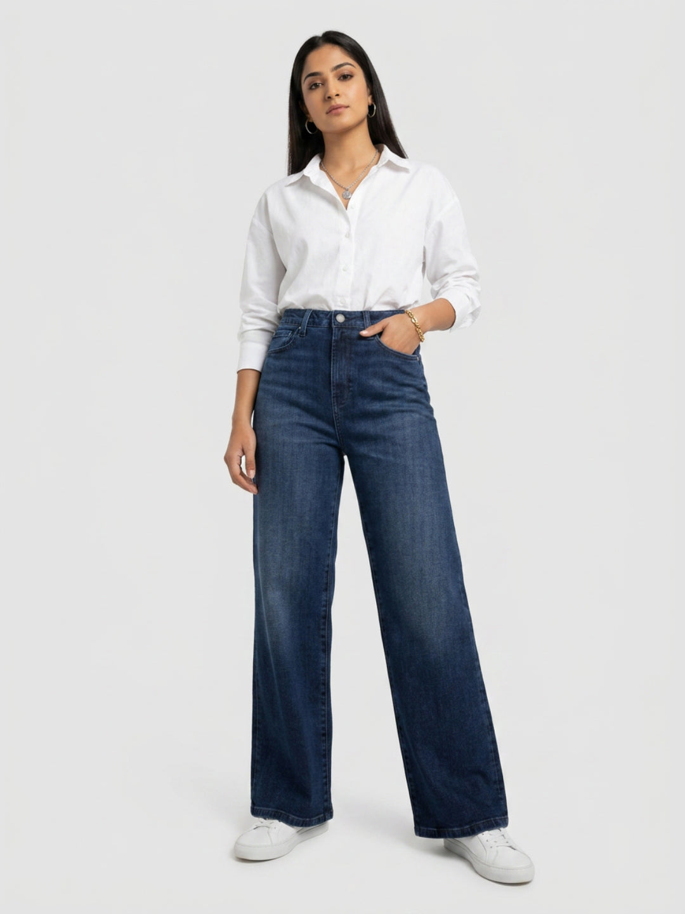

# 5 Denim Looks to Wear for Ganesh Chaturthi Celebrations



Ganesh Chaturthi plans rarely fit into one neat dress code. A morning puja may call for something traditional, while an afternoon of visiting friends can feel far more relaxed. That is where thoughtful denim earns a place. The most useful Ganesh Chaturthi outfit ideas start with the setting: clean jeans for an informal home gathering, a short kurta or festive shirt above them, and footwear that is easy to remove when required. These five looks use denim as the quiet base, leaving colour, texture and accessories to carry the festive mood.

## Can you wear jeans for Ganesh Chaturthi?

Yes, when the host, venue and part of the celebration allow smart-casual or fusion dressing. A family puja with a traditional dress code deserves traditional attire. A casual visit, college celebration, friendly lunch or neighbourhood pandal may leave more room for denim. Check first rather than arriving underdressed.

Choose a clean dark or mid-blue wash with little distressing. Rips, heavy fading and an exaggerated stack at the shoe pull the outfit towards an ordinary weekend. A straight, regular or comfort fit gives you room to sit, walk and help with arrangements without constant adjustment. If the jeans only feel right while standing in front of a mirror, they are not ready for a long celebration.

## The quick formula for festive denim outfits

Build the look in this order:

1. Match the dress code and the day's most formal moment.
2. Pick clean denim in dark blue, mid blue or black.
3. Add one festive colour or Indian-inspired texture above the waist.
4. Repeat one warm tone in a small accessory.
5. Wear tested footwear that can come off easily where required.

The idea is balance. Denim brings familiarity; the shirt, kurta, jewellery or footwear tells people the outfit was chosen for the occasion.

## Five Ganesh Chaturthi outfit ideas with denim

### 1. Short ivory kurta with dark comfort-fit jeans

This is the easiest Ganesh Chaturthi outfit for men who want a clear fusion look without piling on details. Start with a short ivory, cream or pale-beige kurta that finishes around the upper thigh. Pair it with clean dark-blue jeans in a regular or comfort fit. The contrast keeps the kurta distinct and avoids the almost-matching effect created by a blue upper layer and blue jeans of similar depth.

Roll nothing. Let the kurta sleeve and jean hem stay clean, then add brown kolhapuris or simple slip-on footwear if the setting suits them. A narrow watch or one understated bracelet is enough. For a morning home visit, keep the kurta plain. For an evening gathering, a woven collar, subtle print or small embroidered detail can carry more of the festive mood.

Spykar's [Ricardo dark-blue comfort-fit jeans](https://spykar.com/products/mdrc2bf023darkblue) have a mid-rise waist, five pockets and a clean look. The product listing notes stretch and an 82% cotton, 16% polyester and 2% spandex composition, useful details to check when movement and long sitting matter.



### 2. Marigold shirt with dark jeans and brown footwear

If a kurta feels more formal than the plan, move the festive colour into a shirt. Marigold, muted saffron, brick red or leaf green stands out against dark denim without requiring a complicated silhouette. Choose a cotton or cotton-linen shirt with a collar that sits cleanly. A small stripe or restrained print works; large logos and loud graphics compete with the decorations around you.

Leave the first button open and make one tidy sleeve turn if the day is warm. A full tuck gives the combination a sharper line for a family lunch. A neat untucked hem feels better for pandal hopping, provided the shirt does not hang too low. Finish with dark-brown loafers, kolhapuris or minimal trainers according to the venue. This is also the quickest way to turn familiar [men's jeans](https://spykar.com/collections/men-jeans) into a festival-specific outfit.

### 3. Short kurti with high-rise straight jeans

For a practical Ganesh Chaturthi outfit for women, pair a hip-length or slightly longer kurti with dark straight jeans. A high rise defines the waist under a shorter upper layer, while an ankle or near-ankle hem keeps the line clear above flats. Rust, crimson, mustard, teal and off-white all work against deep indigo. Pick one colour that already appears in your earrings, bag or footwear rather than introducing three competing accents.

The kurti should skim rather than bunch at the waistband. If it has a side slit, sit down before leaving and check where the slit falls with the high rise. Small jhumkas or a single bangle stack can add detail near the face and hands. A compact crossbody bag keeps both hands free during a busy visit.

The [Bella dark-blue high-rise jeans](https://spykar.com/products/wdbel2bf326darkblue) are listed by Spykar with a straight fit, ankle length, five pockets, stretch and a clean finish. Their fabric listing is 67% cotton, 20% polyester, 11% viscose and 2% spandex.



### 4. Deep-red blouse or shirt with dark wide-leg denim

Evening aarti or dinner allows a richer colour and a little shine. Tuck a deep-red, wine or berry blouse into clean dark wide-leg jeans. A satin-like surface catches warm indoor light; a matte cotton shirt keeps the outfit quieter. Whichever texture you choose, keep the denim dark and free from torn details so the upper half remains the focus.

Wide-leg denim needs a defined upper shape. Use a full tuck, a fitted blouse or a shirt that ends at the waist. A long loose layer over a broad jean can hide the outfit's proportions. Add one warm-metal element—earrings, a cuff or a small chain—and leave the other jewellery light. Pointed flats or low block heels work for dinner; choose flat slip-ons if the plan involves queues or a longer walk. Browse [women's jeans](https://spykar.com/collections/women-jeans) by fit and wash before deciding which upper-half shape will balance them.

### 5. Light denim shirt, white tee and black jeans

This look is for the most casual part of the celebration: meeting friends after a pandal visit, helping with community preparations or heading to a relaxed college event. Wear a light-blue denim shirt open over a plain white or off-white tee, then add clean black jeans. The colour break prevents the outfit from becoming a heavy block of blue.

Bring in the festive cue through one controlled accent: a rust scarf, a woven bracelet, a small embroidered bag or deep-red footwear. Do not add all four. If the shirt is washed or faded, keep the jeans solid. If the shirt is dark and clean, charcoal denim can soften the contrast. Spykar's guide to [styling jeans with shirts](https://spykar.com/blogs/blog/how-to-style-jeans-with-shirts-smart-casual-outfit-ideas) explains how hem, tuck and fit change the same pairing beyond the festival.

## Match the denim look to the celebration

### Home puja

Choose the most considered version: a short kurta or kurti, dark clean denim and minimal accessories. Make sure the outfit is comfortable while seated. Follow the family's customs and dress code; if traditional clothing is expected, save denim for later plans.

### Pandal visit

Plan for walking, crowds and weather. A breathable shirt, regular or straight jeans and tested flat footwear are easier to manage than a long trailing layer. Carry a light scarf only if it adds function or completes the outfit without needing constant adjustment.

### Evening aarti or family dinner

Use deeper colour, smoother texture and a neater shoe. Dark denim supports wine, red, bottle green and ivory particularly well. Keep the wash quiet so photographs read as festive rather than casual.

### Community celebration or visarjan

Movement matters most here. Avoid a dragging hem, restrictive waistband or new footwear. Keep hands free with a small crossbody bag, and choose clothing you can move in safely. Respect crowd guidance and the practices of the gathering you attend.

## Colour combinations that feel festive without becoming costume-like

Denim blue already occupies a large part of the outfit, so two supporting colours are usually enough.

- Dark indigo, ivory and antique gold feel calm and polished.
- Mid blue, marigold and tan suit a bright daytime plan.
- Black denim, deep red and warm metal move easily into evening.
- Dark blue, bottle green and brown keep the palette earthy.
- Light blue, off-white and rust create a softer casual combination.

Repeat rather than add. If the shirt is marigold, a tan shoe is enough warmth below it. If the blouse is deep red, let a small gold earring echo the richness instead of adding another bright bag.

## The five-minute fit and finish check

Before leaving, sit on a low chair, lift both arms and walk across the room. Check that the waistband stays comfortable, the kurta or shirt does not ride up, and the hem clears the floor. Put the whole outfit under warm light as well as daylight; deep blue and black can look almost identical indoors.

Empty bulky pockets. Carry only what the day needs in a small bag. Test the footwear rather than saving a new pair for the celebration. Finally, look at the outfit in one photograph. If the denim dominates, add a festive colour near the face. If the upper half is already detailed, remove one accessory.

## Let the denim do the quiet work

A good festive denim outfit does not try to turn jeans into traditional wear. It uses a familiar, comfortable base and gives the occasion its due through a clean wash, thoughtful colour, appropriate footwear and respect for the setting. Start with the most formal part of your plan, then choose the kurta, kurti, shirt or layer that belongs there. For informal celebrations where denim fits the dress code, explore Spykar's [men's](https://spykar.com/collections/men-jeans) and [women's denim collections](https://spykar.com/collections/women-jeans) to find a fit you can sit, walk and celebrate in comfortably.

## FAQs

### Can I wear jeans to a Ganesh Chaturthi puja?

Yes, if the host and venue allow smart-casual or fusion dressing. Choose clean, non-distressed denim and pair it with a considered kurta, kurti or festive shirt. Follow a traditional dress code when one is expected.

### Which jeans wash works well for a festive outfit?

Dark blue, clean mid blue and black are the easiest to dress up. Heavy fading and ripped details make the same outfit feel more casual.

### What is an easy Ganesh Chaturthi outfit for men with jeans?

Try a short ivory kurta with dark regular- or comfort-fit jeans and brown slip-on footwear. A marigold or brick-red shirt is a more casual alternative.

### How can women make jeans look festive for Ganesh Chaturthi?

Pair high-rise straight or wide-leg jeans with a short kurti, deep-coloured blouse or textured shirt. Add one warm-metal accessory and comfortable flats.

### Are denim-on-denim outfits suitable for the festival?

They can suit a casual gathering. Use a light denim shirt with black or much darker jeans, then add one restrained festive accent so the outfit feels occasion-specific.

## FAQPage schema

```json
{
  "@context": "https://schema.org",
  "@type": "FAQPage",
  "mainEntity": [
    {
      "@type": "Question",
      "name": "Can I wear jeans to a Ganesh Chaturthi puja?",
      "acceptedAnswer": {
        "@type": "Answer",
        "text": "Yes, if the host and venue allow smart-casual or fusion dressing. Choose clean, non-distressed denim and follow a traditional dress code when one is expected."
      }
    },
    {
      "@type": "Question",
      "name": "Which jeans wash works well for a festive outfit?",
      "acceptedAnswer": {
        "@type": "Answer",
        "text": "Dark blue, clean mid blue and black are the easiest to dress up. Heavy fading and ripped details make the same outfit feel more casual."
      }
    },
    {
      "@type": "Question",
      "name": "What is an easy Ganesh Chaturthi outfit for men with jeans?",
      "acceptedAnswer": {
        "@type": "Answer",
        "text": "Try a short ivory kurta with dark regular- or comfort-fit jeans and brown slip-on footwear. A marigold or brick-red shirt is a more casual alternative."
      }
    },
    {
      "@type": "Question",
      "name": "How can women make jeans look festive for Ganesh Chaturthi?",
      "acceptedAnswer": {
        "@type": "Answer",
        "text": "Pair high-rise straight or wide-leg jeans with a short kurti, deep-coloured blouse or textured shirt. Add one warm-metal accessory and comfortable flats."
      }
    },
    {
      "@type": "Question",
      "name": "Are denim-on-denim outfits suitable for the festival?",
      "acceptedAnswer": {
        "@type": "Answer",
        "text": "They can suit a casual gathering. Use a light denim shirt with black or much darker jeans, then add one restrained festive accent."
      }
    }
  ]
}
```
