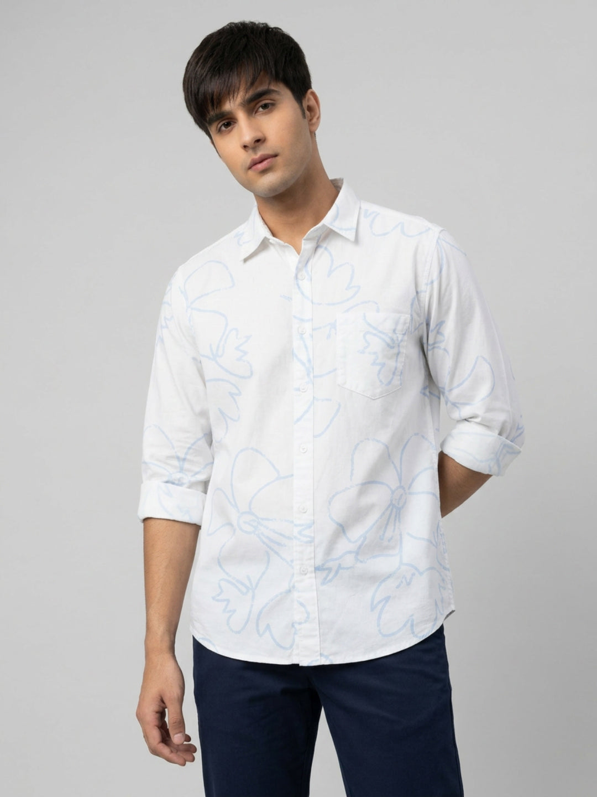

# From Ganesh Chaturthi to Navratri: Building a Modern Indian Festive Wardrobe


The weeks between Ganesh Chaturthi and Navratri ask for more than one kind of outfit. There may be a home puja, a friend’s invitation, an office celebration, a late dinner and, eventually, a Garba night. Buying a separate look for each plan is rarely necessary. A modern Indian festive wardrobe works better when a few well-chosen pieces can shift with the mood: clean denim, a crisp shirt or blouse, one vivid layer and accessories that do the seasonal work.

The goal is not to make every celebration look the same. It is to begin with clothes you can move in, then change the colour, texture and finish according to the setting. Use this guide to build festive denim outfits that feel considered from the first Ganpati visit through Navratri plans.

## Start with the dress code, not the shopping list

The most useful Ganesh Chaturthi outfit ideas begin with a simple question: where are you going, and what is expected there? A family puja or a traditional gathering may call for ethnic clothing. Let that be the priority. Denim is better reserved for relaxed home visits, a casual lunch, a college event or an informal evening where fusion dressing feels right.

Navratri outfits need the same judgement. A daytime meet-up and a dance night are not interchangeable. For Garba, choose footwear with grip, a bag that leaves your hands free and a hem that does not trail when you turn. Your outfit should support the plan rather than compete with it.

## The four pieces that carry the festive stretch

You do not need a crowded wardrobe to create a different look each time. Build around four reliable roles:

1. A clean dark or mid-blue pair of jeans for contrast with festive colour.
2. A lighter denim or neutral trouser for daytime plans.
3. A polished shirt, blouse or short kurta with visible texture, print or embroidery.
4. One energetic accent: a dupatta, mirror-work layer, bright bag, oxidised jewellery or colourful footwear.

This makes styling faster. Keep the denim plain enough to return to, then let the upper half change. A white shirt can become a Ganesh Chaturthi look with dark jeans and a warm-toned stole; the same shirt can feel different at Navratri with a colourful scarf, sleeves pushed up and a sharper belt.

## Ganesh Chaturthi: keep the base clean and the colour intentional

For a relaxed Ganesh Chaturthi gathering, dark denim gives festive colours room to show up without making the outfit heavy. Men can begin with a clean pair of [men’s jeans](https://spykar.com/collections/men-jeans), then add an ivory, white, marigold or muted green shirt. Women can use [women’s jeans](https://spykar.com/collections/women-jeans) below a printed kurti, a deep-red blouse or a short jacket over a simple upper layer.

Aim for one clear focal point. If the shirt has a print, keep the shoes and belt quieter. If your jewellery or dupatta brings mirror work, choose a clean denim wash with little distressing. That balance lets a fusion outfit feel festive without looking like a weekday outfit with too many extras added at once.

### A men’s starting point: white shirt and indigo denim

The [Men Shirt Print White Regular Fit](https://spykar.com/products/mshps2bf129white) is useful here because the product page lists a regular fit, full sleeves, a raised collar and an 88% cotton, 12% linen fabric. Wear it with dark indigo jeans, brown loafers or clean sandals, and a slim watch. For a casual lunch, keep it untucked with the sleeves folded once. For an evening visit, tuck the front more neatly and let the printed shirt carry the look.



*CMS alt text: Spykar Men Shirt Print White Regular Fit in a cotton-linen blend with pale blue print, full sleeves and a raised collar.*

## The in-between days: make one denim base work harder

Between celebrations, the easiest styling move is to change the finish around your jeans. Swap the shirt for a fitted T-shirt and an open overshirt for a coffee plan. Add a short kurta, structured blouse or textured shirt for a family dinner. For ideas on making the shirt-and-denim pairing feel sharper, read Spykar’s guide to [styling jeans with shirts](https://spykar.com/blogs/blog/how-to-style-jeans-with-shirts-smart-casual-outfit-ideas).

This is also the point to check comfort honestly. Sit down, bend, walk up stairs and see where your hems land. A flattering fit that needs constant adjustment will not feel festive after several hours. Clean, comfortable pieces earn a repeat place in the wardrobe; novelty pieces often do not.

## Navratri: add movement, colour and a little shine

Navratri can be louder, especially if your plans include music or Garba. That does not mean the whole outfit needs to sparkle. Choose one movement-led element: a flared jean, a skirt-like silhouette, a tasselled layer, a colourful jacket or statement earrings. Keep the rest of the look clean enough to dance in.

For women, dark-blue flares work beautifully with a fitted choli-inspired blouse, a cropped embroidered jacket or a bright shirt tucked in at the waist. The [Women Flare Fit Jeans Flare Leg Dark Blue High Rise](https://spykar.com/products/wdfla2bf047darkblue) has a high rise, full length, clean finish, five pockets and stretch according to the product page. Its dark wash creates a grounded base for rust, saffron, fuchsia, emerald or cobalt on the upper half.


*CMS alt text: Spykar Women Flare Fit Jeans Flare Leg Dark Blue High Rise in a clean dark wash, styled with a black fitted T-shirt.*

For men, a deep blue or black jean with a short printed shirt can work for a casual Garba night, particularly with a colourful bandhani-style scarf or an embroidered waistcoat. Keep the layer light. The point is to move easily through the evening, not to reproduce traditional dancewear where the occasion calls for it.

## Build colour combinations that travel well

Festive colour feels more modern when it has one neutral base. Let denim, white, black, beige or navy do the quiet work, then add one or two stronger notes. Try these combinations:

- Dark blue denim + ivory + marigold for daytime.
- Black denim + crimson + antique gold for an evening gathering.
- Mid-blue denim + white + bright pink or orange for a playful Navratri plan.
- Indigo denim + olive + metallic silver for a less predictable route.

You do not have to follow a prescribed colour each day to make the outfit feel festive. Choose shades you will genuinely wear again. A colour that works with your existing jeans, shoes and outerwear is more useful than a one-night purchase.

## Make the outfit dance-ready, commute-ready and photo-ready

The difference between a good-looking outfit and a useful one shows up after the first hour. Before leaving, check three things. First, make sure the waistband stays comfortable while sitting and moving. Second, look at the hem with the footwear you will actually wear; flares and longer jeans need enough clearance from the ground. Third, take a quick phone photo in indoor light. Metallic details, white shirts and very dark washes can look different under warm lights than they do in daylight.

Carry a small crossbody bag or a secure pouch for a phone and keys. If shoes need to come off at a home gathering, make the choice easy: clean slip-ons, loafers or flats are usually less fussy than footwear with difficult straps. It is a small decision, but it keeps the evening easy.

## Keep the wardrobe personal, not uniform

A modern Indian festive wardrobe should still leave room for your own customs and comfort level. Wear traditional attire when the gathering expects it. Use denim when the occasion welcomes smart-casual fusion dressing. The strongest repeat formula is simple: one clean base, one festive texture or colour, and accessories chosen for the actual plan.

Spykar’s denim lets that base stay personal to your fit and mood. Start with [men’s denim](https://spykar.com/collections/men-jeans) or [women’s denim collections](https://spykar.com/collections/women-jeans), then build the rest of the look around the celebrations already on your calendar. You will have fewer last-minute outfit decisions—and more pieces you want to wear again after the lights come down.

## FAQs

### Can I wear jeans for Ganesh Chaturthi?

Yes, for casual or fusion-friendly plans. If a host or puja has a traditional dress code, choose traditional attire instead.

### What should I wear for a Navratri Garba night if I prefer denim?

Use clean dark jeans or flares with a bright blouse, printed shirt or light festive layer, and choose footwear that is secure for movement.

### Which jeans washes pair easily with festive outfits?

Dark blue, black and clean mid-blue washes pair easily with bright festive colours, prints and metallic accents.

### How can men make jeans look festive without a heavy layer?

Pair clean jeans with a printed or textured shirt, a simple watch and polished footwear. Add one colourful accessory only if it feels natural to the plan.

### How can women style flare jeans for a festival?

Balance the flare with a fitted blouse, cropped jacket or tucked-in shirt, then keep the hem clear of the ground with the footwear you plan to wear.

## FAQPage schema handoff

```json
{
  "@context": "https://schema.org",
  "@type": "FAQPage",
  "mainEntity": [
    {"@type":"Question","name":"Can I wear jeans for Ganesh Chaturthi?","acceptedAnswer":{"@type":"Answer","text":"Yes, for casual or fusion-friendly plans. If a host or puja has a traditional dress code, choose traditional attire instead."}},
    {"@type":"Question","name":"What should I wear for a Navratri Garba night if I prefer denim?","acceptedAnswer":{"@type":"Answer","text":"Use clean dark jeans or flares with a bright blouse, printed shirt or light festive layer, and choose footwear that is secure for movement."}},
    {"@type":"Question","name":"Which jeans washes pair easily with festive outfits?","acceptedAnswer":{"@type":"Answer","text":"Dark blue, black and clean mid-blue washes pair easily with bright festive colours, prints and metallic accents."}},
    {"@type":"Question","name":"How can men make jeans look festive without a heavy layer?","acceptedAnswer":{"@type":"Answer","text":"Pair clean jeans with a printed or textured shirt, a simple watch and polished footwear."}},
    {"@type":"Question","name":"How can women style flare jeans for a festival?","acceptedAnswer":{"@type":"Answer","text":"Balance the flare with a fitted blouse, cropped jacket or tucked-in shirt, then keep the hem clear of the ground with the footwear you plan to wear."}}
  ]
}
```
