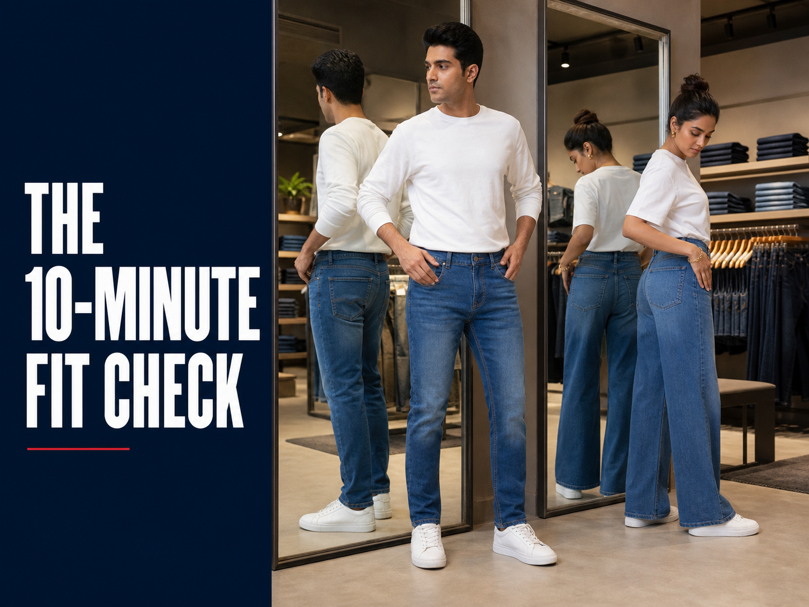
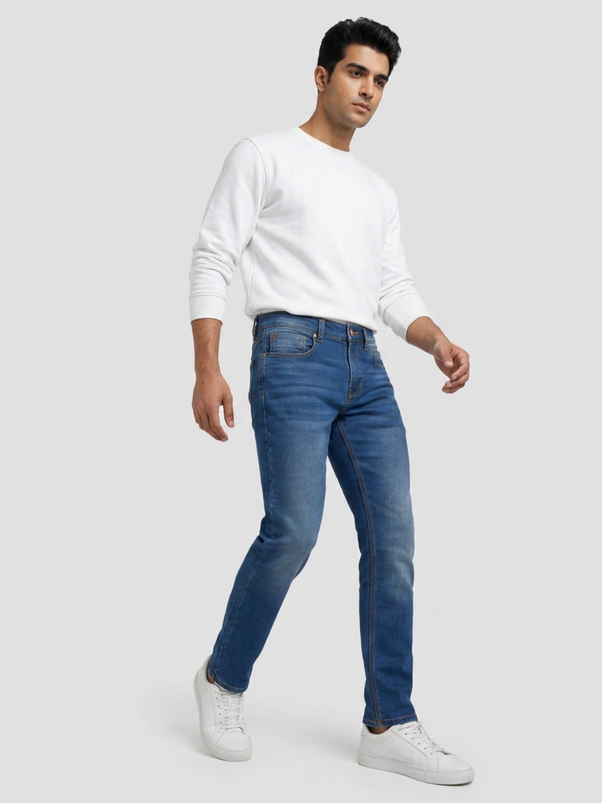
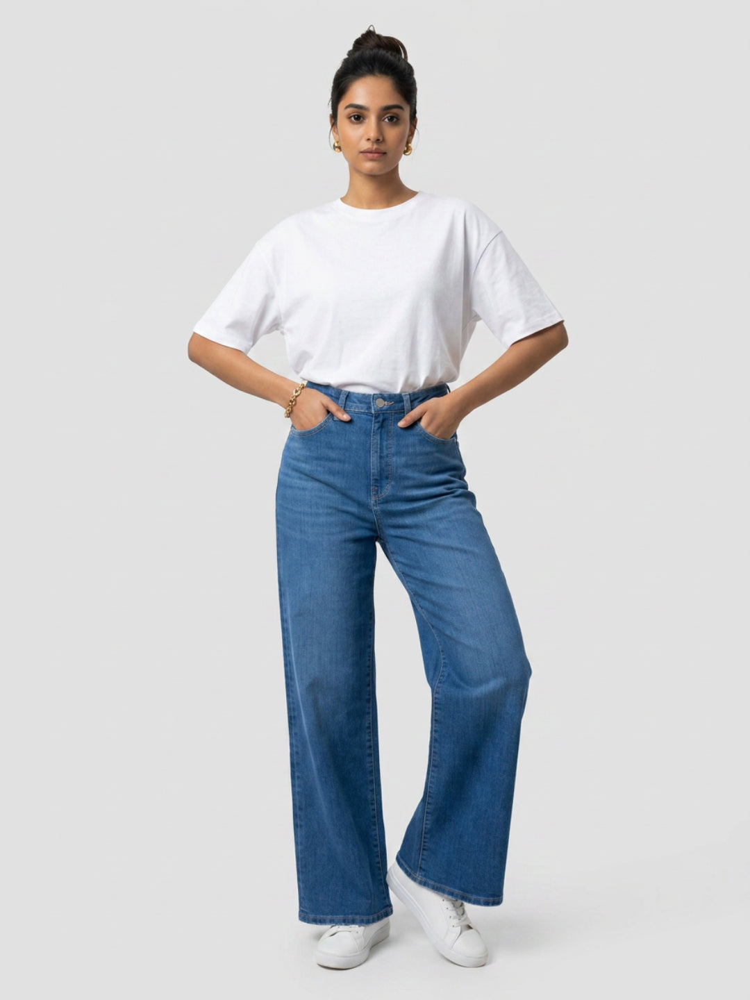

# How to Find Your Best Jeans Fit In-Store in 10 Minutes



The fitting room can turn three promising pairs into one clear choice—if you know what to check. A waistband that looks fine while standing may press when you sit. A wide leg can feel relaxed yet land badly on your usual shoes. Even the same tagged size can sit differently when the rise, fabric or cut changes.

If your search begins with “Spykar store near me”, use Spykar’s [current store locator](https://spykar.com/pages/store-locator) to find a showroom, then take this ten-minute routine with you. It is a decision framework, not a stopwatch challenge. The goal is to compare fewer pairs properly and leave knowing the fit name, rise and size that worked.

## Before the clock starts: arrive with one useful reference

Wear the shoes you expect to pair with the jeans most often. Hem length can look right with a chunky sneaker and too long with a low-profile one. Choose a top that makes the waistband visible, and empty bulky items from your pockets before assessing the seat.

If you already own jeans that fit well, note their waist, rise and inseam before leaving home. A quick phone photo of the label helps too. Do not assume the same number will behave identically across every silhouette; treat it as a starting point.

At the rail, begin with two different fits in your usual size. A straight or regular leg and a wider or more relaxed shape make the contrast easy to read. Take one neighbouring size only when the first pair gives you a clear reason—waist pressure, gaping or restricted movement. Collecting six nearly identical pairs wastes the part of the visit that matters: the trial.

## Your 10-minute denim fit guide

Use the mirror for shape, but let movement settle comfort. Run the checks in the same order for every pair so the comparison stays fair.

### Minutes 0–2: decide what you want the leg to do

Start with the silhouette, not a body-type rule. Ask where the jeans will go and what you usually wear above and below them.

- A regular or straight fit creates a clean line that works with T-shirts, polos and casual shirts.
- A slim fit sits closer through the leg without becoming the only option for a sharper outfit.
- A relaxed, comfort or loose fit gives the seat and thigh more room; the waistband should still stay secure.
- A wide or bootcut leg changes the balance around the shoe and is worth checking at full length.

Spykar’s [denim fit overview for men and women](https://spykar.com/blogs/blog/modern-denim-fits-explained-finding-the-perfect-spykar-fit) is useful before the visit. In the store, ignore the idea that one silhouette must suit everyone. Pick the line that matches your comfort preference and wardrobe.

### Minutes 2–4: check the waist and rise

Fasten the jeans without pulling your stomach in or shifting the waistband to an unnatural position. The waist should feel secure while you breathe normally. Look for a gap at the back, horizontal pulling lines at the front or a button that feels strained.

Now locate where the waistband naturally sits. Low, mid and high rises change the relationship between the waist, hip and top length. Try a small front tuck. If it creates bunching you dislike, the rise may not suit the way you style shirts and tees. If the pair slides when you take a few steps, going tighter is not the only answer; another rise or cut may sit better.

Do not use a universal finger-width trick as the final verdict. Bodies, denim stretch and waistband construction differ. Breathing, sitting and walking give you more useful evidence.

### Minutes 4–6: sit, step and lift

This is where a promising mirror fit either earns its place or leaves the shortlist.

1. Sit for 20–30 seconds with both feet on the floor.
2. Stand without pulling the jeans back into place.
3. Take two long steps and one sideways step.
4. Lift each knee once, as though climbing a bus step or getting into a cab.
5. Reach towards your shoes without forcing a deep stretch.

Notice pressure at the waistband, crotch, upper thigh and behind the knee. The fabric can sit close, but it should not make ordinary movement a negotiation. On a roomier pair, watch the opposite problem: excess fabric collapsing at the seat or twisting around the leg.

### Minutes 6–8: inspect the seat, pockets and side view

Turn sideways, then use the back mirror. The waistband should remain level rather than dipping sharply. Pockets should lie flat, and the seat should follow the intended silhouette without deep drag lines.

Put your phone into the pocket you use every day. Sit once more. This small check exposes pockets that are too shallow for your routine and shows whether the added bulk changes the feel at the hip. Remove the phone before judging the final silhouette.

For a clean fit comparison, look at the side seam. A seam that rotates strongly towards the front or back can signal that the pair is fighting the shape of the leg. Denim may settle with wear, but the trial room is not the place to assume a painful waistband or severe pulling will solve itself.

### Minutes 8–10: settle the hem and choose between two finalists

Stand naturally in your own shoes. Check the front break, back hem and side profile. A regular or straight leg may touch the shoe with a light break. A wider leg needs enough length to hang cleanly without sweeping the floor. A cropped or ankle-length pair should look intentional from every angle.

Now compare only the two strongest options. Take the same front, side and seated look in each. Ask three questions:

- Which pair stays comfortable without adjustment?
- Which leg shape works with more of the tops and shoes I already own?
- Can I name the fit, rise and size I am choosing?

Photograph the product tag or note those details before heading to the till. That becomes your personal denim fits guide for the next visit.

## Two current Spykar fits to use as comparison points

The live product pages below make the contrast clear: one is a regular men’s silhouette with a mid rise; the other is a women’s wide leg with a high rise. Product details and availability can change, so recheck the listing or in-store label before buying.

### Rover regular fit: a clean everyday baseline



The [men’s Rover regular-fit mid-blue jeans](https://spykar.com/products/mdro2bf018midblue) use a mid rise and a regular leg. The live listing records a 78% cotton, 20% polyester and 2% spandex blend, five pockets, stretch and a clean medium fade.

Use this pair as a baseline if you want a straight, familiar line. In the fitting room, pay attention to the thigh while seated and the amount of break above your shoes. Compare the regular silhouette with a slim or relaxed option in the same waist size; the visual difference is easier to judge when only the cut changes.

### Bella-Wide: test the rise and full leg line together



The [women’s Bella-Wide high-rise jeans](https://spykar.com/products/wdblw2bf069midblue) have a wide-leg silhouette and a high rise. Spykar’s live page lists a 76% cotton, 22% polyester and 2% spandex blend, five pockets, stretch, a clean finish and an ankle-length description.

Check this fit from the side as well as the front. The waist should stay secure while the leg hangs freely. Try it with the shoes you brought; the intended ankle finish has to meet the footwear at a deliberate point, not at random.

You can also compare the broader range through Spykar’s [men’s jeans collection](https://spykar.com/collections/men-jeans) and [women’s jeans collection](https://spykar.com/collections/women-jeans) before deciding which two silhouettes to request in-store.

## How to choose jeans fit without falling for the mirror-only test

A fitting-room mirror is useful, but it rewards a still pose. Your day does not. Give the final pair a practical score across five areas:

- **Waist:** secure through normal breathing, with no hard pressure or obvious gaping.
- **Seat and thigh:** enough room to sit and step without severe pulling or collapsing fabric.
- **Rise:** comfortable at the position where you naturally wear the waistband.
- **Leg shape:** intentional from hip to hem and compatible with your usual tops.
- **Length:** suitable for your footwear and clear of the floor.

Fit names describe a cut; they do not grade your body. If a different size or silhouette feels better, that is useful information, not a compromise. Try the neighbouring option, repeat the same movement test and choose the pair that needs the least adjusting.

## Trial-room red flags worth acting on

Some issues are styling choices. These are practical signals to pause:

- The waistband digs in when seated or slides down after a few steps.
- Strong horizontal lines radiate from the zip, crotch or upper thigh.
- You keep pulling the legs or seat back into place.
- Pocket openings flare when empty.
- The side seams twist noticeably on both legs.
- The hem drags under your shoe or a cropped length lands at an awkward point.
- You are counting on discomfort to disappear later.

A small alteration may solve excess length. It cannot turn the wrong rise or an uncomfortable seat into the same pair you liked in the mirror. If the leg is right but the waist is not, ask the store team for another fit before trying multiple sizes of the identical cut.

## What to ask at a Spykar showroom

Once you have found a Spykar showroom near you, make the conversation specific. “I want a clean everyday pair with more thigh room” is more useful than “What looks good?” Show the associate the fit that almost worked and name the issue: waist gap, thigh pressure, low rise or excess hem.

Ask for one contrasting fit, not a rack of substitutes. If a regular leg feels right but the seat is close, try a relaxed or comfort fit. If a wide leg overwhelms your usual shoes, compare a straight or bootcut shape. Confirm the fit name, rise, fabric blend, care instructions and available size from the garment label or current product page.

Store inventory varies. Use the [Spykar store locator](https://spykar.com/pages/store-locator), enter your location and contact the selected showroom if you need a particular product or size. The locator helps with discovery; it does not guarantee that every online style is stocked at every store.

## Leave with a fit note, not another guess

The useful outcome of a store visit is not simply a size. It is a repeatable combination: fit name, rise, waist, leg shape and the shoe that makes the hem work. Run the same ten-minute check each time—waist, movement, seat, side seam, hem—then compare two finalists instead of trusting the first mirror pose.

Ready to test it? Open Spykar’s [store locator and find a showroom near you](https://spykar.com/pages/store-locator). Bring your regular shoes, save the fit details that work and let “Fit For Every You” begin with how the jeans feel through your actual day.

## Frequently asked questions

### How do I find a Spykar store near me?

Use Spykar’s official store locator, enter your location and review the available results. Contact the chosen showroom if you need a particular fit or size.

### Can I really choose a jeans fit in 10 minutes?

The routine can be completed in about ten minutes once you have two sensible options. Take longer if the fit decision is unclear; the sequence matters more than the clock.

### What should I check first when trying on jeans?

Start with the waist and rise, then sit, walk and lift a knee. Finish with the seat, side seam and hem in the shoes you normally wear.

### Should jeans feel tight in the fitting room?

Close-fitting denim can feel secure, but ordinary breathing and movement should not hurt or require constant adjustment. Compare another size or cut when it does.

### Which jeans fit is easiest to start with?

A regular or straight fit is a useful baseline because its leg line is easy to compare with slim, relaxed, wide or bootcut options.

### What details should I save after finding the right pair?

Note the product name, fit, rise, waist size and length. Add the shoes you used for the hem check so the next comparison starts with real information.

## Suggested FAQ schema

```json
{
  "@context": "https://schema.org",
  "@type": "FAQPage",
  "mainEntity": [
    {
      "@type": "Question",
      "name": "How do I find a Spykar store near me?",
      "acceptedAnswer": {
        "@type": "Answer",
        "text": "Use Spykar's official store locator, enter your location and review the available results. Contact the chosen showroom if you need a particular fit or size."
      }
    },
    {
      "@type": "Question",
      "name": "Can I really choose a jeans fit in 10 minutes?",
      "acceptedAnswer": {
        "@type": "Answer",
        "text": "The routine can be completed in about ten minutes once you have two sensible options. Take longer if the fit decision is unclear; the sequence matters more than the clock."
      }
    },
    {
      "@type": "Question",
      "name": "What should I check first when trying on jeans?",
      "acceptedAnswer": {
        "@type": "Answer",
        "text": "Start with the waist and rise, then sit, walk and lift a knee. Finish with the seat, side seam and hem in the shoes you normally wear."
      }
    },
    {
      "@type": "Question",
      "name": "Should jeans feel tight in the fitting room?",
      "acceptedAnswer": {
        "@type": "Answer",
        "text": "Close-fitting denim can feel secure, but ordinary breathing and movement should not hurt or require constant adjustment. Compare another size or cut when it does."
      }
    },
    {
      "@type": "Question",
      "name": "Which jeans fit is easiest to start with?",
      "acceptedAnswer": {
        "@type": "Answer",
        "text": "A regular or straight fit is a useful baseline because its leg line is easy to compare with slim, relaxed, wide or bootcut options."
      }
    },
    {
      "@type": "Question",
      "name": "What details should I save after finding the right pair?",
      "acceptedAnswer": {
        "@type": "Answer",
        "text": "Note the product name, fit, rise, waist size and length. Add the shoes used for the hem check so the next comparison starts with real information."
      }
    }
  ]
}
```
