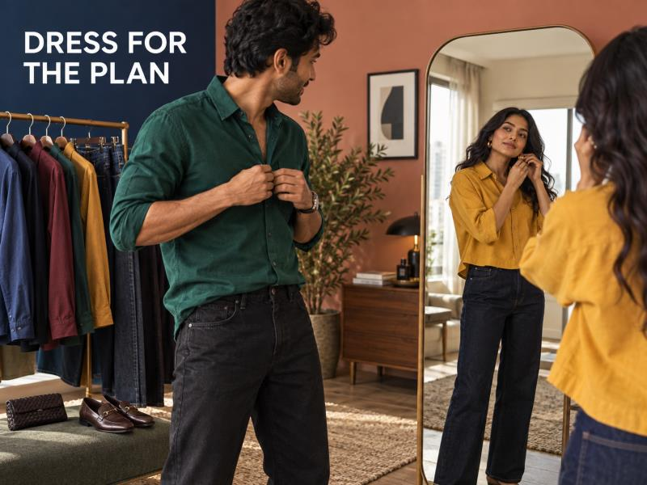
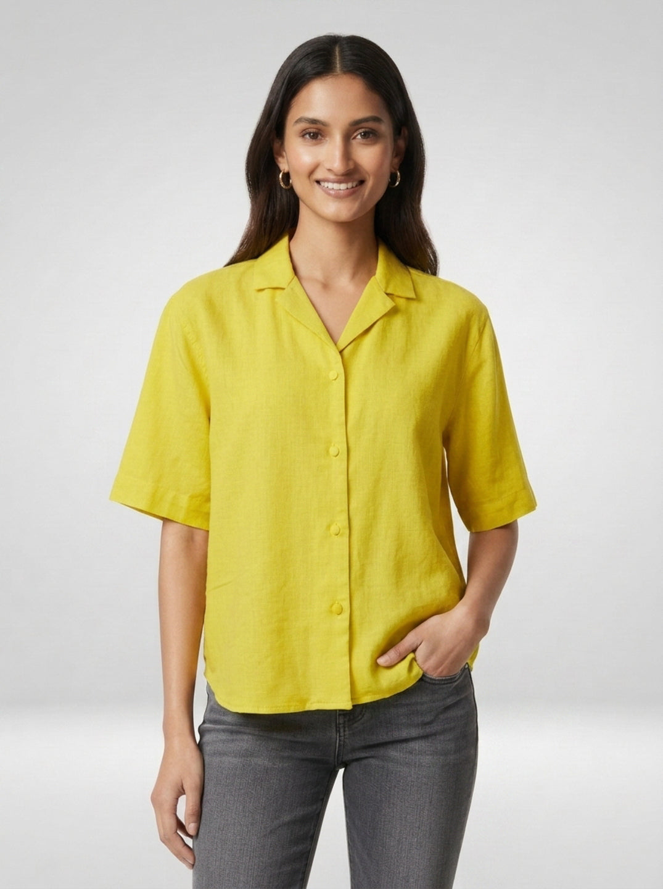

# What to Wear This Festive Season: Modern Outfit Ideas for Men and Women



Festive plans do not arrive with one dress code. A home lunch, a family puja, a work celebration and an evening with friends can all happen in the same week. That is why the most useful festive outfit ideas start with the plan—not a pile of outfits you will wear once. Build around a clean base, add a colour or texture that feels celebratory, then choose shoes and accessories that suit the hours ahead.

For many casual gatherings, denim gives modern festive outfits their balance. It keeps a bright shirt, a textured layer or jewellery from feeling too formal. When traditional attire is expected, follow the host’s dress code. When the plan is relaxed or fusion-friendly, these ideas help men and women bring denim into the festive mix with more intention.

## First, read the room

Before choosing an outfit, decide what kind of celebration you are dressing for. A traditional family ritual may need traditional clothing. A casual visit, dinner or office event gives more room for shirts, jeans, dresses and light festive layers.

Then think about movement. Will you be sitting on the floor, travelling across town, taking photos outdoors or dancing later? The right outfit should handle the plan without constant adjustment. A clean hem, comfortable waistband and footwear you can walk in matter as much as colour.

## The easy formula for festive dressing

Use one grounded piece and one celebratory piece. Dark denim, black denim, ecru trousers or a simple dress can sit below a brighter shirt, blouse, jacket, dupatta or textured accessory. This is how a look stays current without looking overloaded.

Try this quick check before leaving:

1. Choose a fit you can sit and move in.
2. Add one strong colour, print or surface detail.
3. Keep the remaining pieces quieter.
4. Match your footwear to the actual venue, not only the mirror.

## Festive outfit ideas for men

Men’s festive outfits can begin with a dark jean and a shirt that has a richer colour or visible texture. Deep green, rust, maroon, indigo and clean white all work well against black or dark-blue denim. A short kurta or overshirt can replace the regular shirt when the setting is more traditional, while loafers or clean sandals offer a sharper finish than everyday trainers.

For an informal dinner, the [Men Chico Jeans Relaxed Fit Black Mid Rise](https://spykar.com/products/mdynr1bf149carbonblack) gives a useful base. The live product page lists a relaxed fit, mid rise, cotton-stretch fabric, clean look and stretch. Pair it with an emerald or rust shirt, then add a simple watch. The relaxed shape gives a little room for a long evening; the black wash keeps the colour above it clear.


*CMS alt text: Spykar Men Chico Jeans Relaxed Fit Black Mid Rise in black cotton-stretch denim.*

For a more dressed-up plan, swap the shirt for a short kurta or a structured overshirt. Keep the denim clean and avoid stacking several loud elements together. Spykar’s [men’s jeans collection](https://spykar.com/collections/men-jeans) has fits to build around, while its guide to [styling jeans with shirts](https://spykar.com/blogs/blog/how-to-style-jeans-with-shirts-smart-casual-outfit-ideas) can help refine the shirt-and-denim pairing.

## Festive outfit ideas for women

Women’s festive outfits can play with contrast: a bright shirt with dark denim, a printed blouse with a straight jean, or a short jacket layered over a simple fitted base. A clear waistline and a clean wash help the look feel intentional, especially when earrings, a bag or footwear already bring detail.

The [Women Shirt Solid Yellow Boxy Fit](https://spykar.com/products/wshsos1bf141amberyellow) is a bright option for a casual festive gathering. Its product page lists a boxy fit, half sleeves, spread collar, button closure, and an 88% cotton, 12% linen fabric. Wear it half-tucked into dark-blue or black jeans with metallic flats. Add small gold-toned earrings or a textured clutch, and let the yellow carry the colour story.



*CMS alt text: Spykar Women Shirt Solid Yellow Boxy Fit with half sleeves and a spread collar.*

For an evening plan, make one change rather than rebuilding the outfit: switch to a darker jean, add a cropped jacket, or choose a compact bag with texture. Explore [women’s jeans](https://spykar.com/collections/women-jeans) for straight, bootcut and wide-leg silhouettes that can work with brighter festive layers.

## Five combinations that feel current

### Dark denim and jewel tones

Black or dark-blue jeans make emerald, ruby, maroon and saffron look more focused. This route suits dinners and informal evening events. Keep jewellery simple when the shirt or blouse already has a strong colour.

### White, ecru and one warm accent

Use white or ecru as the clean base, then bring in marigold, rust or deep pink through a shirt, scarf, bag or earrings. It works especially well for daytime celebrations and photographs in warm light.

### A printed shirt with plain denim

Let the print do its job. Pair it with a clean straight or relaxed jean, minimal accessories and footwear in one solid neutral. This is easier to wear than trying to mix several patterns.

### One textured layer over a simple base

A light jacket, textured overshirt, embroidered blouse or festive stole changes an otherwise simple T-shirt-and-jeans combination. Keep the layer easy to remove if you are commuting or moving between indoor and outdoor plans.

### Tonal dressing with a sharper finish

Navy with indigo, black with charcoal, or white with pale denim can feel sleek when the proportions are clear. Use a belt, tucked front or cropped layer to define the shape. A polished shoe or metallic accessory gives the outfit a more festive finish.

## Let the accessories do one job

Accessories are most useful when they solve a real styling need. A small crossbody bag frees your hands. Flats or loafers make home visits easier when shoes need to come off. One pair of earrings, a watch or a belt can give the outfit a finished feeling without turning it into a costume.

Avoid adding every festive detail at once. If your clothes bring colour, keep the accessories restrained. If the outfit is neutral, one bright bag or textured scarf is enough.

## A final fit check before you leave

Stand, sit and walk in the complete look. Check the hem with the footwear you are actually wearing. If you expect to travel, take one layer you can add or remove easily. A quick phone photo under indoor light is useful too: very dark washes, metallic details and white fabrics can look different once the lights are warm.

## Dress for your version of the celebration

The most convincing Indian festive wear feels personal because it works for the way you celebrate. Some plans call for traditional attire. Others leave room for a bright shirt with denim, a textured layer or a cleaner, more minimal look. Start with the setting, choose a fit that moves with you, and let one colour or detail set the festive tone.

Explore Spykar’s [men’s denim](https://spykar.com/collections/men-jeans) and [women’s denim collections](https://spykar.com/collections/women-jeans) to build looks that feel right for every plan on your calendar.

## FAQs

### Can I wear jeans to a festive celebration?

Yes, for casual or fusion-friendly events. If the host or venue expects traditional attire, choose traditional clothing instead.

### Which colours work well with dark denim for a festive look?

Emerald, maroon, rust, saffron, deep pink and ivory all create clear contrast with dark denim.

### How can men make a jeans outfit feel festive?

Use a clean wash with a coloured, printed or textured shirt, then finish with polished footwear and one simple accessory.

### How can women make jeans feel more festive?

Pair a clean jean with a bright blouse, boxy shirt, short jacket or jewellery that adds one clear focal point.

### What footwear works for casual festive plans?

Choose flats, loafers, clean sandals or secure shoes that match the venue and let you walk comfortably.

## FAQPage schema handoff

```json
{"@context":"https://schema.org","@type":"FAQPage","mainEntity":[{"@type":"Question","name":"Can I wear jeans to a festive celebration?","acceptedAnswer":{"@type":"Answer","text":"Yes, for casual or fusion-friendly events. If the host or venue expects traditional attire, choose traditional clothing instead."}},{"@type":"Question","name":"Which colours work well with dark denim for a festive look?","acceptedAnswer":{"@type":"Answer","text":"Emerald, maroon, rust, saffron, deep pink and ivory all create clear contrast with dark denim."}},{"@type":"Question","name":"How can men make a jeans outfit feel festive?","acceptedAnswer":{"@type":"Answer","text":"Use a clean wash with a coloured, printed or textured shirt, then finish with polished footwear and one simple accessory."}},{"@type":"Question","name":"How can women make jeans feel more festive?","acceptedAnswer":{"@type":"Answer","text":"Pair a clean jean with a bright blouse, boxy shirt, short jacket or jewellery that adds one clear focal point."}},{"@type":"Question","name":"What footwear works for casual festive plans?","acceptedAnswer":{"@type":"Answer","text":"Choose flats, loafers, clean sandals or secure shoes that match the venue and let you walk comfortably."}}]}
```
