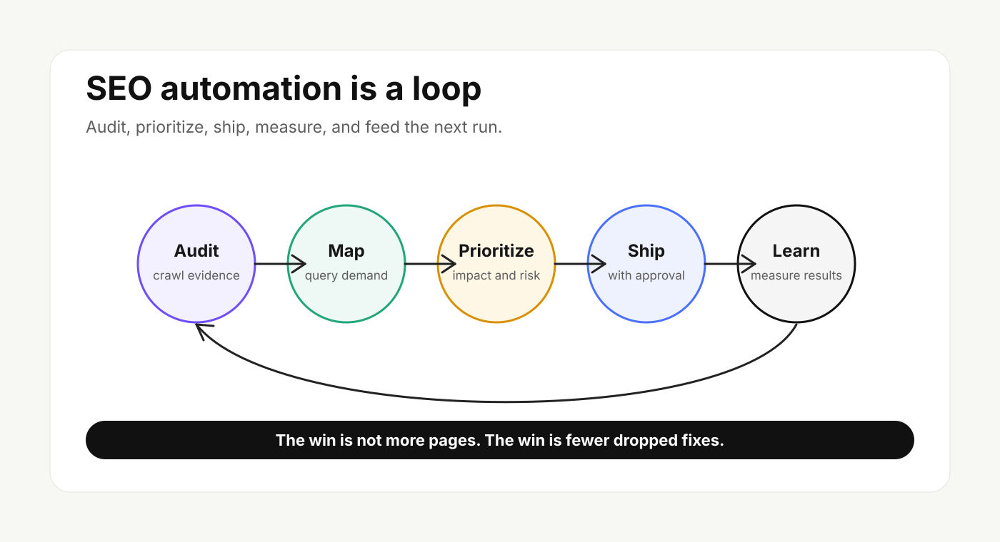
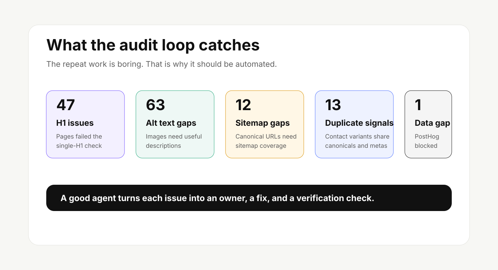
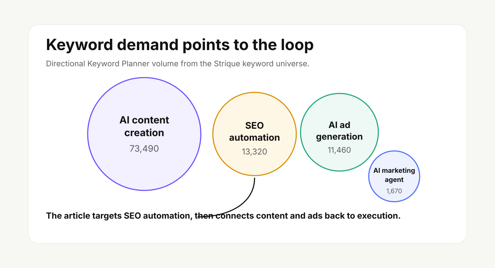

# SEO Automation: Build the Agent Loop, Not Another Content Machine

SEO automation is not a button that writes 50 articles and hopes Google sorts it out.

The useful version is quieter. It crawls the site, finds repeatable issues, maps them to demand, drafts the next action, waits for approval where the stakes are high, ships the fix, measures what changed, and feeds that learning into the next run.

That is the loop growth teams actually need.

## What SEO Automation Should Mean

SEO automation should help a team do six jobs faster:

1. Find technical and content issues across the site.
2. Prioritize them against search demand, business value, and risk.
3. Turn the fix into a clear brief or task.
4. Draft the update with sources, brand context, and review rules.
5. Push approved changes into the right workflow.
6. Measure search, engagement, and conversion movement after the change.

If your SEO automation platform stops at content generation, it is only handling one slice of the work. Content is part of SEO, but rankings usually move because the whole system gets cleaner: crawl paths, metadata, internal links, image context, schema, page experience, and the usefulness of the answer.

## Why Most SEO Automation Feels Busy But Weak

Most teams do not have a content problem first. They have a coordination problem.

The SEO lead sees query demand. The content person writes the page. The developer owns templates and canonicals. The designer owns screenshots and image assets. Analytics owns conversion proof. Someone has to connect all of it, and the handoff usually lives in a spreadsheet, a Slack thread, or a doc that goes stale by Friday.

That is where automation should help.

In the Strique audit workspace used for this brief, the crawl inventory covered 63 public URLs. The repeated issues were not exotic. They were the work every growth team recognizes:

- 47 public URLs failed the single-H1 check.
- 63 public URLs had image alt text issues.
- 12 public URLs were missing from sitemap inclusion checks.
- Contact URL variants shared duplicate canonical and meta description signals.
- PostHog evidence was blocked, so conversion context could not be used for prioritization.

None of those problems needs a 40-page strategy deck. They need a loop that notices, assigns, fixes, and verifies.

## The Agent Loop For SEO Automation

A useful SEO automation loop has six stages.

### 1. Audit

Start with crawlable evidence. Pull titles, meta descriptions, H1s, canonicals, schema, internal links, images, robots directives, sitemap inclusion, rendered content, and page performance. Use Search Console for search evidence and a crawler or browser check for what Google can actually see.

The point is not to collect every possible metric. The point is to find the smallest set of facts that can change the next action.

### 2. Map

Connect issues to keyword demand and page roles. A missing alt attribute on a decorative icon is not the same as missing context on a product screenshot. A duplicate meta description on a utility parameter URL is not the same as duplicate metadata on two acquisition pages.

For Strique, the keyword list shows a commercial SEO automation cluster around `seo automation`, `automated seo optimization`, `automatic seo optimization`, and `seo automation platform`. That tells us the article should not be a beginner glossary. It should help buyers evaluate how automation works in practice.

### 3. Prioritize

Prioritization should balance three things:

- Search impact: Will the fix help a page become clearer, more crawlable, more answerable, or more likely to earn a useful snippet?
- Business impact: Does the page influence signups, demos, purchases, retention, or sales conversations?
- Execution cost: Can the team fix it in the CMS, or does it need template work?

This is where automation saves time. A human should still make the call on strategy, but the agent can keep the evidence organized.

### 4. Brief

The output should be a task someone can act on.

Weak SEO task: "Improve on-page SEO."

Useful SEO task: "Update the blog template so each article renders one visible H1, keeps the title tag separate from the H1, and validates the rendered page before publishing."

The same standard applies to content. A good brief names the reader, search intent, primary keyword, source requirements, internal links, image needs, schema notes, CTA, owner, and review rules.

### 5. Ship With Approval

Not every SEO change should ship automatically.

Low-risk fixes can be batched: missing alt text on known product screenshots, internal link cleanup, stale title templates, or schema fields that match visible content.

High-risk changes need review: comparison claims, pricing statements, product promises, legal language, redirects, canonicals, noindex rules, and anything that affects revenue pages.

Good automation does not remove judgment. It moves judgment to the right moment.

### 6. Measure And Learn

SEO automation gets stronger after publishing. The loop should watch Search Console queries, page impressions, click-through rate, average position, indexed status, AI answer visibility where measured, and conversion quality from the analytics source the team actually uses.

For Strique, PostHog is the product and behavioral analytics source. That matters because SEO work is not finished when impressions rise. It is finished when the right visitors understand the page and take the next useful step.

## What To Automate First

Start with the repeatable work that already has clear pass or fail rules.

### Technical Hygiene

Automate detection for missing titles, missing meta descriptions, duplicate metadata, multiple H1s, broken internal links, canonical mismatch, sitemap gaps, indexability problems, blocked resources, and schema that does not match visible content.

### Content Briefs

Use keyword demand, Search Console evidence, crawl data, and brand context to create briefs. The brief should make the page easier to write, not force a generic template onto every topic.

### Image Context

Images are easy to forget because they often sit between design, content, and engineering. Automation should flag missing alt text, oversized files, missing dimensions, lazy-loading mistakes, and screenshots that no longer match the product.

Alt text should describe the image's meaning. Do not stuff the keyword into every image. If the image is decorative, use empty alt text.

### Internal Linking

An agent can find older pages that should link to a new article. For this post, the natural links are Strique's pages on the product, AI marketing agents, brand context extraction, closing the loop, integrations, and customer proof.

### Refresh Monitoring

Automation should keep a watchlist of pages that lose impressions, gain irrelevant queries, drift from the current product, or no longer match search intent.

## What Not To Automate Blindly

Do not blindly automate strategic claims, review language, compliance copy, redirects, canonicals, noindex rules, or comparison pages.

Also avoid creating thin prompt-variant pages. A page for every tiny wording difference is not a strategy. It is crawl waste with nicer formatting.

The stronger move is to create one page that answers the real question well, then support it with specific internal links, examples, and product context.

## How Strique Fits

Strique is built around an agent loop for marketing work: plan, execute, measure, and learn. SEO fits that model because the work crosses content, technical fixes, reporting, and approvals.

In Strique, an SEO workflow can use brand context, keyword demand, crawl evidence, Search Console evidence, reusable skills, approval gates, and Canvas reporting. The goal is not to replace the marketer. The goal is to stop losing SEO work between audit, brief, implementation, and measurement.

If you already have a backlog full of SEO issues, start there. Do not ask AI for more content until the existing system can tell you which fixes matter and whether they worked.

## A Simple Starting Playbook

Use this sequence:

1. Crawl the site and export a URL inventory.
2. Pull Search Console queries and pages.
3. Group keyword demand by intent and page type.
4. Pick one page type to fix first, such as blog posts or product pages.
5. Create a checklist for titles, meta descriptions, H1s, internal links, images, schema, canonicals, and conversion path.
6. Turn every failed item into one task with owner, evidence, and next action.
7. Ship the lowest-risk fixes first.
8. Review performance after indexing and traffic have had time to settle.

That is SEO automation with a spine. It is not flashier than a content generator. It is more useful.

## Final Take

The future of SEO automation is not a warehouse of AI-written pages.

It is an operating loop that knows the site, understands the audience, finds the issue, drafts the fix, routes the approval, ships the change, and learns from the result.

That is where Strique is pointed: fewer dashboards, fewer handoffs, and more marketing work that actually makes it from insight to outcome.

## Recommended Internal Links

- [See how Strique works](/product)
- [What is an AI marketing agent?](/blog/what-is-an-ai-marketing-agent)
- [How Strique extracts brand DNA](/blog/brand-context-extraction)
- [Closing the loop in AI marketing](/blog/closing-the-loop)
- [Strique integrations](/integrations)
- [Customer stories](/customers)

## Schema Recommendation

Use `BlogPosting` or `Article` JSON-LD with the visible title, description, author as `Strique`, publisher as `Strique`, canonical URL, publish date, modified date, and image URL. Add `BreadcrumbList` only if visible breadcrumbs are present.
